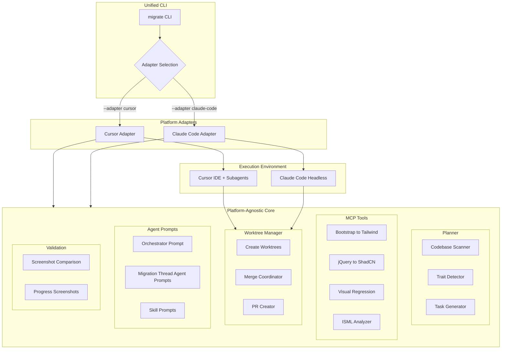
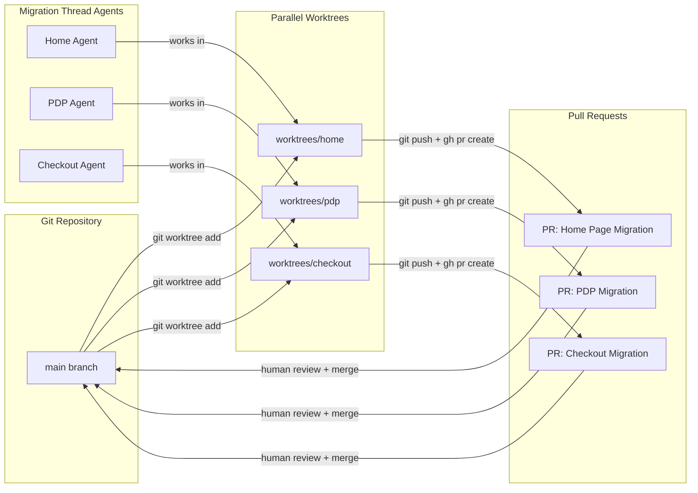
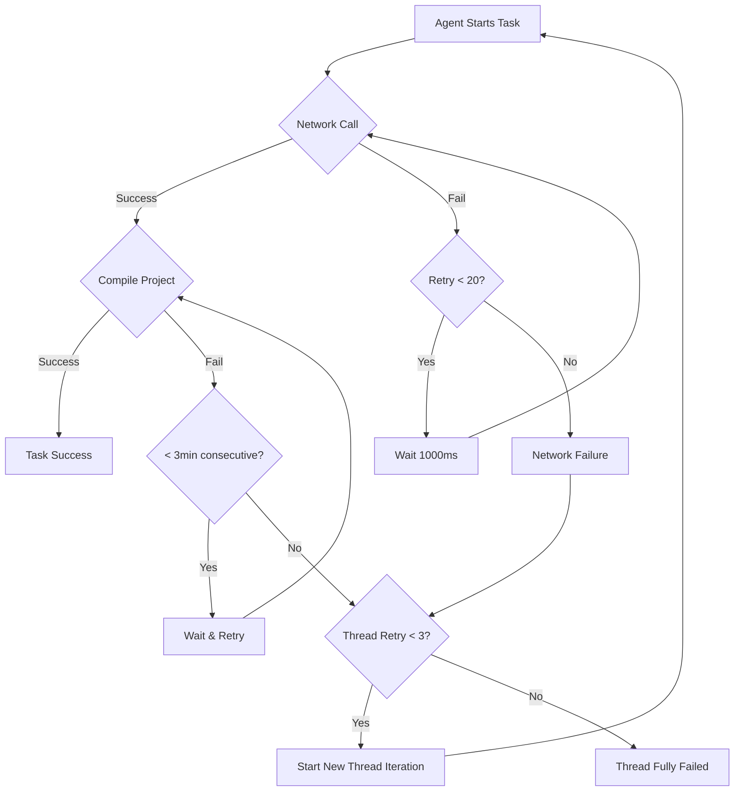
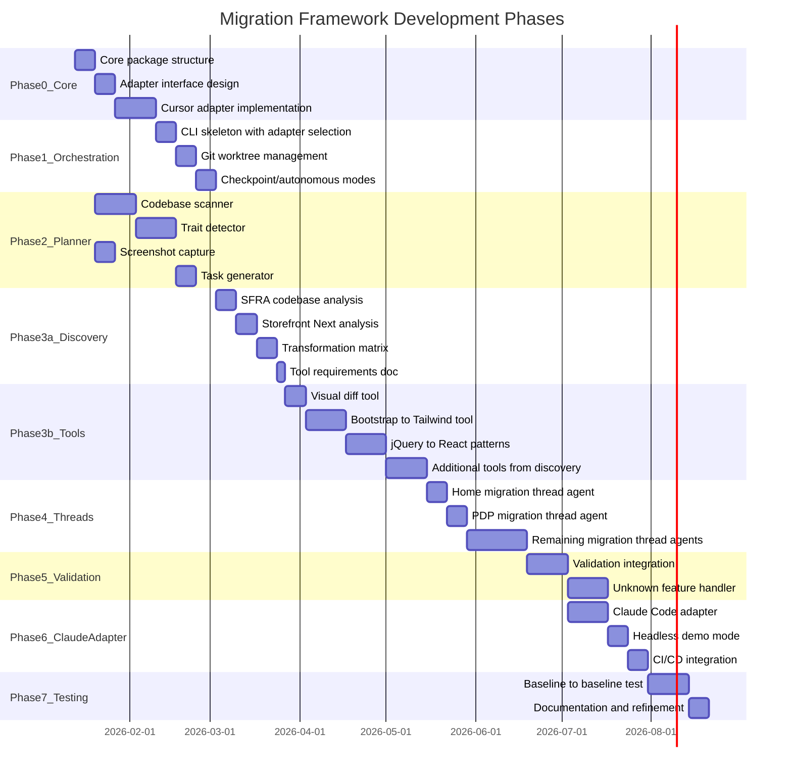

# Migration Framework Master Plan

**Overview**: A multi-phase plan to build an LLM-driven migration framework that transforms SFRA projects to Storefront Next architecture, using a platform-agnostic core with adapters, parallel migration thread agents, git worktrees, coordination layer for shared files, conflict resolution, retry logic, incremental visual validation, and execution modes (serial/parallel).

## Table of Contents

-   [Business Motivation](#business-motivation)
-   [Goals](#goals)
-   [Non-Goals](#non-goals)
-   [Success Criteria](#success-criteria)
-   [Key Constraints](#key-constraints)
-   [Terminology Guide](#terminology-guide)
-   [Architecture Overview](#architecture-overview)
-   [Platform Decision: Adapter Pattern](#platform-decision-adapter-pattern)
-   [Package Structure](#package-structure)
-   [Workspace Structure & Git Initialization](#workspace-structure--git-initialization)
-   [Dry-Run Planning & Output Logging Workflow](#dry-run-planning--output-logging-workflow)
-   [Execution Modes: Serial vs Parallel](#execution-modes-serial-vs-parallel)
-   [Retry Logic Strategy](#retry-logic-strategy)
-   [Architectural Pillars](#architectural-pillars)
-   [Phased Delivery](#phased-delivery)
-   [Risks and Mitigations](#risks-and-mitigations)
-   [Open Questions](#open-questions)
-   [References](#references)

## Task List

### Core Sub-Plans

-   [ ] **Pillar 0**: Create detailed sub-plan for Platform-Agnostic Core + Adapters
-   [ ] **Pillar 1**: Create detailed sub-plan for Orchestration Layer (including coordination layer and retry logic) _(depends on: Pillar 0)_
-   [ ] **Pillar 2**: Create detailed sub-plan for Planner Agent (including known mappings documentation)
-   [ ] **Pillar 3a**: Analyze SFRA + Storefront Next codebases to identify required tools and document known equivalents/gaps
-   [ ] **Pillar 3b**: Create detailed sub-plan for MCP Tools (after discovery) _(depends on: Pillar 3a)_
-   [ ] **Pillar 4**: Create detailed sub-plan for Migration Thread Agents (with coordination integration) _(depends on: Pillar 3b)_
-   [ ] **Pillar 5**: Create detailed sub-plan for Validation Layer (including incremental screenshot capture)
-   [ ] **Pillar 6**: Create detailed sub-plan for Coordination & Conflict Resolution _(depends on: Pillar 4)_

### Implementation Tasks

-   [ ] **Workspace Setup**: Design and implement workspace setup validation (parent git, SFRA git, Storefront Next git) _(depends on: Pillar 1)_
-   [ ] **Coordination Layer**: Implement coordination layer: file registry, conflict detection, resolver agent, sequencer agent _(depends on: Pillar 1)_
-   [ ] **Dry-Run Generator**: Implement dry-run generator: create .plan.md files with proposed changes and line numbers _(depends on: Pillar 2)_
-   [ ] **Sequencer Agent**: Implement sequencer agent: analyze deadlocks and assign priority order _(depends on: Coordination Layer, Dry-Run Generator)_
-   [ ] **Output Log Generator**: Implement output log generator: create changes-iteration-{N}.md files documenting actual changes _(depends on: Pillar 4)_
-   [ ] **Retry Logic**: Implement three-tier retry logic (network, compilation, thread) _(depends on: Pillar 1)_
-   [ ] **Incremental Screenshots**: Implement incremental screenshot capture with historical preservation _(depends on: Pillar 5)_
-   [ ] **Prototype Worktree**: Prototype git worktree + sub-agent coordination with conflict detection _(depends on: Pillar 1, Coordination Layer)_
-   [ ] **Cursor Adapter**: Implement Cursor subagent adapter for development/debugging _(depends on: Pillar 0)_
-   [ ] **Claude Adapter**: Implement Claude Code adapter for headless demos and CI/CD _(depends on: Pillar 0)_

---

# SFRA to Storefront Next Migration Framework - Master Plan

This is a "plan for plans" - a high-level architectural blueprint that will spawn detailed sub-plans for each pillar. The goal is to build autonomous migration tooling that can transform SFRA codebases to Storefront Next with visual validation and human-verifiable output.

---

## Business Motivation

Salesforce Commerce Cloud customers currently on **Storefront Reference Architecture (SFRA)** need a migration path to the new **Storefront Next** architecture. This represents:

-   **Billions of dollars** in potential customer value
-   A fundamental architecture shift that cannot be done manually at scale
-   An opportunity to demonstrate LLM-driven migration capabilities

The two architectures have **nearly zero overlap**:

-   SFRA: Monolithic, server-rendered via ISML templates, Bootstrap/jQuery, runs in Rhino (Java-based JS engine)
-   Storefront Next: Headless React 19 RSC, Tailwind/ShadCN, runs on AWS Lambda/Node.js

**Direct code translation is not feasible** - this requires intelligent trait mapping and reconstruction.

---

## Goals

| Goal                             | Description                                                                                                                                                                                                                                                  |
| -------------------------------- | ------------------------------------------------------------------------------------------------------------------------------------------------------------------------------------------------------------------------------------------------------------ |
| **Autonomous migration**         | LLM-driven migration that runs to completion without constant human intervention                                                                                                                                                                             |
| **Fully detached demos**         | Ability to start migration, walk away, and return to completed results                                                                                                                                                                                       |
| **Full codebase migration**      | Attempt to migrate entire SFRA codebase including customizations, with retry logic allowing multiple attempts. Failed migrations logged for review. Success not guaranteed - framework attempts all features unless explicitly marked as "no migration path" |
| **Visual validation**            | Incremental screenshot comparison at regular intervals within each migration thread, preserving historical progress                                                                                                                                          |
| **Parallel execution**           | Multiple migration thread agents working simultaneously via git worktrees with conflict coordination (optional serial mode for headless)                                                                                                                     |
| **Human-verifiable output**      | All work produces PRs that humans review before merging, with conflict/failure logs                                                                                                                                                                          |
| **Platform flexibility**         | Cursor for development, Claude Code for demos/CI                                                                                                                                                                                                             |
| **Minimize throwaway work**      | Platform-agnostic core (~85% reuse between adapters)                                                                                                                                                                                                         |
| **Conflict resolution**          | Automated conflict detection and resolution with fallback to human review                                                                                                                                                                                    |
| **Known mappings documentation** | Quantify and document known functionality equivalents and expected gaps                                                                                                                                                                                      |

### Phase 1 Migration Scope Clarification

**Phase 1 Goal**: Attempt full codebase migration with a "mostly known" scope, but expect grey areas.

**Known Scope (Allow-List & Deny-List)**:

-   **Allow-List**: Features with documented migration paths (e.g., baseline SFRA components mapped to Storefront Next equivalents)
-   **Deny-List**: Features explicitly marked as "has no migration path" in the migration plan (e.g., deprecated SFRA features with no Storefront Next equivalent, proprietary integrations)

**Grey Areas (Non-Deterministic)**:

During feature detection and mapping, some features will fall into neither the allow-list nor deny-list:

-   **Unknown features**: Custom SFRA code not recognized by the planner agent
-   **Ambiguous mappings**: Features where migration path is unclear
-   **Edge cases**: Variations of known features that don't match documented patterns

**Handling Grey Areas**:

-   **Generalized agentic layer**: Unknown features (not on allow-list or deny-list) are handled by the migration thread agents using general migration tools
-   **Retry logic**: Multiple attempts (up to 3 thread-level retries) allow the framework to recover from initial failures
-   **Failure logging**: Features that fail after all retry attempts are logged in `failed-migrations.md` for human review
-   **No guarantee**: The framework attempts migration but doesn't guarantee success for grey-area features

**Expected Outcomes**:

-   **Known features (allow-list)**: High success rate with documented migration paths
-   **Known gaps (deny-list)**: Explicitly skipped, logged with rationale
-   **Grey areas**: Variable success rate, logged failures for human review and potential Phase 2 handling

---

## Non-Goals

| Non-Goal                                           | Rationale                                                                                                              |
| -------------------------------------------------- | ---------------------------------------------------------------------------------------------------------------------- |
| **Direct ISML-to-JSX translation**                 | Paradigm shift is too fundamental; focus on data flow and trait mapping instead                                        |
| **Automatic deployment**                           | Human must review and approve all changes before any deployment                                                        |
| **100% automation of custom features**             | Unknown/custom SFRA features logged in failure log for manual review                                                   |
| **Real-time human collaboration during migration** | Hand-holding happens at END (validation), not during execution                                                         |
| **Single-threaded migration**                      | Must parallelize via worktrees to complete in reasonable time (serial mode available for headless)                     |
| **Perfect conflict-free merges**                   | Conflicts expected; automated resolution with human fallback                                                           |
| **Guaranteed success for all features**            | Framework attempts full migration but doesn't guarantee success; grey-area features may fail and be logged for Phase 2 |

---

## Success Criteria

1. **Demo-ready**: Can start a migration, walk away, and return to completed PRs
2. **Full codebase migration**: Attempts to migrate entire SFRA codebase including customizations, with known features (allow-list) achieving high success rates
3. **Visual parity**: Incremental screenshot comparison shows acceptable similarity (tunable threshold)
4. **Parallel execution**: Multiple migration thread agents complete with conflict coordination (or serial mode for headless)
5. **Human validation**: All output is reviewable via standard PR workflow with conflict/failure logs
6. **CI/CD ready**: Can run headless in GitHub Actions or similar
7. **Conflict handling**: Shared file conflicts detected, resolved, or flagged for review
8. **Failure logging**: Failed migrations and customizations logged for human review

---

## Key Constraints

| Constraint                     | Impact                                                     |
| ------------------------------ | ---------------------------------------------------------- |
| Cursor requires IDE open       | Claude Code adapter needed for true headless operation     |
| SFRA runs on Rhino (Java JS)   | Cannot execute SFRA code directly; must analyze statically |
| Bootstrap ≠ Tailwind           | Class mapping is lossy; requires LLM judgment              |
| ISML templates are proprietary | No standard parser; must build custom analysis             |
| Customer codebases vary wildly | Baseline-first, then handle customizations                 |

---

## Terminology Guide

Before diving into architecture, let's establish precise definitions:

| Term                  | Definition                                                                 | Implementation                                                                   |
| --------------------- | -------------------------------------------------------------------------- | -------------------------------------------------------------------------------- |
| **Tool**              | A discrete function an LLM can invoke (e.g., read file, grep, run command) | MCP server endpoints or built-in Cursor/Claude tools                             |
| **Skill**             | A specialized prompt + tool combination for a specific task                | Markdown files with instructions + allowed tools (e.g., "Bootstrap to Tailwind") |
| **Agent**             | An LLM instance with a goal, tools, and observe-think-act loop             | Cursor/Claude Code session with system prompt                                    |
| **Sub-agent**         | A delegated agent spawned by a parent agent, runs in isolated context      | `.cursor/agents/*.md` or Claude Code subagent files                              |
| **Orchestrator**      | The top-level coordinator that spawns sub-agents and manages workflow      | CLI tool + parent agent that delegates to specialists                            |
| **Worktree**          | A git feature allowing multiple working directories from one repo          | `git worktree add` - enables parallel non-conflicting work                       |
| **Migration Thread**  | A logical grouping of migration work (e.g., "Checkout", "PDP")             | Directory-scoped sub-agent assignment                                            |
| **Trait**             | A detected feature/functionality pattern in the source codebase            | Output of planner agent's analysis (e.g., "has custom checkout")                 |
| **Dry-Run Plan File** | Markdown file (`.plan.md`) documenting proposed changes with line numbers  | Generated by planner, one per file to be modified                                |
| **Output Log**        | Markdown file documenting actual changes made by a thread                  | Written after each commit/iteration to `.migration/output-logs/{thread-name}/`   |
| **Sequencer Agent**   | Specialized agent that reviews deadlocks and assigns priority order        | Analyzes dry-run plans, creates sequencing-order.json                            |

---

## Architecture Overview



---

## Platform Decision: Adapter Pattern

After evaluating the three options:

| Platform             | Fully Detached?         | Visual Debugging | CI/CD Ready | Verdict            |
| -------------------- | ----------------------- | ---------------- | ----------- | ------------------ |
| **Cursor Subagents** | No (IDE must stay open) | Excellent        | No          | Development only   |
| **Claude Code**      | Yes (headless SDK)      | Limited          | Yes         | Demos + Production |

### Why This Approach

| Requirement                 | How Adapter Pattern Solves It              |
| --------------------------- | ------------------------------------------ |
| Fully detached demos        | Use Claude Code adapter                    |
| Visual debugging during dev | Use Cursor adapter                         |
| Minimize throwaway work     | ~85% of code is in shared core             |
| CI/CD integration           | Claude Code adapter runs headless          |
| Future flexibility          | Can add new adapters (e.g., Aider, custom) |

### Code Reusability Analysis

| Component              | Shared in Core | Platform-Specific         |
| ---------------------- | -------------- | ------------------------- |
| MCP Tools              | 100%           | 0%                        |
| Migration prompts      | 95%            | 5% (format wrappers)      |
| Git worktree logic     | 100%           | 0%                        |
| Validation/screenshots | 100%           | 0%                        |
| Orchestration logic    | 70%            | 30% (spawn APIs differ)   |
| Agent definitions      | Content: 100%  | Format: platform-specific |
| Coordination layer     | 100%           | 0%                        |
| Retry logic            | 100%           | 0%                        |

**Net reusability**: ~85% of work transfers between platforms.

---

## Package Structure

```
packages/migration-framework/
├── core/                           # 100% platform-agnostic
│   ├── planner/
│   │   ├── scanner.ts              # SFRA codebase traversal
│   │   ├── trait-detector.ts       # Feature identification
│   │   ├── feature-mapper.ts       # SFRA -> Storefront Next mapping
│   │   ├── task-generator.ts       # Migration task creation
│   │   └── known-mappings.ts       # Document known equivalents & gaps
│   │
│   ├── coordination/               # Shared file coordination
│   │   ├── dry-run-analyzer.ts     # Analyze .plan.md files for proposed changes
│   │   ├── deadlock-detector.ts    # Pre-execution conflict detection
│   │   ├── sequencer-agent.ts      # Assign priority order for deadlocked changes
│   │   ├── file-registry.ts        # Track file/line access by agents (runtime)
│   │   ├── conflict-detector.ts   # Detect line number conflicts (runtime)
│   │   ├── output-log-reader.ts    # Read output logs for cross-impact checking
│   │   ├── plan-updater.ts         # Update .plan.md files with new line numbers
│   │   ├── resolver-agent.ts       # Automated conflict resolution
│   │   └── conflict-logger.ts     # Append-only conflict log
│   │
│   ├── retry/                      # Retry logic
│   │   ├── network-retry.ts        # Fast network retry (20x, 1000ms)
│   │   ├── compile-retry.ts         # Compilation retry (3min tolerance)
│   │   └── thread-retry.ts         # Thread-level retry (3x max)
│   │
│   ├── tools/                      # MCP tools (work with any client)
│   │   ├── bootstrap-to-tailwind/
│   │   ├── jquery-to-react/
│   │   ├── shadcn-mapper/
│   │   ├── isml-analyzer/
│   │   ├── visual-diff/
│   │   └── scapi-mapper/
│   │
│   ├── worktree/
│   │   ├── manager.ts              # Create/list/remove worktrees
│   │   ├── branch-strategy.ts      # Naming conventions
│   │   └── pr-creator.ts           # GitHub PR automation
│   │
│   ├── validation/
│   │   ├── screenshot-capture.ts   # Playwright-based capture
│   │   ├── incremental-capture.ts  # Regular interval captures
│   │   ├── visual-diff.ts          # Image comparison
│   │   └── progress-logger.ts      # Periodic snapshots with history
│   │
│   ├── logging/                    # Centralized logging
│   │   ├── failed-migrations.ts    # Failed migration log manager
│   │   ├── conflict-log.ts        # Conflict log manager
│   │   ├── progress-log.ts         # Thread progress logging
│   │   └── output-log-generator.ts # Generate output logs documenting actual changes
│   │
│   └── prompts/                    # Raw markdown prompts
│       ├── orchestrator.md
│       ├── planner.md
│       ├── resolver-agent.md       # Conflict resolver prompt
│       ├── threads/
│       │   ├── home.md
│       │   ├── pdp.md
│       │   ├── checkout.md
│       │   └── ...
│       └── skills/
│           ├── bootstrap-to-tailwind.md
│           └── jquery-to-react.md
│
├── adapters/
│   ├── cursor/
│   │   ├── index.ts                # Cursor adapter entry
│   │   ├── agent-generator.ts      # Generate .cursor/agents/*.md
│   │   ├── subagent-spawner.ts     # Task tool invocation
│   │   └── progress-monitor.ts     # Read ~/.cursor/subagents/
│   │
│   └── claude-code/
│       ├── index.ts                # Claude Code adapter entry
│       ├── sdk-wrapper.ts          # Claude Code SDK integration
│       ├── headless-runner.ts      # Background execution
│       └── ci-integration.ts       # GitHub Actions support
│
└── cli/
    ├── index.ts                    # CLI entry point
    ├── commands/
    │   ├── init.ts                 # migrate init
    │   ├── plan.ts                 # migrate plan
    │   ├── run.ts                  # migrate run
    │   └── status.ts               # migrate status
    └── config.ts                   # Adapter selection, modes
```

---

## Git Worktree + PR Strategy

Each migration thread operates in isolation and produces a reviewable PR:



### Worktree Workflow

**Initialization** (applies to both serial and parallel modes):

1. **Workspace Setup**: Initialize git in parent, source, and target directories if needed
2. **Orchestrator** creates worktrees for each migration thread: `cd storefront-next && git worktree add worktrees/home -b migration/home`

**Serial Mode Execution**:

1. **Dry-run analysis**: Coordination layer analyzes all `.plan.md` files (optional in serial mode, but useful for planning)
2. **Thread 1** executes in its worktree (`storefront-next/worktrees/home/`):
    - **Reads from shared location**: Reads output logs from previous threads (if any) from `.migration/output-logs/` (parent directory, outside worktree)
    - **Reads from shared location**: Reads/updates `.plan.md` files from `.migration/dry-run/home/` (parent directory, outside worktree)
    - **Makes changes**: Edits files within its worktree (`storefront-next/worktrees/home/`)
    - **Writes to shared location**: Writes output log to `.migration/output-logs/home/changes-iteration-001.md` (parent directory, outside worktree)
      Completes (or fails)
3. **PR creation** for successful thread via `gh pr create`
4. **Thread 2** executes in its worktree:
    - **Reads Thread 1's output logs** to check for cross-impact changes
        - Updates `.plan.md` files with new line number references if Thread 1 modified shared files changes
        - Writes output log after Thread 1 completes if `--continue-on-failure` not set)
5. Process repeats for all threads sequentially, each reading previous threads' output logs

**Parallel Mode Execution**:

1. **Dry-run analysis**: Coordination layer analyzes all `.plan.md` files from `.migration/dry-run/` (parent directory) to detect deadlocks
2. **Sequencer assignment**: Sequencer agent reviews deadlocks and assigns priority order, writes to `.migration/coordination/sequencing-order.json` (parent directory)
3. **All threads** spawn simultaneously, each in their own worktree (`storefront-next/worktrees/{thread-name}/`)
4. **Before each change**: Threads read `.migration/output-logs/` (parent directory, outside worktrees) to check for cross-impact changes
5. **Plan updates**: Threads update `.plan.md` files in `.migration/dry-run/{thread-name}/` (parent directory, outside worktrees) with new line number references if files changed
6. **Coordination layer** tracks file access in `.migration/coordination/file-registry.json` (parent directory, outside worktrees) to prevent conflicts
7. **After each commit**: Thread writes output log to `.migration/output-logs/{thread-name}/changes-iteration-{N}.md` (parent directory, outside worktree)
8. **Each agent** commits incrementally within its worktree, pushes to remote
9. **PR creation** via `gh pr create` for each successful thread independently
10. Failed threads don't block successful ones

**Key Point**: All coordination files (dry-run plans, output logs, file registry, conflict logs) are written to `.migration/` at the **parent directory level**, outside the worktrees. This allows all threads to read/write shared state regardless of which worktree they're executing in.

**Final Steps** (both modes):

-   **Human** reviews PRs at end (or at checkpoints in checkpoint mode)
-   **Merge** happens only after validation passes

This workflow is **platform-agnostic** - works identically with Cursor or Claude Code adapter.

---

## Workspace Structure & Git Initialization

### Directory Layout

The migration framework requires a specific workspace structure with three independent git repositories:

```
migration-workspace/                    # Parent directory (has git)
├── .git/                              # Parent git repository
├── sfra/                              # SFRA source repository
│   ├── .git/                          # SFRA git repository (independent)
│   └── [SFRA codebase files]
├── storefront-next/                   # Storefront Next target repository
│   ├── .git/                          # Storefront Next git repository (independent)
│   ├── worktrees/                     # Git worktrees created here (isolated working directories)
│   │   ├── home/                      # Worktree for home migration thread
│   │   ├── pdp/                       # Worktree for PDP migration thread
│   │   └── ...
│   └── [Storefront Next codebase files]
└── .migration/                        # Migration framework state (committed to parent git)
                                      # IMPORTANT: This directory is OUTSIDE all worktrees
                                      # Shared coordination files are written here so all threads can access them
    ├── coordination/                  # Shared file coordination layer (parallel mode only)
    │   ├── file-registry.json         # Tracks which agents touch which files/lines
    │   ├── conflict-log.md           # Changelog-style conflict log (append-only)
    │   └── sequencing-order.json      # Sequencer-assigned priority order for deadlocked changes
    ├── dry-run/                       # Dry-run proposed changes (generated by planner)
    │   ├── home/                      # Migration thread: home
    │   │   ├── src/components/Header.tsx.plan.md
    │   │   ├── src/routes/home.tsx.plan.md
    │   │   └── ...                    # One .plan.md file per file to be changed
    │   ├── pdp/                       # Migration thread: pdp
    │   │   └── ...
    │   └── ...                        # One directory per migration thread
    ├── logs/
    │   ├── failed-migrations.md       # Changelog-style failed migration log (append-only)
    │   └── thread-progress/          # Per-thread progress logs
    ├── output-logs/                  # Actual changes made by each thread (shared, readable by all threads)
    │   ├── home/
    │   │   ├── changes-iteration-001.md
    │   │   ├── changes-iteration-002.md
    │   │   └── ...                    # One log file per iteration/commit
    │   ├── pdp/
    │   │   └── ...
    │   └── ...                        # One directory per migration thread
    ├── screenshots/                   # Incremental screenshots by thread/iteration
    │   ├── home/
    │   │   ├── iteration-001/
    │   │   ├── iteration-002/
    │   │   └── ...
    │   └── ...
    └── migration-plan.json            # Generated migration plan
```

### Git Initialization Strategy

**Consistent across all execution contexts** (Cursor IDE, Claude Code headless, CI):

1. **Parent Directory**: Initialize git if not present: `git init` in workspace root
2. **Source Directory** (`sfra/`): Initialize git if not present: `cd sfra && git init`
3. **Target Directory** (`storefront-next/`): Initialize git if not present: `cd storefront-next && git init`
4. **Worktrees**: Created within target directory's git context: `cd storefront-next && git worktree add worktrees/{thread-name} -b migration/{thread-name}`
5. **Shared Coordination Directory** (`.migration/`): Created at parent level (outside all worktrees) to enable cross-thread file sharing:
    - Dry-run plans: `.migration/dry-run/{thread-name}/`
    - Output logs: `.migration/output-logs/{thread-name}/`
    - Coordination files: `.migration/coordination/`
    - All threads read/write to this shared location using absolute paths or relative paths from parent directory

**CLI Arguments**:

-   `--source-path <path>`: Path to SFRA source directory
-   `--target-path <path>`: Path to Storefront Next target directory
-   `--workspace-path <path>`: Path to parent workspace (defaults to current directory)

**Note for CI Context**: In CI environments (GitHub Actions, etc.), the framework will:

1. Clone the parent repository (which contains both source and target as subdirectories)
2. Initialize git in each subdirectory if not already initialized
3. Proceed with migration using the same workflow as local execution

**Follow-up**: Need to design CI-specific workflow that handles:

-   Cloning strategy (monorepo vs separate repos)
-   Git credential handling for PR creation
-   Workspace cleanup after migration completion

---

## Dry-Run Planning & Output Logging Workflow

### Overview

The framework uses a two-phase approach to coordinate parallel execution and handle cross-thread impacts:

1. **Dry-Run Phase**: Planner generates proposed changes as `.plan.md` files
2. **Deadlock Detection**: Pre-execution analysis identifies conflicts
3. **Sequencing**: Sequencer agent assigns priority order for conflicting changes
4. **Execution Phase**: Threads execute, generating output logs of actual changes
5. **Cross-Impact Updates**: Threads read output logs and update plans dynamically

### Dry-Run Plan Files (`.plan.md`)

**Location**: `.migration/dry-run/{thread-name}/{file-path}.plan.md`

**Format Example**:

````markdown
# Migration Plan: src/components/Header.tsx

**Thread**: home
**Original File**: src/components/Header.tsx
**Proposed Changes**: Lines 15-42

## Changes

### Line Range: 15-42

**Rationale**: Convert Bootstrap navbar to Tailwind + ShadCN NavigationMenu

```diff
- <nav class="navbar navbar-expand-lg">
+ <NavigationMenu>
```
````

**Dependencies**:

-   Requires: src/components/ui/navigation-menu.tsx (to be created by navigation thread)
-   Affects: src/routes/home.tsx (imports Header)

````

### Output Log Files (`changes-iteration-{N}.md`)

**Location**: `.migration/output-logs/{thread-name}/changes-iteration-{N}.md`

**Format Example**:
```markdown
# Changes Log: home - Iteration 001

**Timestamp**: 2026-01-15T10:30:00Z
**Commit**: abc123def456
**Thread**: home

## Files Modified

### src/components/Header.tsx
**Actual Line Numbers Changed**: 15-45 (shifted due to previous changes)
**Git Diff**:
```diff
@@ -15,7 +15,7 @@
- <nav class="navbar navbar-expand-lg">
+ <NavigationMenu>
````

**Cross-Impact Notes**:

-   This change adds import: `import { NavigationMenu } from '@/components/ui/navigation-menu'`
-   Navigation thread should verify navigation-menu.tsx exists before importing

````

### Sequencer Agent Workflow

1. **Input**: All `.plan.md` files from `.migration/dry-run/`
2. **Analysis**: Identifies overlapping line number ranges across threads
3. **Deadlock Detection**: Flags conflicts where multiple threads want to modify same lines
4. **Priority Assignment**: Assigns execution order based on:
   - Dependency chains (threads that create dependencies go first)
   - Complexity (simpler changes before complex ones)
   - File structure (base files before dependent files)
5. **Output**: `sequencing-order.json` with priority assignments

**Sequencing Order Format**:
```json
{
  "deadlocks": [
    {
      "file": "src/components/Header.tsx",
      "lineRange": [15, 42],
      "conflictingThreads": ["home", "navigation"],
      "priority": ["navigation", "home"],
      "rationale": "navigation creates NavigationMenu component that home depends on"
    }
  ]
}
````

### Cross-Impact Checking

Before making changes, each thread (executing in its worktree at `storefront-next/worktrees/{thread-name}/`):

1. **Reads output logs** from all other threads in `.migration/output-logs/` (parent directory, outside worktrees)
2. **Checks for file modifications** that affect planned line numbers
3. **Updates `.plan.md` files** in `.migration/dry-run/{thread-name}/` (parent directory, outside worktrees) with new line number references
4. **Adjusts execution plan** if dependencies changed or files were restructured
5. **Proceeds with execution** using updated plan, making changes within its worktree

**Example**: If Thread A (in `storefront-next/worktrees/home/`) modified `Header.tsx` lines 10-20 and wrote output log to `.migration/output-logs/home/changes-iteration-001.md`, Thread B (in `storefront-next/worktrees/navigation/`) reads that log, sees the changes, and updates its `.plan.md` file in `.migration/dry-run/navigation/` to reflect that lines 15-20 are now at different positions (e.g., 25-30 if Thread A added lines).

**Important**: All shared coordination files are written to `.migration/` at the parent directory level, ensuring all threads can access them regardless of which worktree they're executing in. Threads use absolute paths or paths relative to the parent directory to access these shared files.

---

## Execution Modes: Serial vs Parallel

### Overview

The framework supports two execution modes for migration threads, each optimized for different use cases:

| Aspect                  | Serial Mode                        | Parallel Mode                                        |
| ----------------------- | ---------------------------------- | ---------------------------------------------------- |
| **Default Context**     | Headless/CI (Claude Code)          | Development (Cursor IDE)                             |
| **Speed**               | Slower (sequential)                | Faster (concurrent)                                  |
| **Conflict Resolution** | None needed (one thread at a time) | Coordination layer required                          |
| **Partial Success**     | ❌ One failure stops all           | ✅ Successful threads create PRs even if others fail |
| **Complexity**          | Low (no coordination)              | Higher (file registry, conflict detection)           |
| **Demo Reliability**    | High (predictable, clean output)   | Medium (may have conflicts)                          |
| **Resource Usage**      | Low (one agent at a time)          | High (multiple agents)                               |

### Serial Mode

**Use when**:

-   Running in fully headless CI/CD context
-   Need guaranteed conflict-free execution
-   Want predictable, linear progress
-   Debugging migration issues

**Behavior**:

-   Threads execute sequentially, one at a time
-   Each thread completes (or fails) before next starts
-   No coordination layer needed (no file conflicts possible)
-   If `--continue-on-failure` flag is set: failed threads are logged, execution continues
-   If `--continue-on-failure` is not set: first failure stops entire migration

**CLI Usage**:

```bash
migrate run --execution-mode serial --adapter claude-code
migrate run --execution-mode serial --continue-on-failure  # Continue even if threads fail
```

### Parallel Mode

**Use when**:

-   Running in Cursor IDE (development/debugging)
-   Need faster execution
-   Want partial success (some threads succeed even if others fail)
-   Have coordination layer implemented

**Behavior**:

-   All threads spawn simultaneously
-   Coordination layer tracks file access to prevent conflicts
-   Resolver agent attempts automated conflict resolution
-   Successful threads create PRs independently
-   Failed threads don't block successful ones

**CLI Usage**:

```bash
migrate run --execution-mode parallel --adapter cursor
```

### Implementation Strategy

```typescript
// Pseudo-code for orchestrator execution mode handling
async function executeMigration(
    threads: MigrationThread[],
    mode: 'serial' | 'parallel',
    continueOnFailure: boolean = false
) {
    if (mode === 'serial') {
        // Sequential execution - no coordination needed
        for (const thread of threads) {
            const result = await executeThread(thread);
            if (result.success) {
                await createPR(result);
            } else if (continueOnFailure) {
                logFailedThread(thread, result.error);
                // Continue to next thread
            } else {
                throw new Error(
                    `Thread ${thread.id} failed - stopping migration`
                );
            }
        }
    } else {
        // Parallel execution - requires coordination
        const coordinationLayer = new CoordinationLayer();
        const promises = threads.map((thread) =>
            executeThreadWithCoordination(thread, coordinationLayer)
        );
        const results = await Promise.allSettled(promises);

        // Process results - create PRs for successful threads
        for (const [thread, result] of zip(threads, results)) {
            if (result.status === 'fulfilled' && result.value.success) {
                await createPR(result.value);
            } else {
                logFailedThread(thread, result.reason || result.value.error);
            }
        }
    }
}
```

### Future Enhancement: Smart Serial Mode

**Proposed**: A hybrid mode that runs threads sequentially but continues on failure:

-   No conflicts (serial execution)
-   Partial success (failed threads don't block others)
-   Best of both worlds for headless demos

**CLI Usage**:

```bash
migrate run --execution-mode smart-serial --adapter claude-code
```

### Future Phase 2: Post-Baseline Enhancements

**Future Work**: After baseline-to-baseline migration is proven, Phase 2 will include two major areas of work:

#### 2.1: Custom Features Migration

Extend the framework to handle custom SFRA customizations and features beyond the baseline:

-   Custom cartridges and plugins
-   Custom checkout flows
-   Custom product features
-   Third-party integrations
-   Customer-specific business logic

#### 2.2: Execution Mode Evaluation

Conduct comprehensive evaluations comparing serial and parallel execution modes in CI contexts:

**Evaluation Strategy**:

-   Run identical migration tasks multiple times (N=50+ runs) in CI using both execution modes
-   Measure and compare:
    -   **Success Rate**: Percentage of threads that complete successfully
    -   **Partial Success Rate**: Percentage of migrations where at least one thread succeeds
    -   **Time to Completion**: Average execution time per migration
    -   **Conflict Frequency**: Number of conflicts requiring resolution (parallel mode only)
    -   **Resource Utilization**: CPU, memory, and API usage patterns
    -   **PR Quality**: Visual diff scores, compilation success rates, functional test pass rates
-   Analyze failure modes and root causes for each mode
-   Optimize default execution mode selection based on empirical data

**Expected Outcomes**:

-   Data-driven decision on optimal execution mode for CI contexts
-   Tuning of coordination layer effectiveness (if parallel mode shows promise)
-   Potential refinement of "Smart Serial Mode" based on learnings
-   Documentation of best practices for different migration scenarios

**Note**: Both modes can run in CI, enabling A/B testing and comparative analysis. This evaluation will inform whether parallel mode's coordination layer complexity is justified by improved success rates and partial success capabilities, or if serial mode's simplicity is preferable for CI contexts.

**Timeline**: Phase 2 work begins after Phase 7 (Testing) is complete and baseline-to-baseline migration is proven successful.

---

## Retry Logic Strategy

### Three-Tier Retry System

1. **Network Retry** (Fast Loop)

    - Trigger: Network/API errors
    - Retries: 20 attempts
    - Delay: 1000ms between attempts
    - Scope: Individual API calls

2. **Compilation Retry** (Medium Loop)

    - Trigger: Compilation/build failures
    - Tolerance: 3 minutes of consecutive failures
    - Scope: Entire thread task
    - Action: Mark task as failed, trigger thread retry

3. **Thread Retry** (Slow Loop)

    - Trigger: Thread task failure after compilation retry exhausted
    - Retries: 3 attempts maximum
    - Action: Start entire task over in new thread iteration
    - Final: If all 3 attempts fail, mark thread as fully failed, halt all attempts

### Retry Flow



---

## Architectural Pillars

### Pillar 0: Platform-Agnostic Core + Adapters (NEW)

**Goal**: Establish the foundational architecture that maximizes code reuse across platforms

**Core package** (`packages/migration-framework/core/`):

-   All migration logic, prompts, and tools live here
-   Zero platform-specific code
-   Exports TypeScript interfaces that adapters implement

**Adapter interface**:

```typescript
interface MigrationAdapter {
    name: string;

    // Agent lifecycle
    spawnAgent(config: AgentConfig): Promise<AgentHandle>;
    monitorAgent(handle: AgentHandle): AsyncIterable<AgentStatus>;
    terminateAgent(handle: AgentHandle): Promise<void>;

    // Mode support
    supportsHeadless: boolean;
    supportsCheckpoints: boolean;

    // Platform-specific setup
    initialize(projectPath: string): Promise<void>;
    cleanup(): Promise<void>;
}
```

**Cursor adapter** (`packages/migration-framework/adapters/cursor/`):

-   Generates `.cursor/agents/*.md` files from core prompts
-   Uses Cursor's Task tool to spawn background subagents
-   Monitors `~/.cursor/subagents/` for progress
-   **Limitation**: Requires IDE open, no true headless mode

**Claude Code adapter** (`packages/migration-framework/adapters/claude-code/`):

-   Uses Claude Code SDK for programmatic control
-   Runs fully headless via `claude code run`
-   Supports CI/CD integration
-   **Advantage**: True detached execution for demos

---

### Pillar 1: Orchestration Layer

**Goal**: CLI tool that manages the entire migration workflow

-   **CLI Interface**: Commands like `migrate init`, `migrate plan`, `migrate run --mode checkpoint|autonomous --execution-mode serial|parallel --adapter cursor|claude-code`
-   **Workspace Initialization**: Sets up parent workspace with separate git instances for source, target, and parent directories
-   **Git Worktree Manager**: Creates/manages worktrees for migration thread execution (parallel or serial)
-   **Execution Mode Controller**: Serial (headless-friendly, no conflicts) vs Parallel (faster, requires coordination)
-   **Coordination Layer Manager**: Optional - only active in parallel mode for conflict detection/resolution
-   **Progress Tracker**: Real-time status of all sub-agents, screenshot logging
-   **Mode Controller**: Checkpoint (pause at milestones) vs Autonomous (run to completion)
-   **Merge Coordinator**: Combines completed worktree branches back to main

**Key files to create**:

-   `packages/migration-framework/cli/` - CLI entry point
-   `packages/migration-framework/core/workspace/` - Workspace initialization and git setup
-   `packages/migration-framework/core/worktree/` - Git worktree utilities
-   `packages/migration-framework/core/execution/` - Execution mode controller (serial/parallel)
-   Adapter implementations in `packages/migration-framework/adapters/`

---

### Pillar 2: Planner Agent

**Goal**: Analyze source SFRA codebase and generate migration plan with dry-run proposed changes

-   **Codebase Scanner**: Traverse SFRA project, identify controllers, templates, models
-   **Trait Detector**: Identify features (custom checkout, wishlists, store locator, etc.)
-   **Screenshot Capture**: Headless browser captures of all pages for later comparison
-   **Feature Mapper**: Map detected traits to known Storefront Next equivalents
-   **Known Mappings Documenter**: Quantify and document known equivalents and expected gaps
-   **Task Generator**: Output structured migration tasks for each migration thread
-   **Dry-Run Generator**: Create `.plan.md` files for each proposed file change with line numbers and git diff proposals
-   **Deadlock Analysis**: Analyze all `.plan.md` files to identify potential conflicts before execution

**Dry-Run Generation**:

For each migration thread, the planner generates:

-   **Thread Directory**: `.migration/dry-run/{thread-name}/`
-   **Plan Files**: One `{file-path}.plan.md` file per file that will be modified
-   **Plan File Format**: Each `.plan.md` contains:
    -   Line number ranges for proposed changes (relative to original file)
    -   Proposed changes in git diff format
    -   Rationale for changes
    -   Dependencies on other files/changes

**Output Log Generation**:

After each commit/iteration, each migration thread generates an output log file:

-   **Location**: `.migration/output-logs/{thread-name}/changes-iteration-{N}.md`
-   **Format**: Markdown file documenting actual changes made
-   **Contents**:
    -   Timestamp and iteration number
    -   Files modified (with paths)
    -   Actual line numbers changed (may differ from plan if file was modified by another thread)
    -   diff of actual changes
    -   Dependencies created or modified
    -   Cross-impact notes (if this change affects other threads' planned work)
-   **Purpose**: Other threads read these logs to:
    -   Update their `.plan.md` files with new line number references
    -   Detect cross-impact changes in shared files
    -   Adjust their execution plans based on actual changes made

**Key outputs**:

-   `migration-plan.json` - Structured plan with migration threads, traits, mappings
-   `screenshots/source/` - Reference screenshots of original site
-   `trait-mapping.json` - Detected features mapped to target architecture
-   `known-mappings.md` - Documented known equivalents and gaps (allow-list/deny-list)
-   `.migration/dry-run/{thread-name}/` - Directory of proposed changes per thread

---

### Pillar 3: MCP Tools/Skills

**Goal**: Reusable migration capabilities that any sub-agent can invoke

#### Phase 3a: Tool Discovery (REQUIRED FIRST)

Before building any migration tools, we must analyze both codebases to understand what transformations are actually needed:

**SFRA Codebase Analysis** (`storefront-reference-architecture/`):

-   Inventory all Bootstrap CSS classes and patterns used
-   Catalog jQuery patterns and DOM manipulation approaches
-   Document ISML template structure and data bindings
-   Map controller endpoints and data shapes
-   Identify client-side JS patterns (event handlers, AJAX calls)

**Storefront Next Codebase Analysis** (`storefront-next/packages/template-retail-rsc-app/`):

-   Document Tailwind CSS patterns and design tokens in use
-   Catalog ShadCN components and their props/variants
-   Understand React patterns (RSC vs client components, hooks)
-   Map SCAPI endpoints and data shapes
-   Document React Router 7 loader patterns

**Discovery Outputs**:

-   `analysis/sfra-patterns.json` - Categorized inventory of SFRA patterns
-   `analysis/storefront-next-patterns.json` - Inventory of target patterns
-   `analysis/transformation-matrix.md` - Mapping of source -> target for each category
-   `analysis/tool-requirements.md` - Prioritized list of tools needed based on actual usage
-   `analysis/known-equivalents.md` - Quantified known functionality mappings (allow-list)
-   `analysis/expected-gaps.md` - Documented features with no direct equivalent (deny-list)

**Discovery Questions to Answer**:

1. Which Bootstrap classes are most frequently used? (Focus tool effort there)
2. What jQuery patterns have direct React equivalents vs need custom handling?
3. Which SFRA components map cleanly to ShadCN vs need custom components?
4. Are there SFRA patterns with NO Storefront Next equivalent? (Flag for manual review)

---

#### Phase 3b: Tool Implementation

**Candidate Tools** (to be validated/prioritized by discovery):

| Tool/Skill                | Purpose                                           | Implementation                               | Priority             |
| ------------------------- | ------------------------------------------------- | -------------------------------------------- | -------------------- |
| `bootstrap-to-tailwind`   | Convert Bootstrap CSS classes to Tailwind         | AST parsing + class mapping + LLM refinement | TBD by discovery     |
| `jquery-to-react`         | Convert jQuery DOM manipulation to React patterns | Pattern detection + JSX generation           | TBD by discovery     |
| `shadcn-component-mapper` | Map Bootstrap components to ShadCN equivalents    | Component registry + props mapping           | TBD by discovery     |
| `isml-analyzer`           | Extract data requirements from ISML templates     | Template parsing, variable extraction        | TBD by discovery     |
| `visual-diff`             | Compare screenshots for regression detection      | Playwright + pixelmatch/resemblejs           | High (always needed) |
| `scapi-mapper`            | Map SFRA controller data to SCAPI equivalents     | API documentation + endpoint matching        | TBD by discovery     |

**Additional tools may be identified during discovery.**

**Key files**:

-   `packages/migration-framework/core/tools/` - Migration-specific MCP tools
-   `packages/migration-framework/analysis/` - Discovery outputs
-   Skill definitions in `core/prompts/skills/`

---

### Pillar 4: Migration Thread Agents

**Goal**: Specialized sub-agents for each functional area

Each migration thread agent:

1. Operates in its own git worktree (within Storefront Next git context)
2. Has domain-specific knowledge (e.g., checkout flows, product display)
3. Uses tools from Pillar 3
4. Requests file access via coordination layer (parallel mode only)
5. **Reads output logs** from other threads in `.migration/output-logs/` to check for cross-impact changes
6. **Generates output log** after each commit/iteration documenting actual changes made (file paths, line numbers, git diff)
7. Captures incremental screenshots at regular intervals
8. Reports progress via screenshots and logs
9. Runs in parallel with other migration threads (or serial in headless mode)
10. Handles retries according to retry strategy
11. Updates line number references when reading output logs reveals file changes from other threads

**Migration Threads (initial baseline)**:

-   `home` - Homepage, hero sections, featured products
-   `pdp` - Product Detail Page
-   `plp` - Product List/Category Pages
-   `cart` - Shopping cart
-   `checkout` - Checkout flow (most complex)
-   `account` - User account pages
-   `search` - Search results, filters
-   `navigation` - Header, footer, menus
-   `customizations` - Custom SFRA features (isolated, rollback-friendly)
-   `unknown` - Unmapped features (isolated, rollback-friendly)

---

### Pillar 5: Validation Layer

**Goal**: Verify migration quality through visual and functional testing

**Components**:

-   **Incremental Screenshot Capture**: Regular interval captures within each migration thread
-   **Screenshot Comparison**: Side-by-side source vs migrated
-   **Visual Regression**: Automated diff detection with tolerance thresholds
-   **Progress Logging**: Historical screenshots preserved for analysis
-   **Functional Smoke Tests**: Basic interaction tests (add to cart, search, etc.)
-   **Accessibility Check**: Ensure migration doesn't degrade a11y
-   **Compilation Validation**: Continuous compilation checks with retry logic

**Integration with [Ledger](https://github.com/peterjthomson/ledger)**: Could visualize worktree/branch progress across migration threads and be forked to create a multi-threaded swimlane with visualization and status indicators to call out threads that need human intervention

[Ledger Screenshot Link](https://private-user-images.githubusercontent.com/9357736/530471385-45ba7306-fc15-4bf5-ab73-f0fc5ef2fe2f.png?jwt=eyJ0eXAiOiJKV1QiLCJhbGciOiJIUzI1NiJ9.eyJpc3MiOiJnaXRodWIuY29tIiwiYXVkIjoicmF3LmdpdGh1YnVzZXJjb250ZW50LmNvbSIsImtleSI6ImtleTUiLCJleHAiOjE3NjgyNDQ0MzAsIm5iZiI6MTc2ODI0NDEzMCwicGF0aCI6Ii85MzU3NzM2LzUzMDQ3MTM4NS00NWJhNzMwNi1mYzE1LTRiZjUtYWI3My1mMGZjNWVmMmZlMmYucG5nP1gtQW16LUFsZ29yaXRobT1BV1M0LUhNQUMtU0hBMjU2JlgtQW16LUNyZWRlbnRpYWw9QUtJQVZDT0RZTFNBNTNQUUs0WkElMkYyMDI2MDExMiUyRnVzLWVhc3QtMSUyRnMzJTJGYXdzNF9yZXF1ZXN0JlgtQW16LURhdGU9MjAyNjAxMTJUMTg1NTMwWiZYLUFtei1FeHBpcmVzPTMwMCZYLUFtei1TaWduYXR1cmU9Y2EzNGU1N2FjMDQzNWI3ZTQ2NTk4MDNiZDAwMWRlZWNmN2VkYTkxZTgxZjFlZDRlNjQ1NDljMDI5NDVlNTNhZiZYLUFtei1TaWduZWRIZWFkZXJzPWhvc3QifQ.XdiSBvPW_hXzTvmQixyYoBHO27VL_8gptsxofhbb96k)

![][image1]

[image1]: data:image/png;base64,iVBORw0KGgoAAAANSUhEUgAAAvcAAAH7CAYAAABIVbBdAAAQAElEQVR4AeydB4BdRdXHz3/TKwFCJyF06V2QJiC9i6AoFtDPjg0rioJir2DFjgU7ShGVonSQ3pFOqIFUSEjffe+b37nvvHf37dtkk2xCNpndPe/UOTP33LkzZ+beva+tWvupVCrVSqWAjo6OOl2pNGTIW0F7e3s1YP78+XU6ZGDkC4Nmu3nz5lUpAw6AB4IPjAxYGF+2wRYeCBpcBnRAyIKeO3dutSxDDoSsFUZfhrBBBh04aHgg+MAhCx7cDGHTjLELGXQAsgBk0OAyIAsoy6GRg8uADAhZ0IFDDg5ZYGRA8IHLMuiA0AdGHnRgZAB8GZAFIIcGA9BlQAaEjH4AD4QscFlWptF3x5flZZoyALIA+DI0y4MHL8yuWQ9fLtd8nGUdtgCygDIPHYAeOjB0Kwg9GAgbaCD4wMgA+MDQZWiWB1/G0ECUK9NlGfIyhC7wgnTYoAcHwANlHrosCz5kgZGXoZWc8xc2oQ8ccnBZBg3EuIy+DOgAZIGhA5ABwYPhgaDBQMigAXggaHAZ0AUghwaXAVlAWQ6NHFyGBR1n2DWXCz5w2S5kgUMXGDlQ5rujwy4wdtABwYPLUNaHHBnHGnxg5K1oZGVdmW+WoysD+jKggy/joJED8GVolsEDYQMdEDJwWQaNrAzIgJAFXb5WiBNyIOxaYfRlaLZBFzLoAGTQgYMOHtwMYdOMsQsZdACyAGTQ4DIgCyjLoZGDy4AMCFnQgUMODllgZEDwgcsy6IDQB0YedGBkADwQNDgAeRlCHjh0wYNbyUIeGJsy3czThwLQAcEHJq+GBreCSqWRh1cqBV2pNDBlKpVKLZsvEMm9VSoVS6x194MOQF/G0EBZLsl9hU/0QNkmaGwA9EBqoJeFxgaABqAB6HKZsqxcHptWgA3y8FPmkQWUbYJGF3S5XmQAvpptkAMhh8YOjAw/QQdGDt0dUB4bAJvAQcNjAx8Aj7wZ0CMDA2U72oYuAD10M8auXA4bAFnYlm1Chk1AyMAAcjAQNBgIWdDwADx1ggOoFx0QMmjswMiwAQMhK9PIAGSUA4JHBg1AA0FjBw+EDBoo89BAWQ4PIAuADyj7Dj0y9MFDByxMhj5sAxf+irGhrA8aDIR9YMohbwXYIG/Gzecg9PgKOsohgy4DNgAyMBA0GAgZNBA8/qAD4NE3A3pkYAA7MLJy++FDXsbNdPBhDw/A47uModEFlPmgwQA24DJE+9AB6KIOePQAMnj0YCBNOp3mCGRlPeWaZejDV+iQQZcBGRC20OjLPLIAdNDgAPhmCB0YX+ihwbQXWfDIoBd0nNgA2IEBaAC67A9ZADpoMAANBE05aNoEDggbeOgyIAOaZfAhBwP4B6ABbIBmWejAADbggDIPDaALP8HHccCXATt4ygS04pEBYQOGB6AB6FZQrgN9madcADpoMAANBF0+hvABbrbBHgg5NHZgZOEHOmRBw7cCymMDoA8cNDw28AHwyJsBPTIwULYrty1sWmHsyuWwAZDhE7psEzLkAcjKgDz4oMEAcjAAHQBPneAA6i3rkcOX7bBBDqADgg4cMsoFHeXgAWxDBkYWuKyDBtCBsQMHIAfgwQHBgwHkYEmQ9fFXKngX1j7CDlwTOWrzz6YPqUjQMaZxqKWuTpFjAwagAWipsIfvDrALXdRT5pGVeWhOABigPDZgeKlrneikxvEEDwakhg4fyFphZEDog4YvQ1kOLbVuEzog2o8P+MDI4QFkgFS0VSowMvQAtFTI4QFkAVJXXdi0wsiiDfiAB4cs+JBJnf2HHgxQTmrEgnLIW4FU+JIK+2bbMg8dgC+pKAsNUG9ZjwxABkYPQCMLQAaEXCr8hh4cOnAAcqlzu5GFvhWWOttjQ5kAeKDMQyMDoAGpaGPIwAHooaVGXciABR2n1NkeHwDlgKClwi54MH4B6LJtmZa6lkMPlMsFjRyAXxBIRSywDejOHr3UaIdUlA179NDdYY4RaLYJWcilwq9U4PCHPgAZIHW1QQ6UbaWGHTog9OBWfMikRllsAXQAdECZ55ikIlbIAWQA9vBS4VfqjNEHYAcEDw4eDCADyr5DHhh9mYYHkAFBBw6ZVBwDcgA5AA1Qp9SwQQcgRw9IxfFBo5MKHhpZADwADw4IHlz2ix4ZUKalwj9yIHSBkQHwQDMdPLgMUtfjLOvDV8ikwh65JDOIGoRNjXWETCrajgAeKNPwEQPkALLAUlEnsgB0UkMePPoyDQ8ga4WRAaEPGr4MZTm01KgbHsAeDHA88AB8YOTwADJAKuIjFRgZegBaKuTwALIAqasubFphZNEGfMCDQxZ8yKTO/kMPBignNWJBOeRlCJlU+JIK+5CHbZmHDkAvFWWhAeot66GRB4bGBowsIGQhlwq/6JEBZRv4gLINMnhsAfiA4KXCd8gDUy7owMgCkEGDJZlU+MFvyNFBB0iFTfCe3EsKvhOmsNTQwWMAlhqO4JuBRgBleZTtThb2gbEr0/BlH6Er46Bb2VEeCJsyHfZlXegr1c67l8iBsAUDyMIPNBBy6GYdMgAbIGhws21HpaO+eivblu1CXi4fssDogGbeZd0cJzqgZZnaXZ+yrtwmygVgA8CXF2nwZQgbMFDWdUeHXeCyXVlG28p82Q4aHQAtFX0cOmTQzYBPZIGxBZABZRrewar1u1ToAZdXG3L47uTomuvDFkDXDCEHN4PUOM7m84Jts69yvaHDLiBkZYwOPjA0EDwYQNYdoAfK+mhLWQZdtoMGkJeh+bpuZYP/VvIustL5pI4u+nReQxYYu1aAHuhOF3LaX7Yr03Wb2vUZPDjswBwfslaAjjqadZRDBgagsQUD0YdCFxhd2Q4+oCwv27u+FttmebQNOeC2Kc5lX80y7AKadcEHLttxTPBl3/DRBsrAg4GwC1zWoQdayRZFHuUDUzaglSzaEjaBsQXg4zihA0JX5pEFhLw7TIywRR+4mYYvty/syjjoZruQ4wM69NDImnlkAHraBg3Ag4GgwQCy8AMNhBy6WYcMwAYIGtxsu1zP7enai/a3ajsyABsAmj4EbgVhAwZa2TTLwi5wWd8sK/NlmjLwAHT5HIQMeTOEXWBsAewCQ4ceGggeGwAZgByALkPIsIUOwKYskxr5uFTQUoHLZaA9uXeirU7Wk0hJnVYMVIQtOCoEA8gBaPTQADSAHGim4QEzw9yio9dtmxJOLsYyUBYeDARNBwsax+gCkEc9KZUyeOorA7YuT/Wn/m2uSzRyIPxjA48fADl8+K/r06SDD3QA8uCdLvmu65MsdNEGdEDIox5kcZzo4MEBwTuuTfhRf8jS2faEkzJxHNhQBzYAdSAD4FtB2R5fYQMNOJ8OCBo/jtOxurwWp5AjCxocfBlDlwE799nNcXIM2DfbRLuRY0MMoLFtBuQOqQ7qCz20Q+143CbRLsM20W5bqRZ9qiTDBh2YctTvfJSpxQYZEO2FDqDd0GUdvpAB4dvpml/qQY5MaiT68JTFF3qHWhlo16f2gwFso37osg08NgByeK83+cO/yxMNBrABA9iCgTINT1lkAcgAygNOJ7+uT21FBo08dUEfb6BDVsfJFjltBFMODFCnVMQJe7epnU902ADEAj0AHxi6DMgDkDeXQxb6wMiqtTqb24YOGbbQQPBlGXJve1O/Qg5wLLQFmnL4CBpd0NUUSHTYIIsy0ADyAMpBIw8o804nf+iggVbHSX3JrLiGOL+184WcOrw8smQEHccJ3Qxhj9zrS/FwOpWv88kPNP4dUp0cdxJ7G9weWSrresoCSQbv+sSDAeqMOLnfbuyiLGXcrubD6VQGeQC2yOHDd5mmzrAJO/Quq/nlmNCFDBobwGWpzpAFjti6PvkJeZQhRk5TFj0AnQA54GUTT9kAlycZuAzUhw2y8nHCI4/j7HIs1Jsg7LClbVE3ciD8o4fHD4Ac3u2Tn7q+ds6xcX1qMzZ1OvHQAZQrQ7ShWV8/juQ/jpNy2IEDgnec2lXGQS/23J7GGHwEeJtqx+P1R31JBu926YCgiYHjpHN5Og6XpTLIkYU/5PDNGFkZ0FMWjDxw0OU4hQ5MPW6T2oIN5xI/yJoBuQPtTBB6/DgkH8iwqftNdmUdcnjsqA8MeL3JFhrABj0ALwmyPqY4kz7KOugk8lytFUaGX3/mHmMYMCAVFWAED5bkiX7QyAOQQeMDmoOGbwbXpQMr20GXIfULzLzh5fLYOE9nS4Adg37IQu/y1IlCDkYXQHCxAUJXprlApWLidnmqi7LYUh80QCORuQ311eyQ+/HXeMpgRxlwAOWwhXe6ap2PmfIdlSRMf4nGDgg/lMG3Y+pPgA5ADkYXQJug8QG4PjUg6MDIKZ9U9fZQjvJhAwaQYQ8QVzCAPXqgmYanHBjAppKOkzqdTv0DDIS+maYOADlQpuFpe5Qt65rpsKEMEDy4btsUe44ToL3YUY7jwR6Apw+FDgy4PJ0jykFjSzvLti6vDRxRBrtyGWwCwgYeO4dUHowODASNXbk+lyd75NgFhgY4TmwA1yVbaHR1Ph2E05y3Wqxcn+ik8kEKTDns6pD00C5PdJRB5jSxSgDtNomuVrlIzH0iB7D3+CQfney8UvM+XJZTBh4MBA3GF9jlqTw8NJBY9wVdllN36JBTHgy4bWoXNvQRMDEF0AHYIQ/ADn2dT3F1u/CTeHTYuTzFhfqDRodP51MZsPtLdq6rybw85zMVdjr5xQ774PFDGeRg1yU7aHTwTiefzqfrmLLYowMDfn2X6qdM2c755Jcy0EAXOpVPTe107t0GeeoW0F5X8uNtSRhZgMvS8QYftvCuq9lH3S5PJzN0iTR08JSF5riwA3wyrx0/NsjAbpd8o4dHDoQ8aPjQc5xBB8bO25COFxn28MidL8nhkQfQXmjkDul8UdbpVI76AHiXJz20lynRbpN4t6Fcijt2Lk88NGVCDw0gB5DXbZMfZEDdBlkC7Dg+dGD0gPO1epDDIw8gxpQFQlemGfukJZ/bo75yG6gveOqM43S6Fie3of3pGOk76KIMOvyCQ+4Y+wToAOzB6AK4lqApC7g+NSDowMgpn1SGDKAc5aFdnwROd3OtJHUaVNNfapPTyRn2TqfjxFfQyDlO6nQ6XQdgAJvAQcMD3o7kv5mGT9WlytNf0mMHjxwaDEA3+4QPORi7aBc0Mq4T+hBy7F2e4uA42u6Kon5IoJO+1K5oG3qAOsDIoQFoZNQdNHJJsI3zlDjsgETW5cEjk2p9OzGSrE0qnEgFttqPVBhG4TKOypFJRTnoWtF05GacZOyQQzsuBQieIDpOAQFjRxkAHqBzwAcgA4InKNAhCx5ZKyjbQdOGsh18+ABjgx7M4ACG51ijbdgho2xg7ALQQ6MLoBMFDcYGHIA9EDx6eABZ8NAhgwaaeZcxoKT4QwOtbMInOsD51Hv5RzOODZ6yAciwa4ayHTQQZaApFzxliSW4LAu6jMOmjN1f6j/gsC3TYRu6wCEHY9+Mwy4wNtDYBSBzXukV7QAAEABJREFUOsUWDI9N9AvokKF3SPFE7nRqd9nW5TVfTqNP5wxb/ARGB5T7EDpkzbGty5Mv95H8Oy7xXi7x4ADKAfBhX/aNvEvbaz4oB7hNaj/XNT7qfJKhB5AFhsYOHgxfpuHLcnjagI3TyS84bKAB+Gh72DbjsAOXATsAmftJx4ivOg2fAD12XCvoAkMDtNNxqY3w2FE2oKO9ePwOHn0AvAMJZPLRbIcOWzA+aQs0EDR6ABnlAWzBLuvoMPTwgdFH+cBuW2onNshcH+1LvpAByPEJjV/HtfJ1PtkHjT6gLAu6FaYOyoDLdUHX7Wt10t66jHprcsqXwcvWdGV7xivsQkadnF8wZco66oJHD6YMAA20oikT8sD4xh6MrBmj6w6wBWgDGAhbfAUNhkdfBuQOKdFxnPrfwnDZTytb/NOesg4ZEDJ8BI28zIe8jNPQapXUNuyw5zot6+HRIQNjAw0sy7nd66uNGdDRlmhP8OhCBg008y5LYzo4oJVN+EQHOJ8CRl8rxyXOCTLsmoFyUQ80UOYpFzxluVbAZVnQZVy2QQ6PbzB8ALKg0ZX5shw69IFpSyv7kGGXQuKJMzL4OB54fNbjUzt/2CDHNzT24PADjZ45kD6GHTwYHTh4MLIyoAeQgYGgpSL3RtYM2PizOFJhhEDqmtQjb66Yg8VhWYcNgCzADyp1vjqfLj4OHDsAP2CAwIAB5ADl4IEyDR/1l+VBBy77QAZQFowOGgwEDQ5AXretTVyhC4w+aOwBeOQBIUPukHwhC8AOOTwYQAYPhi9DWYYNOmRA0CEvY2gAGyBocJQty+nMIQcHdLLhnKaTgQxIpCcJ0AH494GkdlHAo2vGIaOeoMs2QaMPQAaNfQAyAB5d0PAB3cmwB7ADY8cxQQegQ4YOOjB0QMjKuDz5I8cf9tBgABqARh+ALGh0nBtkADw6MFCmQ4+8o6O9PnjBl6EjJTrlckFznJw7bLEBoEMffGB00AA07QTX+dRfgg8ZvqgHjAyMTQAyaOQANBA0OGyQl+ngsYEuAzIAWWBoygfAB4QsbOGJTXv7fO/zIQ/7MkYHICvjjnROkHWk+IOBMh08MsqBG7J2a9Ad3obgwWWgLHyUh65UOrw/QKehv06X5egoU0C711H2BY2OMtjGeYQOXYHb620tdPwvU8X9wQP46Ujx6EixAJCVIWTNGJtqLfmspjEm9NBAR/IJxk4q5riOVAdtRl7QRVugA9BRBh4cfNDIAeRg5M0YHRBy6oTuSG0K+47UFgA+bOFbAfqwCxwyeMqAkQHQyDgv4OCDpv8iCwg5fJnmOg5/ZR02ADLqCJuQIQfgA+ABeHAZkOGjDOjhyzjsyrKg0UGDgaDBAcjDJ8cW8jKu69OYhT2AHnkAMmjkDguZ27EFupRLdVAeHRjABowMCDrkZQwNYAMEDY6yIXc+tdNxqhccEDZggHMKBqDxBx0ATx+iPDL4VjhkzXYhj3LoA0KGTQAyAB67oOEDupNhD5TtOCZkgdFBh4/AyAFsQwaGRw6UafiAai0HhnebNFZRBzSAPHgwPHIAXirGLHipyNeRwweGlgqdJKs/lhMKsNV+gi7joDGBDvAkPg2qNMohOk7g1IFcnjABCZry0GUZfDNYWhE0bDpqkwSTBXQBzXp84L/oeJVUpsMnkoYdsgZUU8CBSqWSbCs+0VVrx1RNOvxRFprJPHhwALqql+lcV7VWvpIm04ZttVZPxXHhu5BhU/DoOL4CIwPQh6/Cd4dxnIUMe4AylXQcFfdf2FVqfKGvprYGFD4rbgtdTW2mrsDI4MHIqqls1IccCL6aymIHBM05hMem6mUrtbYE7nC+msqGr2qyqyaecmAgdB0+OXbU24vfsh22DVnVfaPvDB01Objq/QN9R5psq6luyoMbsa24DXoA2zIgq9bbW02+Cwg/hY66Kp38FPKKH0vQ+MJ3YGigw4+7YRv26AD4jtR+aKDMV2vHhD7oAle8rRxn1dvfkdrXngDc4Tp8NaAjtRUoylWTXyD0QVeTL+pCXk024IBq0lVdhp+iHuIU+jLdsKukegsoZEUcowx1Vd0vNoXfaqqjmmRhA8auwO31Yyz4jk7+i3KFrFryQ5zCB+WSyv1A025sG5i2FO2MMlG+4Kupzjj+St1PtdbmwqarD+QdaXylnqLewiZo9FFPYGShB1MeGfr589u9HdV0MCHHJvxjV0mTVIE76u0seNoNdPg41JB1uF3BV1M/qjhfSfNAe9oVp55qOs6q11nEuZLqqCQ9QLn29nb3WW4HcvQANDb4KnBRZ+jQV5JPMIBNNdVZSXVQBhk0/gu6I8WhiCU8gB4MUB4cEOXgsQOqpeMJ+2qqE6BObCqpTfBAlC1wR4pTtRNUUlsB9ED4hC7k7W4PDRTyDj8OaOqgnejKgLwxLlfcRzW1HRswEOXBAegDqn5c1VRXh59bbKo1H2FTxtVkT1uqySagoe/wNqAvAz4Lm45UT8WBssShWvOHDVDYFTZBYwM0+GqtnkrCFfdHWWwWZ26nbNHewlc1HRt1Vb1tFY9LtSZDjn3VdXE8jdihL/uC5jjBDYh6Ghh/QGFTScdVrUPhs+LHWdBFfdjTFmSBkVW9rbStsCt0BV/1dhe+gm70oQ6vE3+hKzDyStJVPBa0sZrqKPwW8mryW/DU2Z7a2pGgUoOCxiYAH0U9VfcL3Rk6avICF74rXn811V1N9VUTjtiihwYDZV/VZAtfTfbN9TZsO9w3dg1ZJbWh6sdQ9eu9WvBp3C58JX3KbaGbgRwbX8jB8AB8GUMDIYcGfOceAkAJQLeC0IEBKgSn5hoNnzt3rk2ZMsUmTZpkkydPdgwPDUAD0AB0wNSpUy0gZGU8efIU941s6tRpNXpqwg2YmnygnzIF2RT3V/CURTbVZWFXxtOmTUu6aTV/2DfD1KQL2VS3pTzQqAN92AVGBgRP2QIoR/k4NmhkAQVPubAvcCEvfE5OcS6Ot9AFDS7bFXSzDT46Q2EXssJ+cop9yCd7fehpV+CCLmympnNfyOGBaMvk5Kc4tqmdYolsqp9T5AVM9XMJXfjCpvAzLcV+airfgMK2sCvoho4yRdlCHzR2QKEP++Y+07lMYVvYFGULGp/wRR9q+ELegCKW+CjiUPCUA5A32xZy2lBAg2+ULcpNTTGfnGJS2BWygi7KdLUv5NgUZRt8IcPHtGkv1GI9pRPmONEXMKWp7imldkCX64Yvw9SaLRhAV9gXsShkjbZNbVkX+jIU7ZqafAcUfvGJHRgo6KK+gu58nIXNtJqfKbW68TnFpk2b5jGJctgWcZni9pP9Opma6Cluhx7bgBdeeMGwD542l3loZOihwQHBg4GwC30zxgZADi63BT7kYHyh7yyf5seAHkA3OV3L0AGUCbqMsQVChv8yjxwZ5Zvl6JAFYFeWBQ0OwDZ8gUPejPGFbUChn1Y7J9P8eNEV8qnOQ+OzLOc8Tk1jFzJgahq3gGa7QjY19YeptTqmuk/aAXQuix39qOg7lC1Ds294fIA72xV+8I0+zhl2yLANObIFQ9FeygDYBsZHwU9Lx1e0u+CL+oPGHijsGzr0AVNTLKFpa8Nuai1W+C7KTU1xxq4AZIVNyMu4ONZpqW3Y4aMZyvKpqa5pCcBTU5mybfCBQxd8UaZcd3EcxXks2lqUKWwoV5ThWJEBhd1UH28KvmGDHVDI8dVVh77wgb4BjTLIinK0L+STfcwqdEX5qen4gWj/1NSmQk8ZgLrAk9N40CiDDTA1lafstIShC8CectgXdGE7NZ37qX5eCztsCj70DTm6AtAB6MDUN9XPX9Em5AU0fBV2rcpjA5TbBj81tQ1ZAeF/ci0enf1NTccATK7FE9wFpky2iRMneo48a+YsI4+u59NpAUH+DQ9GFxg6ABkAD5aK3X1owJN7qdjKRwCEcdDwQHd8e9rxefrpp43kvl+/ftYK+vfv73LwgAEDrBWEbuDAgbYgoOyC9M26QYMGLdAf9vgEoBcEPfG1oPLomutZEp89LdtcJ+1oBWFX9tsd3ap8WRa+Qlb2E7LAzbYhb8YLs1uYPvz11C7sF9T2sFmYz9D3xFf47A6Hr9B357PZLuzLuFy2THdXtlleLtOd37J8Seju6mpu08Lq6M5Pc7my3ygTOGwHDx5sIQMDIYNuBZRtJQ/ZwvRhtzBMO5p9IVtYudBTFoAvlyvTzTr4gCgbfG/j8F9uT9CBu6szyjbj7uyRN/tclLKUX1TAfxmifFm2MLrch8O2LMNnyFvhhemjTNlnyAIvSBc24LDraZ09scMngP8FQU98Lag8uk71pDxmSXz2tGxznbSjFYRd2W93dKvyZVn4ClnZT8gCN9uGvBkvzG5h+vAXdgtqU9iCe2IXPrGHBqAD4APIYwF4cEDkxW1tbdavrciT0XG34Mknn7T58+ezh++JfjnfJskPPnJwqfucHRugjY9WhZEBZafBs1MfNA0jsR82bJjNmzfPb0tQJkOKUlqB5TjkOOQ+kPtA7gO5D+Q+kPtA7gO5D5T7AI/vkDcPHz7cnnvuOZs3d27xCE8tdyQ/L9vDS8UOPXLycGQAPDig/rYcBCgBaAA6wJ+pZ11BpZUqam8EiT0NK1fiyvzRWxHIfnIEcgRyBHIEcgRyBHIEcgRWwAiQZw8dOtQmTZpc37lHRt7N4UID5NkANCB13sEv27ZhKBUrARQB5YLYpLzeeK4eGh2YFQc79lEm4xyBHIEcgRyBZR2BXF+OQI5AjkCOQF+OAHk17Z87dw7InE/76Oleh9Pk3MgC3Ch9lPky7Y/lIEg29b9mHgWyZpg5c6ZXij5DjkCOQI5AjkCOQI5AjkCOwHIWgdycPhEBnv+fPn2GPxVDMg+wqe65NzvstaNwvpoy/xIPiVwqdvP9VZg4CEUzDU8BABsAGpgzZ45JhSPkGXIEcgRyBHIEcgRyBHIEcgRyBHIEFj0CPBFDfl3OvaHJ7XlMBwivyLGViqdvpEY+Xn/mHoMoAF2GkPPwf0Ne8XcPSw1nYZfxChuBfGA5AjkCOQI5AjkCOQI5AjkCSyEC5NmVSkfdc+TcDYH5EzMk9sjKeuiQ+WM5MFLXzF8qEnecUCF2QfNFHOEI+YJA8+Zav2eesv6PP2qaNJGWLcjcrDLP2maNt34z7re22c+aVSsLtG+vttvTc56y+2Y9YE/Pfdo6qo3ALLBgVuYI5AjkCOQI9GIEsqscgRyBHIEcgcWNADl2pVL1R3Mi7ybXrlQqKRVuPIqDf+TNgBzwx3KkIrFH4A7S/j9b/0FTGB24mhJt5PCBobsDpaR+jS9/1tb96fds3V/9xNb//jdtyA+/beroJgGfM9FWfeAkW++5D9h6kz5l6z37bht2/4eMhL9VHTPap9u7njjF3j79NPvIS1+1t7/4GXv3+FNsTmVOK/MsyxHIEcgRyBFYSAQqaXz+5dlnL8TKbPq0aXbTVVct1C4b5AjkCOQIeATyxwIjUK1WLQDD5tEAS3gAABAASURBVDw7dMkKdadH46VGLu8792HslumjmlYNKb9PVMqpOxq75lVP7IuVQzU1oLlSL1D+SBPE6imhH1yVCZ9p5aFUfI1Jz9ugy/9ZtqzTox4/3UYMnGGWcv9qRzWVM1t90BM2ZPwP6zZl4kvPfMOeGfKisVmv9nS4qdyTQ1+0zz/95bJZpnMEcgRyBHIEehiBShrfn3rssYVa88Ur0yZPWahdNsgRyBHIEcgR6FkEyK0DqinvrqbxGJ7S0CnTtZRVw/oOP4QkUJ33nXuXlD68cHLGLQFJblzIzFcUyDsqHU6XinUh216aYUPmpB301LhOyqrZsJtu6CQqmKqN6P9E8ltwfCbTVKlsxLzrYLvA7QMfN9YNKCrp2NKfKdV398Cn0vrES6PKsOJFIB9RjkCOwDKIwB033GAffevb7P3HHutfssL4f9p73mOf+r932l9+8ct6C7792c/aJ056u511+ufsix/+iMt/8Z2z7BMnnmgffMPxXvaxBx607yS7jycZc4ob5Y8cgRyBHIEcAY8A42uMjST0KRV3OTIAhg14aPQSWW9Kk2uGklIOXTXfuXfjpMCQpB0+AFk4Cdp1VTN4p7v7SDv3UlFxYQKdCqa6bM6sQlT+TCq11ZtU1qSEfW4nPpgq9qlcnU9EJd0pyM/dp0DkvxyBHIEcgSWIAN9A/sMvf8VO/+7Z9oUf/MC+/NGP2v/uvNOOScn+V3/2U9vzwAPcO3brj9vAvv7LX9j7Pv2ZtLFi/shOe/t8O+2ss+zkz55m111xhdtuvu229o1zzzWJ+cBFS+kju80RyBHIEeh7ESC3BiL3rqYNa44CGVBNOTSADFwGZIBn0mXjNrV51o8xBoFjNQFftsemO6gOG2bzUoLfRZ8G9TkbbtJFnEZ7mzVHltYddZ2gVLXZ2gCqCwx5qcOSu07ydAi2evuwTrLM5AjkCOQI5AgsWgQ62tuNR3Ruu/56u/vWW23PAw6wqRMn2qqjV3dHq6+1lmOS+FGjRzs9YOBAx88/+6y19etnlH3miSds9TXWcPnIVVZxnD9yBHIEcgRe1ggsh5WTYwPlPJsX2MAD0WRseDwHLKWsuZTwY+PJfVva/ZaSMu23YIiiDCT22KDDOYAMvmzXTFcHDbaJ2+1k1baUoif/rk+4Pe20zzruTc42f0we9W63l6qm9GvJvmJtNn3MJ5pNnf/C6I9hYkp1tKUyljDlThv1AQO7Uf7IEcgRyBHIEVjkCAwcNMj69+9vu7761bbTHnvY/bffYRu+4hV2xYUX2dw5c+zfF1/sPgelsf4ff/yjPf7Qg/aFD33IZZtsuaXdffNNttu++9rGm29uM2fMcHn+yBHIEcgRyBFoHQHya3JrALqzVUrnUxIfsshxsZPkYmjK+jP3MEDK7eu79iiRAZIMjCwAHnBvC/iopCR+wjFvtOmrjbaXhg23ieuPtQmf+JxVV12tdan1DrenV/+yTatsZjMqa9nEjm3tmfV/ajZsbEv77VfZwc4ZcbptO3cDW2f+arbzvA3tZyPPtC1GbNnSPgtzBJZCBLLLHIEVKgJs5rxy771Nkn33T3+0P/3yl3b5hRfaB8443cZsuKHtuPur7Dc/+IHtfeCBtsEmG7vdGd//gQ1NY/xnvvUtGzJ0iMs+993v2u/OOcf+d8/dnuSvsuqqtu4GG6xQscoHkyOQI5Aj0FsRqKbknc3zyK95VB5ZAWZgdHWcEndoQJKPu7SlntxLMkt/GFj6KXA1UeaJfThDXgY3WMhH+7Y72Asf+oRN/eTnbM47T7bq8OELLFEdtbXN2OzbNm3zn9qczb9o1cHF7dzuCm04dCP75tjP27ljzrKvjEmTz5Ax3ZlmeY5AjkCOQI7AQiJAcn/w617nVnwl+okf+IC97m1vM0kuYxf//z76URuz0Ua2xfbbu+wHZ37RfnHWWXb6+99vb3z3u102es217B2nnGIHvfYYw+fqa61pG6VdfFeuVB/5YHMEcgRyBBYegXJ+HXl35wS/8+59eKQc9vDQbRBSsTOfFgCwDtVqJa0QLEHDEQWBalpZAG6YP3IEcgRyBHIEVvoIfOY737ZPff3r9qWf/MTWy7vzK31/yAHIEcgRWIQI1EzJrQFYz7crVVP6hZaE2AHeiWrK00vJO3JJ5sk9jiTVE3mUKX/3HXt0ln7AZcAGSKr8lyOQI5AjkCOQI2BSY/LJ4cgRyBHIEcgRWLQIRJ7NozmUhI9cGwwPoAseOkAqxmBP7qVGYt9sAF/xXfxiBx+n4RAafYYcgRyB5SYCuSE5AjkCOQI5AjkCOQJ9NAKRYwcm1wbKfKdDY/c+7chjgxzsz9xDIAAozIoBDKDjhfmS6jv5yAMokyFHIEcgRyBHIEcgR6AvRCC3MUcgR2B5jQC5NXk37QsMzSY7uJA1NtulIjeXih179IDv3CczfySHgoAk5yWZO0xl+JISSS7HBsABOEOOQI5AjkCOQI5AjkCOQI5AjkCOwOJHgOQ+AC/Q5NpssoORpU36lItXIA09LyvwXN0l5o9HtllK3JU+pCJxj8KJNXbw/Tn9tOVv6QcdkMjkuGrgDDkCOQI5AjkCOQI5AjkCOQI5AjkCSx6B5jwbXipydJL5ooaCL+jGpyRn2kjeKQhIhRANKwMwECuCcMouPvYA+gw5AjkCOQItIpBFOQI5AjkCOQI5AjkCPYwAeXYAOXYZcCEVeXrIkWGvtEkPjRzen7lHACAMDC0VKwMKYRw6SX4rIGykZJHBpBwHKcdAyjGQcgykHAMpx0DKMZC6i0GWSzkGUo6BVMSAPBso59zk2g5pN95xbfddKnJx7EMOlmT15B6BpZ/AifQ/eAAGDEiC9WR22LBhliHHIPeB3AdyH8h9IPeB3AdyH8h9IPeBxe8DUpFfk2STb0eS73yl6o/EY4IOGSDJ5UFLsjapEEry3XhJnrRb+gmn4UQqbPxZ/KQPeSJf9r/cgByBHIEcgRyBHIEcgRyBHIEcgb4cAXJv8muA4+iKzdraVE/o0UvC1GWUb0vrAE/my0oU8JZswQAywEunD2jkicx/OQI5AjkCy3sEcvtyBHIEcgRyBHIElusIkFcDNDIwNDm3lJLyxCCvpF38RNb/kAUjqdi5t/QTikqleL2O87W35EgyScmq+HNdQebPHIEcgRyBHIEcgRyBHIE+HoHc/ByBlz8C5NdSY1c+WiQVOTh6ZOAAeKlzmTbenWmpjJQ+kkUNmVQYSgUm6cdRMqnrgkeWIUcgRyBHIEcgRyBHIEcgRyBHIEdg8SNAvk1pcmxocADyMkiNHN1SGi/JJFmb8VPboXcy0TiBluTP4QePDDoAPkPXCGRJjkCOQI5AjkCOQI5AjkCOQI7A4kSgOc8u89CSWrpFBxTJfc0EQY30h/KDDhz6Zhz6jHMEcgRyBHIEFhqBbJAjkCOQI5AjkCPQJQKRX3dRJIEkXoaZqMZf3Z5cP23Oo0FWJPdJCBPCOo2batUTfWQBzXbwGXIEcgRyBHIEcgRyBHIEcgS6RmD27Nn25JNP2hNPPNEDWLlspk6d2jVgNcn/nptrn7lkon38ouf7JJx68US79tFZtaNZOFpQnu262j/SQuNNSgl/ytNTug7r+TpEkdzXsn0Eyc6f14HGWEqZf2La2mqmyUk4TeJF+ps7d67NmTNnhQKOaXHjsUjBy8Y5AjkCOQI5AjkCOQJ9LgLt7e3e5u2339522GGHDE0xWGuttWz69Okeo/LH1Jkd9qMbptmMuRWb217tkzBzfsX+fNd0u3/CnPKhdUtLRbIeeaW0IL7YfMeZVOTqSQJrbZb4cIJE6uwodDzUjx5ABkD3FJ577jkbOnSojRw5coUCvqxh4sSJ/r8JPY3FsrTLdeUI5AjkCOQI5AjkCLx8ESBxXWeddV6+BiznNY8YMcI3fZub+cikec2iPss/Mnl+j9oeuXVgCpVp+DKELrBSUk+C38bufAjBldqWf7lw0JKc7Nevn0nFIsAFC/l44YUXbNNNN7VVVlnFhg8fvkIBi5VXvOIVtqDbSgsJT1bnCOQI5Ai8XBHI9eYI5Ags5QiQW0lF/rSUq1qh3FeqpcdK+viRLe6R0HcADh9M4g4dIMnz8eDR92vrZ20YIwwsNRmm4EqFrFJ+B34qJCl9LvyPR1cGDBiwcMM+aiHJ4rZbHz2E3OwcgRyBHIEcgRyBHIEcgaYIZPbliIBU5NeRm9MGScYvdMjBgFRsuLcp7dmnvL1NSqYJeKZeEmXqD+TDSEWBcmGSfAAZNhlyBHIEcgRyBHIEcgRyBHIEeicC5FdA73jLXvpSBDjvAZJMkjffZZb25lPyLpGbWyedJKtUK57Dt1n6keRMIpOhJUh8cmCFP+MHp+AAqaQM4VLGV1555QJr+Pe//2233nqr/fCHP6wfz4IK/OUvf1mQOut6OQLZXY5AjkCOQI5AjkCOQOcIzJ4zz+5+8DG79Lpb7Mbb77Vfn3+JfeJL37E/Xvwv6+jo6Gxc43gUeN68xjPp5513Xk2zdBA5YMDSqWHxve624Ujbfszwbh2QrQLdGiTF8IFtdtjWqyWq538brDbIVh/Wv+cFFsGSWEuNVgevlJhLKUf3BN8812Wzve669vyPJ/d1YSKSvRvjgPw+ifxPkuOl9VHupBxEc4eGf/rpp7169M2PwUyYMMFGjx5tO++8s2277bZ+DG6cPrCfP7/zPzPg76GHHkra4g++oIpgNfsnePgJm4xzBHIEcgRyBHo1AtlZjsBKGYEXZky3X/3xb3bbnXfbg488ZsOHDrHdtt/a5s2ZazNnze4Sk8MPP9w++9nP2umnn26vfe1rXX/qqafa0spR/v73v9tJJ51kX/nKV2zjjTdebv7HkKz09TuvaQelpPyD+61v/dqQeDjqHwOS7Jy3bG7H7LCGnXrIWNtt3Mi6LghKnfnajezqh18IUY/wK9YZbuuOHNQj254apX35uinnE6gLEgEPtLW1JU4JzKAlOZ1yf8dtOIrElQJIpcIIHTKgLIfuLcD3z3/+c7v22mvtiiuusClTpthvf/tb+9e//uW78OjZib/sssuMBJ2kG/sLLrjAHnvsMW8GNhdddJFtt912zpc/WDT86Ec/MjonyTzlf/zjHxv+sOPdsz/5yU+c/9nPfmbw6C+++GJ76qmnfNVM/Zdccomdc845FMmQI5AjkCOQI5AjkCOQI9ArEeiY32HbbL6xHbTfXjZu7HrWv1+bzZ47N+Uf7TZkyGAr/7BjP2PGDPvBD37gyfaxxx7rST3/2/iOd7zDX7P50ksv2c0332xHHnmk7bnnnjZ37hwjD3rve99ru+22m5199tle5tBDD7U3vOENvkAg9+HJh8MOO8wOOugge/7558vV2utf/3r79Kc/bW9+85vt4Ycftuuvv96wPfjgg+3FF1808ih08J/61Kfc/8c+9jF74xvf6HWQi3VyuFhM50IHbLmq3fr4dLvkrin2jUuftI5uXggzr71i59/iEC/fAAAQAElEQVQxyX5y9QR7/SvXtEH9ZacevIF9YN/1bL/NR9lW6w2zkUP6+wJgxw1G2Dv3XNc+kBYL660yyD51yAb2sQPH2PqjBtnIwf3tEweNtVP2H2Mbrl6cl31eMco+d/g4e+32o603fhTZec2ZpBplHlPUUrFzHwqpwQuDpEhrmkQmRaJNEsgi2WfnXipkUlFYKngMSarBSwJ0wq222spe85rX2P777+8dhg5HpyHhv+WWW4zOe8ghhxj/lHvTTTf5Ac5NHf/qq6/2qq+66io7/vjjnW7+uPPOO/0VnNTzn//8x8aPH2/HvO4Ywx+2d911l3c86pZk2PAGHF5dRV3YrLrqqsZKOVbIyDLkCOQI5AjkCOQI5AjkCCxpBNi4nD9vnk1/YbqRq5Bot8+ba/3790+Jfr9O7nmt+EYbbVSXnXDCCZ67kbex8fm+973PnnnmGdtyyy3t29/+tifXv/71b2zWrFn2nve8x3Oc3/3udzZp0qS0cBhif/zjHx2Tz6H/v3f+n5188sl22mdPq9cB8clPftL22msvu+666/zpiGOOOcY+9KEP2XHHHWe///3v3f/RRx9tbMzyiDQJ/7333uu6HXfc0Tdr8dObsNlaw+zxKXPs1idn2P+em2XrjBhog9LCqLmOIQP72WmHjbPPHjHOvnXZU7b+qoPtialz7JqHX7Rjd1nT7ntmps2c22G//u/z1j9lxbeMn27f+8/T9qZd17TrH3rBrnrgBXvtjqNtzGqDrD0tIM676Xl7+oW5Xs1Nj8+wM/8+3o7ZaU3nl/SD8yAVebZU4PApFTzP1SPDNqX8nhPDl4F9/TpfGJp3FEmOrfZDx6mRdSSpTi8uMXjw4PoKkTp4VebMmTO9sf369bNp06Z5Uv/444/7e1B59GaPPfawN73pTb6CxPaFF17w12y2asNqq61mr371q9327W9/u98ZGDxosLGLjz3+qeeRRx7xRc3aa6/tq9G3vvWtdnTqqNjwCk9Jhg4+Q9+PQD6CHIEcgRyBHIEcgeUhAu0d81PS2O474EVyP9Nmz5ljqlY65WG0lcT+jjvu8BwJ/ktf+pLTQ4YMgbXBKacilzvggAOMvGncuHEWu+Z8L09bW/E2FRYOLAKw5bt6KIxu0002ta233to+feqnEdXha1/7ml1++eXpbkKH18FTEJtssontu+++dvgRh7td//7FQgQ/POrMhiwK6iK/g+5NeH76PBs6sJHGvnHXtWxe7a2O5Xpmz+uwr/zzCZs9v2LTZs63FAJ7/sV59lyCr13yZIpx2drsxTntLpBkE1IdT02ba3++dZI9/Pws++V1E+yALVa1Q7Yqns+fnRYFVayXPB3GSx2kYkOd8xNCp1NlvBEHmUSlAFxn8KhQQCoMoIEwg5Y665ChDwy9uMDJJ2n+wx/+4B1n7733Nnbbzz//fGNFCv+3v/3NV5msRDfffHN79NFH7cILL7QHH3zQbz2xy1+uf8011/THcLitROe7++673f7+++/3FSe+WcXybP5u6RbVX//6V184kOTvmFaYl156qdtTjyRbf/31y+4znSOQI5AjkCOwYkcgH12OwDKLQEdH1ebPnWvTXpia8BxbZ801bO/ddrHXHnZwlzaQvPOoy3777Wc8PkPiLCklqAVEAZ5G4FHjf/7zn110kmzVVVc1HqHB17rrrus23/jGN+zjH/+4vf/97zf+jzF8gSV5Ur/WWmt5jkbOxl2Cd73rXTZ/3nxM7LzzfuePAr3yla80NlbHjBnjdw6uvfZa22WXXdymNz8uvHOSvXOvde3EV61tH37NGLvx0RfTQqd1DTyy86sbJtg7917Xnpoy13bfdBV7/S5rGI/V+P+a1oul7LlG/+nWiXb8LmvZm1+1lq03apCNXW2wvW/f9W2NkQPtoYmzk1XDtjfy4eTQ//AFOFP6kORc6ArcaAPKQmZWT+7rgnRLQlIKUNXY+peEvZ94qUGHvSuX8GPXXXf1x2qio/KcGI/irL766n67iB13Ogs79lR1xBFH+K46q0tWjQMHDkRch80228w7GJ0Q4VFHHeX222+/vfs78cQTDZpHbe67/z4bN26c8XgOHV2SP1t29NFHGwsJVqAsAvCTIUcgRyBHIEcgRyBHIEegNyOwwZj17LADXmPHHnGonXDca+2g/V5tW22xuQ0bNrRlNTwiw+Mv/C8hNEZPPPEEyN7ylrcYX6x55plnpmT7PPv+979vJOGnnHKKsdnJ4oBHjtlZZ+OUXOuGG27wJyR4ygGf/I/h7rvv7v74IFeKR5n/9Kc/2Q477GDcGcCW/1/ccMMNMbMPf/jDxlsIv/e973nOyP8r/uY3vzH+R3LQoEFu05sf89Ki6Kx/P22/v2Wiffc/T9mNj0/v4n5+pWof+P3DLn/guVl2drKf016xL/59vP3oqmftVzc+xxPo9qGazc2Pz7DHJ89x+/FT5tiX/znevnP5U3bbkzPskUmz7cv/GJ98PGUPPDfLLr1vqt0zYabbvvXn/3PcGx/k15LqruBhAkMDhUlhJ3XGbVbwJimBWSUFoiiUeCuSfBwCIS9j6L4Me+6xpz9H9ra3vc1YvfblY8ltzxHIEcgRyBHIEcgR6FsRGDJ4kG284VgbMXyYsaHYk9aTLA9YyJeDsqvfnS90t99+u22xxRbGUxDw2PIEgyTIhQJlor38My9vK2zebMVmoY6W0GBuStZrqWuPPbHfzfPzCyuAXyDsKFfmQ95bWJJJjdwbv+TfkiA7AXccpEKOTVnZxpJFKhyFAiMAHiw1CgcfGJu+DpI8mH39OHL7+2YEcqtzBHIEcgRyBHIElnUESOR5oQl4SeseMWKEseBYUj8re3lya0Bq5KVSkaNLqoensDF/yqYuLBH+Kkx4icJWT3KlwomEnLWKdfnBeRdhCwEnnX8SaaFaIUT8Y8nQoUNXiGPJB5EjkCOQI5AjsFxFIDcmRyBHIEegnshL8lydnfvmsFTZsU9C37lPuP6XynihEEhykkReKuhKi/9GdqNuPkh8+QIq3hvPP2msSMBxcUtr5MiR3Rx9FucI5AjkCOQI5AjkCKysEZCK3GllPf7FPe6VNWpSY1Od3Ls5fmVZMrVKpdJsYm1S5/BVKinvry0H1FZUIMniuSpLP5I6LQCSaKF/vMFm2LBhftuGWzcrCrBwWWeddRZ6/NkgRyBHIEcgRyBHIEdg5YsAr/jm7X0r35H37Ih5soOcsNl6o9GdX5bSrO9L/IarDehRcyW5ndQZu7D2IclzcKnI0Tvl5ya3auOTVQAALRUK+EpHYzUAjx6QCofQGXIEcgRWnAjkI8kRyBHIEcgR6N0I8E+mvGv+gQcesAydY8CTDyx8+D6h5qivMaK/nbjLKjZ0gKeqzeo+wQ/oJztmm5G27XqDe9TeSg+ejCEfD7CUzEtF3m7pJ23PmyRrsyST0ocVPxSQZJIKQfoMGTix/ic19C7IHzkCOQI5AjkCOQI5AityBPKxLWYE2L3nCYYMa1o5BmussYa/c7+7sO44Zoh99Yg17bvHrN0n4VtHrWX7bDq0u8PrIpeKzfNyvh1GISOBDxpdmZYJUUrum/5XVioUaKUGXS4ctNTQY58hRyBHIEcgRyBHIEcgRyBHIEcgR2DxIiDJJHUpLCWZ/6mlPgqQo7cFI8lJhE6kD0nuQFLiuv6VbbtqFyLJ6hyBHIEcgRyBHIEcgRyBHIEcgRyBnkUgbchLRU4uFTgKlnPyNpgADKSGccjBoZPkCT98hhyBHIEcgaUVgew3RyBHIEcgRyBHYGWOQOTfxCDoeCwneEmo67m5JGuTOgvD2NKPVOgS2emvJw/8dyqQmRyBHIEcgRyBHIEcgRyB3otA9pQjsOJFoHXa7Ym7VFPWdu+lgm/O28nR/bGcTq/RqRkTMQzAAIUDpOKBf6lwjD5DjkCOQI5AjkCOQI5AjkCOQI5AjsBiRiAl7uTalAZL8sQeGpnJTEof1vrbabGTZJ7cwwBW+2lFS4UzTKSCLtsh77OQG54jkCOQI5AjkCOQI5AjkCOQI/AyRkAq8muaIBV0p1y7lPxj0wokFcm9pR+pcJJIXxVIclze1Q8dFUkydvZXpG+bzccywZZ1DJ544ollXueyPsZc39LtV88884wBSzPO2ffSPYcvd3yfffbZ3IcmTMhj8RLGYPz48TmGSxjDl3sseLnr7+jo8NybPJucuzuQ1FqVxJRt48F8KXE1M4QBiKDBgNTZrl+/frbhhhtmyDFY7D4wZMiQxS6b+16+9ugDa6+9to0ZMyb3ozwOLXYfWH/99Q2gP2XI48pi9AHvezknyn1ncftOlOvfvz/pdj3BJweXGrk3SqnBQ2KDHJAJZG1KRCikxNUAbVkeNHJJIJMK7Ez+yBHIEcgRyBHIEcgRyBHIEcgRyBFYrAiQawMUjidn4CV1yrmRAWad5ZZ+JFlbklv8YAgEX8aSyqxJnflOyswsfgRyyRyBHIEcgRyBHIEcgRyBHIGVLgKk1lKRX5OPS/J8G5pH4cERFEkGLylEddxm1YLGoKAan5LqTpFiA1BB8OAMOQI5AjkCOQLLJgK5lhyBHIEcgRyBFTMC1VpO3uroJLmYPNyJ2ge8VOjIz+HbaroaqnZK5tVWrApqyjriVgGF64JM5AjkCOQI5AjkCOQI5AjkCLzcEcj19/EIkF8HcCjQYEAqkvgyjT5AkufxbQgaRvI34MA7VP3TP7CTikIuSB+S0mf+yxHIEcgRyBHIEcgRyBHIEcgRyBFY0giwgY4PSf7YDXRA5OLgkIU9vFTk5W1S58KSPOvHKApLsnJh5JIs/6zgEejm8HhV07x582zOnDmdYO7cuYaum2JZnCNQjwBjyPz5840+U+5H8MjR140zkSPQIgL0EfpKuf8EjRx9i2JZlCNQjwB9hL4yd27nuYx+xByX57N6qDKxgAh0dLQb/YV+UwZk7e3tCyjZWsWjNZLquXjZSlKdpf/CgKVCDg20WcGjN3RtbYUApdSgqQxZM3jB/LHSRICOy2BIf2g+aPoGOmygm/WZzxEgAvSNubWFIDSyAPiOjg5P+sEhz3j5jMDL1Sr6RvShVm0I/eJMrK38ZdmKFwHmsOhDrZ5zRs98hs2Kd/T5iHorAvSP+fPbOz/1UnNOH2IMwqYm6jFiLqS8VOThFERmNVaSSUri4hEbbBNTk5mlVF6+K++FTN5AScZPITOT5DaWfqRCJxU4iZbZHwM2lQWGzrDsIrAoHZQV67Jr2ZLXlPvUksewJx4YU3raj5hYY8Dqie+e2FD/iy++6F80M23aNGPg7Um53rLpjfqICbGhTVxnHBNQjuvs2bNt+vTpPp6z2A7AhjLB4wMaGXRfgPLxL6y9xHtpX9vElBhyDhbWnkXVc6yLWqYn9kujrT2pd3mxIa497fPEqqe2y8vxvdztIGbE2Mxe7qYs1fq59jnWhVWCDbYLswt9PCkjFXm2pEYeXuTy/rgOfs0KnSTjh++uQt7pssD6YwAAEABJREFUmXsElgzBUjJMf1b7CVkZ11Q9RpRdkPHHP/5xe//732+nnHKKzZo1q4vpt7/9bX8M5D3veU9d98ILL9jxxx/v5X74wx/W5b1F3HLLLflRkxRMLtRW5++OO++wO+64wztaMqv/Ydubk+p///tfu+uuu+pw99131+tqJv7617960kabP/axj7n68ssv90THmRYfn/jEJ7xMqC644IIgM+7FCERSWnZ52223GXD77beXxU63snfFYnzQH++77z4bMGCA30KVZI8++qiPKd25u+mmm3x8ede73mUzZ87szqzH8i9+8YveD//2t7/1uEyz4VNPPWW//e1vXfzVr37Vj4VvxvzKV77isqlTp9rZZ59tl156qT355JP2y1/+0hg7v/Od79if/vQn+81vfmO//vWv7bzzzvOyX/7yl+3HP/6xLY3x0xvUyx+t+sTkyZPt5ptvNr5ptrk6EvxmWW/xL730kv3973+3a6+9ttt+xLlisbU4df7oRz/qNLYy15188sn2gQ98wM/d4vikzK233rpE5fHRl6FVH+JcEpcHHnigy6ExlzCndVEsgYD+etlll/m4wnzWqk3hnnGD8w5wfYd8UfHVV1/dqT81l2ccYKx773vfa4wpzfqe8o8//rhdccUVPTXvk3bMJ819gn7CuWQuQ18+MGybZWV9mcZWKiXgSYksofqf1NCHTkqylPxLsjZLP2WFJD/5nv1XqiYVvJQKJdv4kzrzIW+FWfVefPHFds011/huUisbZHSI7373u8Yk9fnPf96uvPJKY1AkYCSQsfJhlwR7gAti2223te9973s2fPhwo+OzI/fRj37Unn76aUzszjvvtDPOOMPOOeccH9DOP/98l5955pl+rP/73/98QYFfYnHWWWfZ2d892+vGDxMobfjSl77kEyU27mAl+mg1QT7xxBO21pprGd8QGrEuh6RVmbJ+Ueh1113XOM9bbbWVAQzE3V0otIfFAIkcdXC+SPIlGYNpnM8JEyYYAzl9g76F3c9//nMjoWORecEFF3gyRJ+kD7PQIxGiL2DLpP6DH/zAk7X29vn2yU9+0hMq6szQOgLVaqWLYvvtt7ftttvOSNCaldVW98ubjXrI33PPPf4tkueee65ddNFFniDj//7772/pgXP+7ne/2373u9/5+HLCCSf4eEG/OCuNEfQ/xg76xWmnneZ9iY0J+j3j3Z///GdPmv/1r38Z/YZKNt98c6Md73vf++yf//yn0Y+ZsBmj0PcE6H8PPvigj6VsblCG8myI0KYZM2bYqquuascee6yNGzfOmKgPOuggO/zww+0tb3mLL2Lf9KY32dvf/naK2tChQ31zhEUD8XDhcvpB+4Dm5nEedt55Z792m3XYA83y3uDpR0ceeYQdcMABNmTIkJYuWWDRJ0LJuMNmAhgZmGR9/Pjx3r9+8YtfeH/hXNIHsQl47rnnjPGIjbA//OEPviimf1111VX24EMP+nnkztSUKVN8/jzppJMMnvLXXXednXrqqb4Iwfe9997r8yI0wFiGL2wp/853vnOJEjz8LI9AXwCa2/bwww/bdttvZ4899piRVzTrW8mabXrKk6cwz3AdMx6RdJPjdFceO847i/QPfehD3k8YX1iocyyMJSzYGavY3GJRiC/u3jH3kXAyLpDPkMdQhjyI+Y7xBFuAdn3ta18zxrcvfOELPlYwt7NZQHn6BBsxlKdu5jz6EWWJG3WRf6Gn33/wgx+sb9QyJrJ4oD5iSV9k042yfRG4ZprbTazWTbnK2LFjW147HR3tzUW68MSui3AxBJ7ccwtAUipe9URFkvlvwlERGJCU7Hr+x+TFBHTEEUfYq1/9ahs0aJA988wz3Tpg54VOzkDN6icSbnbYuis0ceJET+Dp7KNGjfJJ67Of/ax985vf9Mnz97//vX3uc5/z3Sw61b///W939ZOf/MQYLJmsmZyPPPJII2E99NBD7E1vfJNf4Hvvvbcn/lw8TIiHHnqoD47uoJsPfHDhUFc3Jn1OzLlvbvQjjzziScRaa61lLMya9a3KNNssCs/AQ18NYDJsVZ7kn0Hj61//uh111FHGoL3ZZpsZ/UmSMbGS7OCP83/66af73Rl2R9785jfbK1/5SuMCpewll1zi/YmBjV0dEqXdd9/ddyU47mOOOcbYEf3oRz9mH/nIR2yTTTbxftOqXSEjEWPntrfjE/6XZ9wqV+cr25l89txzz5ZN7604kXyxuOvo6PB68EtiTgLsgqYPxi4mU/ob4xbjxA033GAbbbSRMWm94x3v8AF8xIgRRr9hMfmNb3zDd3KZrPfaay+/S7DOOuv4wpRr5D//+Y/TyA4++GDvW2xkDB48uKn27llJNnr0aPvVr35lm266qY/ZLBje8IY3pMXrpbbBBhs4nHHGGUa/bfYkyRNENkTQMRkzSTNmSkK03ALnrFXjiPWkSZNsvfXWa6VeKjLG92HDhqVzPHCR/LOYY4OBJI1Eh3GHxI2kjEScOYb5kjsrzY45V8xTb3vb24yxh80Jjpm5ddbMWUbituuuu/p5J5kneTvuuOMMO/ow55gEC79sgrBLS9/5/ve/74s/khLmYBYbLEhJ8rFdELAguPrqqxdk0id0O+ywg1137XXGeNC/f/8ubeZcdREuhoCF6O/ShkEUDb8k+zfeeGOIu2DOE+eOhST5yIYbbmiMmdxxYyOU80z/OPDAA2211VbzcYHFHcn6/x74n/vbZptt7NOf/rSRaDN2YBsLAQzY5Dr++OON/Iu+wqKUcY3x7qGHHvKcivmOvk+/pR+zocExIGfOJcHHlyRjkcBGGfnQmmuu6Ytg+hobuPR/joE6sO8OmL+5NrrTv1zyVmMR1w+xJ1eAbm5bJW2YN8uaeakYg/EPhF5qyJFJsvQH6SCpjinXZomvVCreEZh4+YdaFNX4dis3N0MGGRi6p1CeuBhgFlSO1d8aa6xhdFRJnnQ17140l19llVU8yaTjoqODktyRpLEbCGaCZjCT5KtR7AButbPjRcLPQMcJeeqpp+0zn/lMp53EQw45xB8JoeMy6VO2O1h//fWNHTpu/3dn09fkUuooTY3mwmRngAmAhKJJbVLXMs02i8LTJyV1+f8Pa/qhP5DUcG7pEyRoDGgsMl/xild4efT0Zc6TJN/dYlEZfU2St5/Je+DAgf4PnvQlbjWya8YCFXsmUCbTb33rW0biRpJE/2tqUieWNnAXQlIn+crKEC+uQXaQW8VA6p04MQaQ4JfrYGFB/WVZ0IxV7E7B01dI7FkMMj7hi00FdNFHGNQleWKFfMiQwT7JkvxTJuqRhNr7F4/MMHEx2bmwhx9bb72131mkr9MvmSBJsO699z4f3w5OC4f/+7//s3/84x9dPHIsTKxM2CjZ5SdZZLEA3xfh+eefN+48kJQsq/azUDzo4IMWqTpiT1JF/2ETgj7BQk+S8bgp8x/JD3ceuSaanXOuSMyom3MmyUiamMNJxkm0udtNOTY0qIdEjIUPY86QdHeBfoGeBSJz8+PjH/e57frrrzcSufnz5xkJH/0Sn7QZ++6A8Y9j6U7fV+QPP/KwsUhinmgVe2LZG8cyceLz9Xyq2R9jRbMseOZYNobe+MY3GnMuSS9JJIsScg3mKRZ6nGM2ntjEYJHCGLf1Vlsbx8UxSDLGMTa7WEzsuOOOUYVvvvLoHo/AslmFgjurknwTiztV1M14w3mX5Hf+6H/4wT9JPuXo1/CMT+xos4HDrj/l2LVnvmRexhf23QE5GX25O/0iyJe6KXHgET0WXcS+uUKpGPub5a14ST5HhI7rEJDkImhy9hrbqU9JKh7LkVRyUtDp08S/20rGDycJDBROq5A9Ag44DMt0yAJLMnbKN954YxfttttuxkDELgICqWiLVGBkAJ2ZRHN+7dV6THx0InZdN9hgrN/i/PCHP+zPYzKY0anZveU4KMcFwqqUZ+Do9KyE0XFy9ttvP1/pclGxAGDgLMeC+pvBL6Y0+TbL+zLPMTW3nx1MHmlgIOACbNYTv2bZ4vLUcc3V16Qdh4v8kQrO+YJ8bbDBBsbOJXdyOLdMPizymBDf+ta3+jPIUqMfkZhx52fffff1BSV3jBjIpMKG5IyB8NZbb/GBlV0zdiO4HU47fvrTnxo7MiwaWsUKmwD6YPTxkK0suNW1w105rtlWMaiFv5VqkWX0R84vmMKSbP/99zcSH/hmIGlnwXF82sliJ3X10au7PbthPPLCLr1U9A+pwOFDgpePq5JcLMl5mNVXX913+LlrRJ9hXEHeE6B/kZixyGQBwp1CJnx20JgoSdDo+ywcOF58cswANP2PxSi33eE5Rq4P7mTFggX58git+g/tZAyn7fyfAXwzSGoWLRFPnEkABw9a+B0XSf5oFP2GxyvYQCBx4rwxjhF3NgW4E4SOBJ/NKalos1RgGsxmCo+KcecRH8gAScadTHZ/4ZuBuZTkizuPV155ZSe1TD7HXXjhhf5/F6NHr2GnfvpU3/DjTkIn4xYMC47R6U5SC9VyKZLSESdobtzo1UenO1+XmVQkrM36uH6a5YvK77XX3vba177Wi5GUQ5CYc/67GwexYSHPo8TsqLN7z10ZFnqMJXFdSMLUj4H2kr/wKA6P07DpSB8gsab+P/7xj0ZOQx/0QumDHIp86/Wvf73tsssuSdL4I0lnU4s+iFQq6gqajS82DCK5Rw5I8jyORQP9muuGTZOYL2kndt0BY9yC4tJduaUtZxxuroMNBjZ/SfC51pv1CztW7CX5+YMmDwW3Agk7S0l9oZXkBDk25drgIADoMlQ6Kqlg1SsKvVQ4KNstiOY5eCYubinxDBYHzOqyVRlOvtTwz+MP7B787Gc/s9e97nU+ADExlXeYSLo+9alPuTsmWzoqt4bYceC2ptTmzyWye8uOKRcBEwG3qjgRnCB2t+jwlONxjL/85S/GIzskrFwclOWi4NYpCSAXk1e4En0QJ6lxbuLQSR5IkKTOOklGGeulH5KrffbZx3beeRcfdNiZIAHvzj2DDDtV6BnAGDzZFYGm/9C3SGjYXcCGRxQYRHhMgwuQxQR1sotGWQZh+slXvvJVe9e73mUjR440dskoxyqdSfPzn/+8y+iD+MzQNQLEsVm65ZZbGouwZjl8//4DQL0CLORJfk488URjsmPjgEcQFjRx8Bwy4wiT6OabbW5MsNwSZxyg/7BDPmbMGH+Wn2uB8YVHdBiLsOXRLuplYcldIm6rczBMcjwDz6ODbDww0SLvCVDfzjvvbJJ8XKT/bbHFFl6UcYz/X2DRwKOI7OqiQBY2LHDRAfRtrhVJfrcy7CmzvEL/Fo9MHHbYYcbjLNxhbW53K/tmm57yzIPnnnuu/1MycwM77/BAJD3NvpifSGZ4lp45iPmExRU8tvDcueHxUZJw/gGX/kAST9/AJoBNK/oQ4xjnnUdFGQvpd2xO4Yskn0dLeEyLcuyQct3de++9nrzT79g95dyzqXH00Uf74zAnF8sAABAASURBVIQ8w48ti9of/uCHRv30U6nz2I7Pvg7Eo/kYWKRwPb/qVa/ya6usl2TE2HrhBz8k2swZxJj/v2E8YpHdnXuep5fkj4vSV3gKgXPDXMa4QtLPfMsjW2DuQEjyc8hYxF0ZSf4/GeRG5E3MZ9yh2X777evVMibgk/GNpxfIt+hfGDDusSnK3WraSp9HziOm1Mk4yWM4jD1sXnE9omfRSJ/ibhP/98g4yf/7MF/iszevT+pbVtCq3WwqMhYxDnGtN7eFODXLmnnGmEjQpc7XntTgC7tqKg4kVPuTCps2nr7BSCoE0DWbegcPmVTYSHJdyMO+O0wCxUQIjgmmla2kLmIuBISSvM6gwQuCKBc28FwgwUud/aFvpUMmCeT1SwXtgpXsg8mgp4e8KLY99clExOKLfsTgRlLYXVmpcZ6kzrTU4KO8VMikBpbk5zxswM39pMxDS8IsQzcRkGStJtZW5gyePRkMW5XtTsadQQZOnk1ll5SJjfPWnT1y2iA1zqukLv0CuwBJQdaxVMikAtcViaB+qas8qRb7T+pdf4vdkKVQkH7Rv3+/Hnnm3GHfI+MeGEmyE9Pi8KSTTjI2edgQgAdY8IeLMpbk/UVSXcw5rzOJKPPQUmErFTiZ+J+kLr5ckT6k1jpJSWteDt+WfqRClsj6nyS3CQG2koJdoTDH1tN+IcmWxnxG/ZJ8E4z22AJ+pMZ5kApaUqfzRXFJoE6Ab6khh8dAUssFi6Qufi39SHJ7ScaP1BkjC9/QAVLDrqwv02Hb1zDXv1Qc34LaLvW8D0mqxz9y7O6wpFQtwA5+I8mX1HgsJwrzzL2klPM3DK32gw0AC16Uk4NtTyd1/C8NYCdtafhdWXxKMlbyDErdHTOTKTZS0eG6s8vylTcC9BEGRcaEVlGQ5M9+LqiftSrXUxm7SCwQu0vGeuon2718Eeif7uiQcEmtxxnE9LGXe855+SKUa15YBPqnO0D0Eal1H6J8T2ywy7ByRkBa+FzVzXzXbcDIrYGYH6Gloo9KDVzIO7vh/xKRI23jAwZHkqxSSWqe0keRQJKvItAntv5HGaAuyMRKEwEGPBL4VpAn05WmGyzRgUry3bBWfWhhE+4SVZwLrzARYE6ir7TuQ4N93lphDjYfyFKJgCTfSGjVh5Ax1y2VirPTFSoC9BP6SytYnJyIsY38GkygoMEBwZdSdR/vUrZuJvOfNj4l+bP1FJAKjcIiGSCvVComKXHFn9SgC0n+zBHIEVjmEcgV5gjkCOQI5AjkCOQIrBARkBr5OLm31Mi14eMgpc7y0MnkJm1pn96JUJDEQztY49EcqagQY3TgDDkCOQI5AjkCOQI5AstvBHLLcgRyBPpOBCK/Ztc+6HLrm2VSkcxLKUev5ezY8LJL37UvF5ZqxmkFgBE6kn4pFa7dB5AKG3QZcgRyBHIEcgRyBHIEcgRyBHIEcgQWPwKRc4MlmaROzqSCR4+C3JyFAFjWyNHrj+VgBEgCmdQwkmRtbW7qcqmwsfyTI5AjkCOQI5AjkCOQI5AjkCOQI7DEEZA659ck8VIhg/anbQrW65KKXF0qhJI8T/eMnQJulT6gJSWq8YcMDiwVjuAz5AjkCOQI1COQiRyBHIEcgRyBHIEcgSWKALl2OJAaOTc79Mhl6bcmlxp6dEClWmm8CjMKuaJSAdVBkrHlXxeUCOQZKh6fHIdFjwOdOMdt0eOWY9aIWUdHh3+rcI5JIyY5FjkWy2MfWNHbRGq0oh9jPr6lO7bQhwByozKWBEtaX3+UXlKiUyLf1pZw2tOPx+aTVRsOAE4YJSWZJMg6hpHkPLYSDqvO867hDAP9tX45DoseBxaVOW6LHrccs0bMeNUYkGPSiEmOxaLHIvehRY9Z7medYyYp5wIDO8ck95FFi0fqQp5bSyL19qQdgtwbgJaKHBw6QJKXg5dkbZKMHwlchawb4AhAKMnlUuGUpEx6uTryogUrd67lN170o3x+lt/z0xfODUkZ0Bfamtu4fPZ1+g+Qz8/yeX76ynkhV+orbc3tXD77ulTswtOXmiHyceTkTmCzIieXBGn8YNeW5NYwMpPkj5hY+sEgIV85sLMPD0iFDTT6DDkCOQI5AstVBHJjcgRyBHIEcgRyBPp4BCR5Xs5hSAJ5Th75d03kMpmsmn4lWVoimP8UhklRrZokl5H0S3JeKnSuyB85AjkCOQI5AjkCOQI5An00ArnZOQLLawQkdWma1JBJjXw8peyeo1OAf6SVCTIl947MpEJgpR8SfqlwAh3JfskkkzkCOQI5AjkCOQI5AjkCOQI5AjkCSxgBcu2yi2a+rINOKbo/bYOdTMafpZ/6N9Qm2v8wgJDkj+sEDwas9iMlJzV65Ub56HMEcgRyBHIEcgRyBHIEcgRyBJYsAlKxod7shfw7AF1stpd37l2uNpC1KaX5FHAufUhKn+bP77DFDyPJcFS2K9OWf3IEcgRyBHIEWkcgS3MEcgRyBHIEcgR6EAFya6nIwzGXOtNSwWMHYANIhZz/j4X3FF9qrBQwduCh/FriD48xEDQYQJYhRyBHIEcgRyBHIEcgRyBHYNEjkEvkCJQj0JxbS0Xijk1ZJ8nSH+Iu4O+5L0sljJW27tNf2u+XlAqrbOK0pJZyV+aPHIEcgRyBHIEcgRyBHIEcgRyBHIElikA5ocdR8OCAkMNDt0nFrr0keAeUkhaavGPnBfLHchKB3IwcgRyBHIEcgRyBHIEcgZUsAvNnmc2euvxB+5zFOhHl/LpMS11zc0leh6R63u6P5VAQcG3tAx6ABUtFIakzRp8hRyBHIEcgR6APRCA3MUdgeYxAx1yrzp2+nMGMFKlqgmXzR55VrgkeWJAMfUDZrjt6Ybbom8u2ki2qTU98NPtcJJ7+M+dFq7anfrS8wexpZpX5i3Q4kur25dgFzbvs6wbWsA2ZJPPk3tKP1DCQClrqvKsfjpN5/ssRyBHIEcgR6AMRmDt3bh9oZW7iShuBtLNZnZV2XOfNNFuu4CWrznjOrLr0E/yPfexjNmrUKNt33329G/BPkePGjXPZJZdc4rKLL77YVl11VVt//fX91YcTJkywkSNH2ogRI2ybbbZxmRvWPvBx0kkn2Zvf/GaX/P2Sv9sqq6xi6667rs2ePdtl5Y8vf/nLrt92223TIVeto6PD9ttvP6Nd73rXu8qmnej3vve93oZOwhqDj80228x9nHXWWTXpUkCVjk5OOye/6RRa4xwGVbYJGgyEM2igzM8pjafoAPTVlDZDg+HLUF3E5J5cW5JJcjfNPIeDzJW1D6lzvt6GXFLdidQwoLAkTLzjSIUOOeCK/JEj8DJEgIGLwejwww+3b3/720utBffdd5+dfPLJveb/a1/7mt1xxx295i87WrwIkPAOHTrU9txzT9tjjz3s+eefX2RHjIGf//znbf78xq4Mss985jOL7GtpFvjoRz/qk/WPf/xjmzkzJVBLs7KV0Pf3vvc9O+aYY+ziv1/sRz9jxgx705veZP/3f/9n0AjPP/98e93rXmfnnHMOrF1//fVGwgT87ne/c1n5g/GNZOi6665z8YUXXujlv/vd7zrf/PHrX//ajj32WPvNb37jKpK3D37wg3bcccfZPffc47LmD/rqmWeeab///e+bVc7TdhK3d7/73TZlyhSXLY2Patp1XRp+m31yvECzfKF8tXPiuFD7RTRg/Fh99dXtxRdftLFjx9hTTz1l3/nOd+y3v/2tTZw40T7ykY+4R5L8F154wTjXP/zhD23y5MnGfDJ9+nS79957/Y2Gblj7+Nvf/uZ9Av8c9xWXX2FTp021a665xn7605/WrApEf7vrrrsMX7vttptj+tx73vMer+f1r399ywXBQw89ZLSd8tTxla98xXPFSZMm2aWXXmqMOczPtPtb3/qW67DpSAuHX/3qV+67aEHvfv7tX9f4mDdh4hSbMGmKXXn97Xb1TXfavPZ2u+TfN9isOXPtvL9e5u2Z9uIMO/8f16R8uWrn/e0yG//UBJszd55NmDjZ7n3gMbvmprts2vQZNvXF6Xb1jXfas89PsSuuv9XtL7zsWrefOXuO3XnvQ3bPA48mmzvs8aefXaIDkoq8m5hK8vwcuuxUUpn145UaOXo9uefkhKVUFJIKjFOpoMMm4xyBBUdg6WqZ+NrThfqnP/3J+vfvbz/60Y/s7rvv9kqRX3755U7/5z//sb/85S++CwH95z//2S9olCTZf/3rX/2imDdvnjF4/i0NiNDoGVjPPfdc+8Mf/gDrdk7UPv7xj384df/999u0adOMehkgEeL3tttugzQWCA8//LAPdi+99JLbYX/11Vd7u8477zy78cYb3fbKK6+0Rx55JE3Sv6638540OTMQzpkzx20YOH/5y18aGMFLM1+yn/zkJ/bss0s2oOBrZQJ2vUieSK4OOuggj/eHP/xhT9SIJePe+9//fmMBeccdt3toSNxJ5J555hnvb0xYJFWuTB+f/vSn7eyzz7Y//vGP3l/YOTvhhBNs6tSpSVv84fed73ynHXXUUcbkWEiLTyZ16rvgggtc8Jfz/2JHHnmk928EZ5xxhn0+LSje+MY3GpPvIYccYrfffruNHz/eF7n45HhILjkW6po1a5ZNeG6Ckci94Q1vwE2GXooA1/OTTz5pjENvP+ntfm1zbth4eNvb3mZgzsHPf/5z7xMkbCRlN9xwg5F8k+hwzpqbw4KMJI9xg4TrF7/4hdfBmEHfLNvj7zcpqWec+v73v+/97hvf+Ib3GxLBf/7zny4rl4G+9dZbjfb/97//9cTt2muvRewL3aefftp23nln+9SnPmWf+9znbJdddnFbymB00UUX+dgF3ZswK41xN95+n7v8z43FNffHv//bnp881aa88KLd+9Dj9mxKuq647ha3eeKZ51LSdoe9NHOWXXDptXbbPQ/a7JS4XfKfG+z2lGxdcOk1bjchJXnX3HSnXXPzXfbEs8/b9GR/xXW3uv2cNPb/5m+X2s13/c8uvuJ666hUvMyy+hgwYICdeuqpPodcddXVvjN/yy232Kte9SobNGiQ8yToLAzpSx//+MeNMeWFF14wdvNPOeUUo8+hKwOLyVe84hV+GJKMObNfWz97y1veYiTrZVtedc6YxVhx9dVX2/Dhww187rnnGmPeN7/5TevXr5/3oyiHY8Yx+gi0JPvf//5nz6Wxhn4+bNgwX+B+Po1Xe+21lzE2Us8aa6zhbSH5Hz16dN2nLeWfVVcZYc+lRD+qWXftNWxm6m/X3nKXDR40wMXt7R325LMTrT0tPhBUqtWUWJvJzB574lnbcZvNTG1ttv7aayaJ2azZ8zrZr598vnq3HeyGW+9z/eJ8SEWCXi4r0QIzqYE5D1b7aUV7co9ekhcsG6lNqFzuROlDKnQlUSZzBJZZBJhwTjvtNGP3lUmSHTASd/rv3HTbjAGFxjDojRkzxpMoBhNuSZIYM6GB11tvPZ/EZqYdTQY8eAYxyjIIsTOOlKmaAAAQAElEQVQyIA2+8KeffrrvkEAD7Eqw28JEfNlll9lNN93kA/Q+++xj66yzjk/G//rXv4yJ8Atf+IJtsskmFDOSdJIydkg+8IEP2CabbmIsPEgSvvjFL9oVV1yR7OST/4wZ031nbeutt7bDDjvMd1Si7E477WQc78477ey3cxloGfBT4fzXgwhwzlk0sTNJkkUStP/++3u8Dz30UE/ISZzZdW1r62fElj7BTudWW21l3L7m1vnvSjuvnD/OPTumJOlnpGSc3dbXvva19RaxsKMvUXdMjCgfffRR718sMJkk2d36za9/YywUr7rqqjRpPuc7vh/+8IftgAMOsMcff9xoG4kB/RAb2vahD33ISAafe+453zmm36+z9jp+l4LJmrqWC1gBGkESRCLdliZ8dsv7pQSIxfkGG2zg8WbDQJKxEYCO87raaqv5ufzsZz9rXNcs3ptDQTK1++67u5hFKAs56mCMWWuttVweHyRIbGbQX+hbyNkwYEHBeMZjEZIQ14Fx48QTTzR25hGyQfK+973PE3YWJSSV9GvuWjJG/TrdGWCsZbF75513+ljH8VC2V6GKN/9IRGCzG2+7z8c6S/ulSWFz57V7AnbznQ/AOgwePMjWWH2UDRzQ33OWHbbe1IYMGZxKVO2O+x6yPXbZ1vbedTtbd83Vkn3VRo4YluxXtYH9+yffZjttvZntv+fOdmtaICSDZfrHnMAdxAcffNDbvvbaa/u5oBGMO5wfzhlzwO9+/zt/PIfkn+T+rLPOsoEDB/q1zrUPMIZQthkYNxh38H9tWsxhy/jB4oH+8+pXv9rnIs4tcyV94utf/7ptuOGGxvz0yU9+0ihDf6OOXXfd1Ziv2tNGG5tc9Om///0SX8jSf+k7bFgwv7EBRR3veMc7fKOBPk77GM/wGZthyJYU+rUVqe381K6Btfl76803tNvufsg3cfA/erVV7Kob77B11hxtXFvIBg8eaHu9cjsbPnQIrK2WFgTPPjfFRo0cYUNS/5qTdvTXX2e0PfDoE64fvepIt19l+DDn+cBm9GqjIBcbpEaCz3lv5UiS9xVLPTzab0qWQEIegSgcOMmLv9q1hRwohPkzR+DljwCTT6u7Tc0tY/JkAGKyJaEn0dpvv319N57FAToGLQYnbF75ylf6DgV+JJkkSAcSdPw5kz64NUpCNXbsWN9ZZUGx3Xbb+UKCgZfbqUzuydQf7dl4443TJFL1HbVPfOITvitDEnjKR07x269rrlnsBrz1rW/15yQZfPv3H2DsrrEjx+D55JNPeJK/xRZbGO1+Nu3Wk6SSVDJAj087uNSXYeERYNG25ZZb2mOPPWYsmEiuSYTZjT/xpBNt1KhRxi4ZO6vsjLKAe+CBBww9kxw1SKr3F0s/DLKSvN+wu0/fIJljBzap/Q8f7LzRf0jKXZg+mNiZ4GkXST+7/SwI+6fkY9999zXKJTPfVSPhI3Ej4ZqXdh6R07/gaTeTPXWHTiraRPuwzdB7EeD6Y6HNYgqvJEYxX3IukZHUkJiRnHMOOP/stHMNkzAzlrFYBLibgw/KBTA+0Q9ZgKJ7+9vf7ovLSM7Rc0eJRYQk47x/9atf9cdpSJwYG7bffnsvQz9mN5bHiRg/6IP4pI/NmDHDx5XRaUcV34xhlGd3mHazaNhxxx09OeOZb9qLX+4yRFuXBFNHR0fFXVQqtQQkca/Zcye75qa7E1X8bbzBuva/R56wLTYdmwRKYDYoJfWrjBxu7KwS/zvve9hS3mNKv2kD1m0efOwp+/f1xR2BoUMH2Sojh5kkix8e2xgyqNjFDdnSxpV0p4B5iH7AfEFc2WjijiAJ9Lhx47yNJ554orFRdd+99xmJMItCduF5zAZ6WNopZ34D6AvldhMPHhNj/uIRHsrvvffehi39hDGGuY9NCOZJ7ga9Id3l4/EdeO40sagk0afMgQceaPSDo48+2tjwkOTP/zNeMRdx14dzSdtZgNDvWXjSDvoSdwV4np9j504nPrmGuGPBwoHH1rirSt3Mg+Vj6Qm9y/Zb2D+v/K9xZ4cEfdQqqV+kNh64185GUt+WNq6HDxtia49ezXbYalNbbdQIdzt86FD751X/TXeJpqcF0wAbMXyo7fOq7W3CpMmpr42z+x5+3C69+mbbdYct3X7+/Ha3584S/m68/X67Nd0BOiD1VzdYzA/iJBX9UlpYol/oKRP9nWo9uYdwBUSCoANL8s6VVP4nyXHonckfOQLLMAI8x8eKn0mLiYqdSgYfdibZHWtuCgMmu6XcGmTCOvjgg42dKSY3kiEmN6no181lg7/zzjt8Zz742Nng9ic+7rjjDk8I2RXBLwMzz3SHfWB24dgpZgAlGecRjCFDhhgDKDbscjC48U9STMT8A9UnP/VJ311Yd931jAUFu4QsAlgQ8E9S7IqceGIx+OMjw8IjwAKRxw14rpRdTvrEE088YSQ29993vz8Di5xJlt1YMDv5JOucK0meaDM5RW2SfKHGpESCzi4V/ZR+FzY8psWigt06qdHnmOxYQJ511ln+fwC0Az/wPN5B4h8+FgdzR4HdMhI/+g4J4eL4yWUaESBp32efffwZZhbhJCvc1eEcc8eOsQFrMLugJGDEn4SHJIsFAckRiRCPFQLstFMmAJ88ZkVfok/QbxjvsOVxROZhHivjDib+KXfyyScbj9DwSA8LPsa3O9OOO2VIzNZdd13jEULuLLKopS+wkGXTgeQMH9wZoi0kbGwsUA99mjpZmNKf8Idfkk4WFoxL+GSRwLgGj6+ewuBBA21+e4fx2M2gAQNqxWQjhg21LTYZW+PN+fsfHm+bbTimLntu8tS0w3+vzZw1O+UrbbZ9Stp4rKJSrdhuO25p/7rqJnt0/DO20zabe5mHHn3a7XkUCMFl195iN91xn229+UawyxQYQ+g3PL8+IB03u97sgnPumadozEknneSP32DDOd1hhx2MTQYeHyUh5hxjVwbOM36Qcc2TjFM++gnyADYtqBc9vkjMuXM9Pm0Y4X/EiBFh6pjNMOwZl9AzT6FgHqZd0NwVYAOL/kA/wS9309kEo38gxy6ADQoWIJtuuqnR98DxaFHYtMaNcRT9umk3/tD9XmV77bJd6guyHbfe3JR+h6Ud+d132sYGpzsdG41Z13bZbgvrn+627bbDVkkrO/w1u9th+77KVh81MsEqxo792musbuusMdra0li972472uH77Z741d3+sJr9WmmRsOm4MXYYdaadf65n6/SjTtyCGK4zqUjYu7PDJiBspM511JP7VgZSYVx2IjUqlQp9lM04R2BZRYCBigmNXSUSaHYleLzipZdm+DOjJPC0hQnPzPy2IpMVSfMf/vBHo+yGG23oj8yw6zE0rdhZJFCmGUjEkVXSThLXAjQgyb70pS95IsYuGI9ESPIkncmbyY+BjUc9GAgpw+4dAxY7xP/+9799F5/bpOyCkCRgQ6JPO3nG8ogjjjAG1SfGP+H/PEViyS4HjwLwhgUmAnbzaCOJPgMzPjIsOAIk9rETTvJN8sVkws4kj+QQe2L9hz/8wXf1eTSGAZv/ieAcskCjBnj6HnQAO/ZMXscff7z/Y9znTv+csSsXeh6fOuOM0/05WxaAIR88eLDRJtrCzpYkYyGHHxYXnGvawQTJc/js5FKWJJLEgL4IT1JHW8844wzjGEg0kbPrxq4Zu/r0IXbrkGdY/AiQ3LOoZmeSc0MySzIGzQ48CXM1bRvzOAQLR+STJk3y55j5PxueTeZ5/VYtoA/tuuuuNnfuXONxCZ6DpzwbB2V7EiR2aukj6KmPPs3jHCSNtI3+UC5D8s8YSftI5ukTJGf0d8YcSb6Dzzj2l7/8xf+fh+exTz75/cY4S3LIgqDsE5q6K2knuoyRLwrs+6od7DV77OyPO1DuDYfvB0rJ/TjberONjMRtvbXXMOQDUyL86l23t+HDhtobj9zfDn71rp74H7rvbp58HbLPrikpa/NEjcSNhG+N1UbZyGHD7JiD93b7YWlj5a3HHGSH7LObHbjXK93eK1xGH5ybfdICMWB0umtC1eykMxYwLsCHHsydW2TcNWHTobtxn7mEZFmSsVNPWaA5YZZkyAN4Kw/+sWP8YW6B7w7wjY5Npo997GN+hwEeYBefMXXUqFEmyTgu5PhmYwo6gPGKeZP6AI6LxW/ou8X9B1lybsvjT7WtzdR/SI+bJi08r5aUDrcAHEsCdYI2OEluCM1FCS6DVOjRAejAAHSGHIFlHQFJxiTEDhKPVFA/yc8HPvBBf2yFQRFZJEAMoOx8sXvGYCnJjjryKGPXFh5gd4wyZZBkTN7ISMAZfKAD0DHRsXNFEo8cX0yARx99tO+2szvMbj46Htdh8MIPtz0ZvBgMuQ1LG1kEsFhh52P48OFentvjLEbilWZM+vzPAbfE8UndJHJRP7IMC49ATCzEnYmHEiykSHKQBc/jL8HHuQ6epIhziG0ANiwW4alj9dXSLk/qR/ABa621tjHxUl/IwPQdzid9GR5M36Ee+LCHB0JGol6uEzk87YxjwyYSh5Bhl8HMFjMInAMWbgBjC9csceYuIYkz50+SL+6wAehP2JBgs7M5cuTIlrWzY84dHvoJ5QI22mijTvaUDx1Ykj8qxnjHOIHeuvmhP7FwQH3iiSf6P2vTZnjqZexhAwUf9Ot99tkXlbGLzDE4U/sggaPPgbFnwQFfU3eLWiU+krq1XxLFInulHeq3JFWuVGWZ95jXlvlBq800fG3TiHWWO2gbttYih0NSPSensCSQA3l3ledvEgfNs2cFToL0F3Rboi1W2tBtbSUnJQeSOlWGrSRQhhyBHIFeigC32wcNSrsQveQvu8kRyBHIEehJBLiDyG5+T2x71abfQNOwNUxDVl3+YHhKzHKe06unu686W1btJjknJy/Xhyx4KeXd1ZTSpzuCkGaJt8aPVPCe3COWZOkvJfqpFAIgkZKg/B8BIaSClxqP5yDPkCOQI5AjkCOQI5AjkCOwyBFo62/Wf/DyB1bkO4t8PLlAjsBiRkCSSUV+HUl94LJLCRtzW0s/zTZtSeZ/hUJOSxRKmX3ikEuFHDqJ3Bm0VMiRZcgRyBHoSQSyzfISAcYwdkiWJVDn8nL8uR05AjkCy0cE+L8K/qdhWQL/H5LHo+Xj/JdbwTkBJHmujU4SqM7DYFPGUiNvl2Se3EvyQhjHYzmSLH6Ql+kyH/KMcwRyBHIE+koESOiZ3HjzyLIE6mz1j4h9JW65nZ0jwFw4d95c/6dXErRegbkL98dbwjq3JHN9NQKMB/xj9rJuP32XsW9Z15vrW3AEpEbu3WzJOUMmyXN2aKs9Pg8tpQQ/8dh5co+wO5DURUVBhIGhM+QILA8RyH2ycRaWRSyWRR2NI+o9qrvkaFkcD69C7L0jyZ5ezgiQHHW0d/gXDpGgLSug/1LXy3nsue7eicCCxpyJkyb6N2HzylG+94LF403//a+/VStqR8Z3dcAztvDaZ2iAV62W7PesuAAAEABJREFU+wn9FUAHLKhu9BlenghIKUmvNp6eaW5F5/PWsC3bdUnuK6XX/amtKCSptEooiksqiPyZI7CcRIBBjNdLLsvmVCoV413ki1In78NnQI4yvDqRyTr4JcV86Qfv3OZd7J0Hga6eeY9+V+nCJXzxDZMIr2FcmDXv82Z3amF2L6eeSfH2O243voyHc8orLnmFIPHji1V4vSQTKK8d5NWjfBcB7xDnNaqcz7AFA7x2dcqUKcbrDnmdZaXS0e3h0W/58hp8MoE3G/Ie62ZZM0/76fv4AdOfeDVrs93S4qmvO9/0RZKM7vR9WU7/6K799A/6AMA5Jka8znLmzJfqRRgHeBQDAXrOIzRAXwMH4C9oMD7BGVasCNAPGF85qjXXWNO/eIy3Gg0ZMsS/u2DX3XYzXiOJHlv6xezZs2CNVygzLsPMnj3bGLuin9DXsGV8Q98d0Kf//Oc/G2M2/ZXx5Lrrr3NzaMazaJ8Ll/CD76WhLl4Ru4SuVqjikvx4pAJzXqSCluQ5uaRkU63TvEVHpiSz4rEcCjmXPtw2YWSVjopJRYIPLylprC6TCt7yT47AchABdjdavQ6SSZIEjEGEdz8zkDCJMgiSeDD5kqAzCPJlLXzZBoMXPOVI7Oj/JOG8u5oBFJ5Dpk6+TIRkjsSQARV/fPMkXxLz/PPPY+bfWnvX3XcZdbogfZD0MrHzJSEAtgy8DKh8WRI8uyz44YtmUhHjXdl8uyDlOAbaRhvRAXwxFu9r55V8vFIRGcAx44f2wnN8d9xxh+Efnneh42fmzJn+iAG2vHMdHXG75567jTbBA0wavNKTOBCvBx98ELHvKKFjIkGHT47HlcvpB+eZ87r6aqsZ71S+4oorbK+99rKddtrJxzqaTSxJ2jmmTTbdxN87Tow535x/+hjng/eS88557DhPvPp07bXXtilTpuKmJXDOeUPSvvvua7xfHyMWBSzOiOPPfvYz373jXLEA4H3mlCHO2GHPKxn5Eiz6IZjXGfI+dL5chj6OPYs++jn2nDMWMGFDfyAOyLgGsKGvwHMs9Gfq4v376MoQfZLyXCOUo79R7p577vF3pMOTWNx5153+RXDRJ7geiVvZX1+nOW6OgWMm+eLaIjZcq1wzUmNPjXNDXLC/7rrrLBZBXIeXXXYp4jpwbdeZbgjq4Tyhpp9QN+eO8881zbUMjb43gP7Dca5o57A3YrM4Pug7jDP0C65lfDC20I/4fgvOHeeQ8Yqx4eabbzZ02HG+eU2yVORl+In34TN2cC1SBtsFAeMW4xg2zGVrr7O2bbrJprDGq035oqmyH8Z4+ja2zBm33X6bPfzwwz5m0efo1+jpv7SXsQfMWMRx0v8ZD+irHCv+OEavcCX8oA+0OmypOK/osAkwK+TwSjQJvqWftkSbVCTwiTfuBEjJJEHBV0F1G6nQSY0ybtAHPjj4hTUTGyDsoANCtrTwrFkz/fZuK/9cTFw8XAjomYzBKytw8ROPmFQYFHgPc6t4MIjwZR8MdCTFTIBMSOySkpwRU94vT1kGo7FjxxrvJ2cApQzfFMuuLTuovJ+eb+DDFj/USWLGwEmyRaJDm2gfAy2DGrYkTNtsvU39OsIWP+zG8E5ovrCDLw6hr5EokyBSjm975FsGH3vsUYuBnUSTRJuBkYE93ndPWerFL2XLQAzwgz1AAktSOnjwYCMGJLWbb765J/aXX3G5kZASC3wyYG+55VbG5IJPkrd4NzZliQ+LE9pHv6R9Tz39lDGAEz/eG0+55RV4FzzngHfAcy7ZQWJy4pzST+gLJK2DU6w43yOGjzCSXPoSZZmMSPSJK32CchtuuKFtueWWvtPGeZo3f94CD5+FHOVoB4s+3p3P+SJ5IiHkHF9zzTXGdyZw7mkX54XFQziW5KRUYBgWDOzg0y85T5ybadOm+bnhi2f48rV99tnHLk2JJPJx48b5F1/Rhzk+vn2SLzZiccluIecbOb4DuF54Jzvnn+uQeliYkCTwhW30cWzRb5X6EZM4fZ1jpq83vy8d274IXCsk1lxr89P5Zqxgx5WYM37TvzjHHBvP6bNJQOINz7nccsstIB2I3dixGzhN/8FvJP4u7OaDxIm6UDM+Mq5QP+eMc0G/ItFDT3upJxZwjB0sAOnDXPvUOX78eLvyqis9gaTPAxwDMs4ntvRHrgHGUc57T9pJ/Rm6RoDrrlKtGLGUiuuY8YANG0nGeWRM5RyzUcQXRI0aNcrzNq4l5hnGKkCScd2S5HNOdthhe7+2u9bakOCfuYDxZf78+cYYtOUWW9YX6GwaALNqdwroA/Rx2sE1TfmddtzJuLbpG8xjYDZKmBvoc8yLjLNg5mDqYowbm+ZdfGPHeNpo1cpFSUVuTaziyKWiL5RloQNLhd5pK+g2mHKB+Ida5FJhJMkTC2TYckIlmSREyy3QSfjGyWjgBRdcEGRLzIXA4MYAxa13jvXnP/+5cXGwA/bMM0+3LLeoQm55tSrz5JNP+cXbSscEzcXD5IqeARbMbTLwygYMBPTDSJ5JGBgAIw4MKEFLjX4qKQ2EVWPC5PxiQ0LD4ELyevzxxxu7ifQBBjdJRgIHDSb5IpGRZP/61z+NCdPSD4MSA9kTTz5h7KLCJ7GXBTPJUp6kGZ5EEZ+SjIGOMgA6kmFkkaQz2O6//wF+vTE544uki/7AoMkCgGNh54ZBFh/NQDzwgz22lCXhZKJ/5plnfNAnGfByaT1PHfFlJAzexIbBmMmHZCyOj50cdBwbfvmCHo5x4402NiYUjoMdG/e7nH5I8nM2aNBgP18cO+d4082K3SomV77lkUmIY+X4SIxZBBDvHXbYwfsU55SddRJuScZ5RE+SN2zosAUePeeaBJ4vNuIaJ5ZDhw012hIFOVfAHnvu4SLOixPdfMS5oZ8B8CxOSBwGDRroizWOh/PZPr/dSBKw+elPf+rHA8955jg5vxzfxhtv7LrmKrkW6WP0YUl+S5868U057EkiSf45NtpBMokO3+j7OrD459iI2fTpM/xwuFOxYVroERviyCYDi9777r3P2B1lHKNfTZo8KY07LxrXCmMZfeell2YY1yaJ/2677Wb0O3fazQfz3RprruFa2sG5YEHB3MV5YB7DV8SbMZB6WNxxrugL3LGifZwn6mSDY4/d9/ANAGR8wR5jJQkcdxfoq4x7JJzsvqKjv3sj8sciR2DQoEGm9Mt5g2a8HZw2FXBEv+KaZxHOHMW1Ss7Cwipdcv7ljXz7K2MwwAYM4xj9jOvt0Ucf63T3FZ/NQJ9hjmOcoU+QpNMnOdf0D/oV17qlOYKy9CX6PZsQTz75pG8OUYb+hj5AUpAmyaEuSISkdHdzitHH6Ev4SOKV8o8YS51jhKweDCUKSKj4K05G2EiFso2TJKkebHbuiwLmMqlIhiRZ/EiFLPge4JfFhINlYCVhLzeATsguGDsnZTn0jjvuaCROXFx0bjovg9wBBxyQkrlLfQeDcvicPn06RRzo3OyCXHrppUaSddVVV/mtKdrADgg8cgZrBlUSBi4gJjx0XLA4wgaegRIeYFcUzO4xFxo+4fHDhcXOCRccuyocFzImExJ/6g57yqwowGBFsrr77rv7LgeDWPnYWPwQE2QktExs7GqR1LJrzq4HAyWDGTYBnFt2E5j0GGQYONmJY1cbe6m4DrDZa6+9o5gn+SwSxo4Za+w6kKxxXti9xWhU2l0BA+wEk8jRZ9iB4a4BO2Xsukjy8tgBPGLBZEub4RnQ8Utf4DxznPjjWOkPsUuKLZMCtvRj+jDHwWKoX782v7bvvedeYxKg3fQdyjMos9tLfdSLHxYUYIB+SyygAY4TzPXS1tbmjx0RM5IVdplZJKGTirhhuzwC/UAq2via17zGOB8P/O8BT4BJXkiKSIKIETEllpw3rtdIxvr162f0EWKHnGuaeJEAlc9/8/FLMmIUcsYg6rvm6mt80cGiirGFcYl43vTfm3wRErGPcmDOJRggcZRktBP5xRdfbNyxgV9vvfUxsTiX7NCRSFDPzjvv5PWSOFx44YXGN6+SsHF+6X8cpxeufUgyEnX6DvGhj3HuWdhA87gafZGFAXcQiBFFwewqQ68IwDnkPHPNMwYwP4xZf4wfGgkT8WPHPvoa/YPzTNz23GNPIzHGB+WZt4YNG+47p4zljDecD3fWzQfX+cTnJ6YkabIvrKkPGUkhySBjDueAduECOQt6Fh2SjMUBOq53SZh4P3Oi6UMq9CFmx5ZxiAUI107IM170CLDAGjFyhPcH+gqbB+GF+Y7rDxsW/htvsrHnK1tttbWbNNtzvpExV44bN85YnHENu3GLD/oicyRzH32WTQ0w5SQZ1zTjDr6iOG3ivCNjY4O6mG9oN/5YZGBLW1hoQNMXmasYoyhPG/FNWa4BaOxWRpC04MNOubxMbiOBi3xcKjB3flC28UHyB0CXARkQMkkmydmy3AXL6Qcdk85CMkcTSYJIiNh5owMz2SAPYCJiYmbXkcEPexJ5dvKPPPJIYwXLipoOyYQV5RhEmTQPPPBAI+kiESChRE9yCZAUkExRjovmtttuNS4COj/1YIsenlts8AAXDWVIYFkQROyZQJh0SQZ4Po+Jmp2h2267zXfXGNy52KTinOFrRYQ4x+VjIw4cPzIGK+KMjDgyMJIwcb6YkKRGfBjEGFgYdDj/lMNekvG178jwSdypFxrg3NAv6FNgEkLOC3WgZ8IGAwxyMZhhC1APNrSZPoAdQB3sxgCSLPzig0GWfkWbGfAZTCkTwOCPnjZHHRxbv379jQSe9qGnr5NYsNhg0QRQHyDJyn4pQ11RB+2GxkaSPzYCzT+CkTCSkNLXy2Ww7wovr4TzGW3kHBAnQJInwExGTDxcc8SAmGPHeeeckKRK8uuZxBY5/Y5jR7+go2MCpG+GDe046qij7NhjjzXOHfVxnki6kB9zzDFGGa7tKBP48MMPD9J38mAOO+wwT9Zf97rXuU9k+++/P8je8pa3+JjOeMWkf+ihh9ohhxzqMsodffTRXheP2tCH6JtcQ1649MGYRZuIE3Ejcaft9A/azxiMjr7BsbLgYSwj7iU3fZrkvDFukCBz7MSTpIeDoq9w/M9NeM77COMPSTvXGOdVknHdYS/J40+/keQJFbbMWfjqDogxsT/wwIM8MaQ81zbnBr+Uo02MC9CcR9rLeaO9nGPmMe6A0j5JRvvQ0TbGQY6DBQx+AMqDGc8YQ1ggcI7xn6FnEZDUxXBwuovYRVgTMCfUSBs0cFCQC8WcI6lzXVJnPpxIDTnXfVlOPw8+MP2iFR2yBWGpqEsqcCv/Cyq/oukiv4vjaubL8kJX9fECuSRrk6f1Vnya1ZWFsfmPVAQbpiyHlho69Msz8Kwou4kMkLSdwYr2gplgoAPYsWViPuKIIzwmdFomcg6XQZhkkEGQHXF2XaKcpXDgD758MeCf3Xl2xaRkhEEN5qdb4XRkSf6MN2JWs5Lqj0Eh6wngn2PjFu9uu+3qRdxzcwIAABAASURBVMrtcEH+yBFoEQH6PAsLdqzpjy1MVjgRCc3LdVAxTrxc9S8P9TLOsfBbHtrSm21g8UcizbxBHyOhCv8kwSz20QHY0RcAbLj2yvYk1CEnIe/peM7CinLUT/JNXfDMXyw4oQNobyywSPaxQYccTCIpyWgbc58kX+zBA5SR5I/1UQ/HRL22NH5WUJ/Eq1//fiZp2UKbjPO3goa1zx4W1xGNJ58DoAFJIAfk2ElKfabNN3NdUftwPbSkurItnXBkAAbgAHhAatiHbnnEkrxZkoxdD24ZMyCx88CzkDyCEc9Mu2H6kIoyiaz/SbJ99tnXeJ6WXRluNeMjBsC6YQtCknHxsitK7DBhwOTuALt63N7n8YfyYzjY9BQY9O+99x7jNi7/6Midh4cffqSnxbNdjsBKGQHGASY2EqtlCSRo1LdSBn0FPGjO58txWEzs5YXAy9GGXGfvRYAdeBa8yxQGD0mJYdd8p/eOKntanAjwFAe5olScG6nAyNxfYiX5BjAywOXpgzflUF5SsXMvJWsrfnjmPozBABoGEzAgNezhl1dgp4EEmvaRiL/tbW+D9FuN226zrR188MFWPi4edcDOjWofJ510klNcdOxs4pNHcrjlyWMarkwfG4zdwHffJfkr9JLITjjhBF8Z89w07TjuuOMQ++1y6uI2KncFuJXKozfcYYhdl7ht7gXSR/xzI7fnaXPsenELlOftSFQOPPBAox5upbKgaHXbPrnKfzkCOQIpAlxHJNrLElhUpKrz3woSAc4nO/LLGhjvV5AQ5sPIEcgRKEVAUn3RJck1UoGdqZqRxEslmSvMxG9N7o/lkMBLMn5AkkwSbD35xQaBJN/llwo9sr4CUqPNTOw9abfUKCMVtKR6fBbkQ5KrJbm9JOf5kAqadgDIyiAV+pBJ3fNSoZPkt0+t9iMV8hq7QiEeP+KfuBYHeIRphQpGPphejkB2lyOQI5AjkCOQI/DyRSBybjBASwKn7N5zSmRlQC8VeZ8n92VlR0fFk/eyUVmPHB4MQGfIEViWEeB/J5YkQWdhwD+OLcs257pyBHIEcgRyBFaQCOTDyBFYyhFg05ccWyqSdaqTGpvr6MoyaEumyIEuyb2UtG6Vtv6rafM/gdRwiEoqbKQCI8uQI7CsIkDHLdfF/0CU+VY0O/zlhL6j0tHKrJOs+U1KnZSZyRHIEcgRyBHIEcgRyBHoxQiQ3wRInXNsSSapU23YSoVMJtdJsjZJJsniB0NWDPDQgaXCRiow8gxLHIHsoBciwPcAsJsP4I5+W07k+QcTXr0Xemy6g7INrxTFjvL4hAawCR4dgDzDihWBeF9wHFUzH/JOOG2GBF+tVIJsiaMPlZXlvgVd1mU6RyBHIEcgR2DFjoDUNceW5Hk6uUZ53oBOKtdFVKTCtg1lQCjhoaXCKGjkABVIQpwhR+BljwBJEF9QxStHaQxf5MWuO+/+5xvveCMR33hH30XfCujTfAEZ303AFwXx2A//vMzbh/ieg0suucSinltuvcX4Vlj8nHfeb423LvHFY/AZ+mYEOP8//s/P7LK7L/cD+OY/vmNf+OuX7KZHbra57fPsc+d/wU4//0x7+Llu3kSVkvqnbrjB/vKmN3r5Ry+91K7/2lftpu+e7Xz5g37E92bwhVK8wSt048ePN16vy7vJ+T6N888/38xCm3GOQI5AjkCOwIoeAfIUqZFfSwWNPDbem2PA/CU17ODrj+VIhUIqHsGhsNSgcYwMkAp5WYY8Q47AyxEBOjyJOK8Y5Xl6vluApJ4vVOEVo7w1iC9YkYo+3qqNfIMj357Hm5B22203/4ZHvrCHZJ9XzuEbv/42paoZNBfQrrvu5t/6xytSW/nNsuU3Au2Vdjv7su97A6EP3vYAs9RF2jvabev1trCjdz7SNl17E3ty8pN2zM5H2ZnHnm7fvewH1uqHsXCVMWNs4NChrl5zm23sVad81GZPmer/w+TC2gcLT96gxRux+Abbmtj4hmKSepJ//CGnj7F4ZOGK/OGHHzYWq7xKF32GpRuBjrRoO/vyp+zup1+yKTPnZcgxsKkz59v8jgXflVu6vbLJe2ZXuAgw/gMcGBgIWkr5N/9RmwRSotMYJRW4WpL7zn2yqf/hRFKdh5CKgkGTTEEHhs6QI/ByRUBq9FdeAQpsscUWxpczSbKpU6fadddd1yXJKreXJIrkicd5Jk+ebLfffru/eYhX3JH08+2S2PDFMnzjJl/8wt0AviSGcptutmnZXaaX8wg8PfUZ+9pF37BbHr3Nzv7X92xg/4E2ZECRmPP4zfUP32RbrPcKe8fP32sbjB5rP/rPT+3kcz9kg/oNrB8ZY+Vt5/zId+gr8+fbiPXXr+tGrLuuPfKPSxKfVoJp8E1E/Y/vpLj44ouNO0V1YSJYTPIaW/ogfSqJbMKECcbrcflivfvuu8/om+sm37w6F32GpRuB8/77vN36xAxbc+TANH7wf2gZ6M4rM1TSwb84u937w9Ltfdn7yhgBSfW3VEry99lb6Yd5h2+hBUtF7iMVmNxekkkyf+beSj9SoUDEKgAH0CTyklKHrnplkhBnWHEi0GeP5HWve523ncQIgu8jIDniewT47gAS8sMPP9yGDBmCuiVg+8wzzxj/nLvGGmsYiZYk//Kzq6++2vs9u/bsuj722GPGl59NmTLFv8eAR3jWXWfdln6zcPmMwPqrrWefPOLjtv0G29oHDz65UyP7tfWz1YevatNnTbfVh61qc9vn2v/t/Tb7zFGn2tg1xtRtJdlO73mv7fGJT1q/QYPqcsbMW3/4Axu796tt0KhVbd5LL9V1EHPnzrV9993XWDSOXmM0om6BPkv/ZTFJnwPWXntt45GebgtlRa9F4N6ninPXL53rXnOaHa0QEWiv5t37FeJELmcHwfzBRqJU5NhSgaOZUpGHSwU2K7Akk2SV1C/x0WayTj9tbfJExoVp00kqeCpzWe2DwkCNzShHYJlFQOrcaaXOPA0hIQIDfOGL1NmmTW2oOgG78zzCI8l22WUX15HQk4ituuqqJsl4ZIcFA7unfGEYRuzu8+Vm0Bn6TgT6pST+hN3faEq/tHqVoSNtu7HbGfKjdz7K7nn6PjvnpO/biMEjbPDAoXb30/fY+/d/L6adIfULBFLqN+8/2STZ1m96k028+27bMi08B40ciboO9Ef+wXvatGm28UYb1+WxG8+3TtN/+aI6knr6ViwkSfZ51Iw+WS+4zIiVr6I0Ba58B52PuM9EgBwM6DMNzg1daAQkuQ3nFZAK3oUL+IgcXSa3Sqm8jF35cNLRUTGpSOilwkhSJ1nYSrL8kyOwrCPQr18/77OLW68kGziw8XjF4vrJ5fp2BCTZOqPWrh/EoAGDbK1V1nR+3OgNbL8t97H+/fo7v82YreygbQ7wxN8F3Xyss+OOrhmcduw3SLvzq4wda61+eGSMb7iWGmMoSTy2JPY8WsbdI3juKvH4lyRDR7lBgxp3CrDJkCOQI9B3I0BOBXAEYAAagAagAWgAmsf7LrroIkiHkMOUafhlArmSJY4A542cHEeSPPeWBOs0ephI5qEleU4UOrA/cw8hFQm9pZ/gE9nJmVTYSEVF2GGTIUdgWUeA3U92zBcH2P1c1u3N9eUI5AjkCOQI5Ag0R4CXM/B/XAcccIDttNNOxmOl3Bnm0dK//vWvts8++9jGG29skyZNsj//+c920EEHGXeYn332WTvzzDPtC1/4gv9f2Xve8x47+OCDjX/W58USY8aMcVve9tZcZ+aX7wiQW0tFvl1O4pFHy2MBAI8cUNquh5dkbZZ+ECbkf1Lh0Jn0UdYlNv/lCCyLCOQ6cgRyBHIEcgRyBFb4CJBjbbDBBv5/NHfddZf9+9//tne/+902ceJET9RPPfVUO/DAA+2CCy4wXs3MXbxzzjnH1lprLTvttNPs9NNPNxI9Xs987LHH+t09/n+MpPDCCy+0vfbaa4WP4Yp0gFKxeR7HJC2YDzvHVfMNeUs/nty39WtzgSSjo0mdnSU7/wsd2AX5I0cgRyBHIEcgR2CZR2D5qzDNq1bhoxebNr+jah2VXnSYXS2XEWh+TJRHT0nO2c3fe++97YgjjvDvWTn55JPtRz/6kfE9Gb/+9a/9WMjHKM9u/4knnmh/+tOf/E1x+ADcKH/0mQhwPmlsYGhJnXL0hgyqGHQkwThQtq1q6bdaNToSAqlI8KtJLhU01ugCSw05sgw5AjkCOQI5AjkCK3MEKh1mX/3HkzZrXtdsfMIL8+zR5+fY9Nnt9uSUufZUAmJF8v5IkiODb0/JPPxTU+emjTazi+6YbNc9/GJK8Ks2a26HPThhtr0wqx1Te3zyHHt++vzkM1XskvzRGxF4bNIc+8SfH7PTLxhv89q7nsveqKPso62tzXhDGzJ28CUZ/39DYs5O/Ktf/Wrj8RxeictOPMk+z9ofcsghts0229jHP/5x4/sxDj3sUOONcTyaQz7H//VIjYQP/ysV9PGDlRrnjvw7IA4L3kwmyfgpeF7VW3VZm0yJM5MStuJHkvELR8cDSwJlyBHIEcgRyBHIEcgRSBFI+2J2xX3T7NJ7ptkV90+zTdYcYl//15NW3sGvVmXnXv+cDRogT/7bk/Kf90yxmXMrdscTM6xfm9kNj7zoCf8ld09x/tkX5trkl+bb4P5tNnRgm8/HP7zyGRs1tL+df+skmz2/Yj+9ekJaKMyx/v3y3JxORa/8VatmP0hxnpdul7w4p92+/+9nesXvgpzwz/E/+EHx5XiPPvqom37wgx80Xnn7yU9+0vgixZ///Od2wgkn2HHHHWd8qR2Ann+uf/DBB31xcNpnTrNbbr3FeHXzgAED7MYbbzT+Md8d5o8+EwGpcT1Hwl5uvFToJXDVNwHQS/Ck86kTJwGjRlIWTOJNKgygWf3hXGrIkCMDZ8gRWAkikA8xRyBHIEegZQSYGvfabJTt84oCdthguA0e0GZp16yT/XqrDrT1VxuU5lrZRmsMtnVGDbI5KUEfNXSA/ezaCXbHky/Z5JnzbZcNR9rPrplg1zz4oq0+fICNHNLPVk0J/dSkY5f+e/9+2h6ZOMcmpR37fqmSnceN9OS/U2WZWewIkAmV85spLxV3SRbbYS8UbEs7+2U38FIjJ5MadP/a273K9pnuWxGg/wVwrsutlxrnGptK2iggnQ8bScYvujZLvRkilNBA8GB4KRVJAE+FkiAz5AjkCOQI5AjkCKy0ERg0QL4rTwD+cdcU+8TBYyA7QXez5V9vn2ifPGSs7TxuuNtPSbv1Hz9kjO2x6Sp2Z0r4+6UE/vkX59pqwwbYWiMH2icPHWvH77qmrTFigOWf3o9ACrftv8VqvkAbMaiffebwsb1fSfaYI7CACEiN0YLcG9PusIQtkFL8dNsp7NrSgrCNglLjGfpEmpT4lPVLRSFsKARAA2UaPkOOQI5AjkCOQI7AyhqBgf1lH3jNemnXvjFvEgupartuNBLSjt5xtOO1LR0zAAAQAElEQVRtxwy34Sl5fMde63oSv8uGq9iYVQf7rv49T79kw5Ju+7HDbZdUTmmi7kg7dCftubbd/Nh036kfMrDNjtx+dJqr0+6ce8wfvRWBQ7ddzb5w1Dg746gNbWg6D73lN/tZiSOwCIceuTUJOsWCh5YEckBeYgtZytsh0Hly70QaQKSU1DeNFZLSACJ/1ZLVfrAPqIkyyhHIEcgRyBHIEVhpI5CmyjRPquXxb7b2UJfvutEIxxusPsh3+9mB33vzVWzc6EE2ekR/T+p5zGe7McOMXeQB/WS7bzLSBqSFA4/pvGbLVW3TtYa4j102HO44f/R+BAb2b/P/feh9z9ljjsDCI0BiT44tyY2hnUgf1VoCn0hLm/UgB0nGb9h6ch+O0sZ+fXDCSJIXwrijo8OkgkdIGXCGHIEcgWUWgVxRjkCOQI5AjsAKFoHZc2bbrFmzli3MnmWVytJ/G9AKdqqW+uFIbLKnFD5l7uTekjrl3olzXlK9LdgBdUEiPLkvCzs6Kmk1UGzfIweSXUr63RTSIeTO5I8cgRyBHIEcgRyBHIGXOQK5+r4Wgfb2dqtWipxrmbY9VTlnzpxlWmWurOcRkIoknxJSkciTdwcgB6RCJ3XGnrGHMTiMgw4+VnjIAUm+ekCfIUcgRyBHIEcgRyBHIEcgR2DRIkA+VS4xb948u/zyy/2Vl8j5xlq+nRb6scceswsu+JtNmzbNXnzxReO998DTTz9tL7zwguseeughTI134VPuhRdfsPnz57vtlVde6boFfZDr8aTGgmwWRcfxTZ48eVGKrNS2xIsAgKUiz4YGkJv804LnfPEkDRgNcsCTe6lmnUpJxWpBCpm5EwpTUJJJBeAAWYYcgZcrAtGhl2b9vTnQ0U52apZFu6krQ+sIzJs/z4455piWyrFjx9rsdMuaiZTzNGXKFP+GyGbj2bNn2/77798s7nX+0EMP9TGYCbwnO21f+cpXbMaMGT1qxzrrrNOrt+bPPvts22WXXez888/vVD8xPOyww4y+H4q5c+caX9Kzxx572NSpU0Pc53CbVW1Zg/pclHKDexqBJ5980q+hV73qVcY77Pfcc0876qijPEGfNGmSHXroYZ74MzZx7Rx55JH+jbS33nqrHX30a41rjTmLb7U9NI0djz/2uN12222G3aabbup+umsL1+TEiRPtpZde8i/GCjt4FhPwPD4UNHIWFZQDkxMiY/ERdpJs2LBhdscdd/i4xBiAnvbjL8OCI0BMJXnejWWi0oiTbrvAJEgqnx/KOTq0J/cUTjb1P0lOV5MLJ9IHNkAi3RG0VNghy5AjsCwjwADx2te+1nbYYQc7/vjjezVBieOgj3/mM5+xffbZx0466STv96FbEvyNb3zD7rrrriVxsTyU7dNt4Db4DTfcYOyS/fWvf7U//vGPdskll/g5Pu2009IE2G5veMMb7JxzzrGhQ4fa+9//fj9evjzme9/7npFk0z+YwFxR+3jkkUfsO9/5jjFBIiJp5Qtqxo8fD+s7cnzRzI9//GOfhL/97W/7JIo9kx/J8bPPPuvtiV229773vd6/3/nOd9o3v/lNb6M76+aDnTuuj1AzidLm6667zkXwv/3tbw3/LFAQkhDQL2n/E088gcguvfRSO++887xuJuz//ve/RvtcmT7+8pe/eNsTaXzJDsd48803+5fufOtb37LnnnsOlbf3Qx/6kD3zzDPuy4Xp48wzz7R3vOMddsEFF9iBBx6YJH3vb1BbxQa3dSxzGNLWbmkbru8FLLd4oREg8WWnm2sT+v777zeuq5kzZ9oqq6xijFvrr7++8eVXTz31lF1xxRU+jjEeUY4yXP/wJPXbbLONrbnmmn49Pv7448YmQXeNwCdfjnX77bfb4MGD3Qw/jEmMeSwaWHAwhpDM8wVbfGHW3Xff7Yk7ST/jDHYsUv73v//59f/oY4/6F2oNGjTQ8N2/f3+bPn26+88frSMgqa7gHMBIhaxNbSYVtFRgbKq1nJ3z0xYFpJJBtbYqqCEpDSM1mVTYUQ5n4Aw5Ass6AnxzH7t+DBRvf/vb7Ytf/GI9OZs7b64nWLTp+9//vn3sYx/zHUMSnI9+9KPGwIPub3/7m33qU5/ywYck7ctf/rJ9+tOf9n9qQs8gOWHCBLvmmmuMxIUEjD4PoAfOOOMM9/3rX//aGOwYBBnwuLhOPfVUI3HEDhmD3vFpIUJCSRsYCM8991xPeN797nd7IoXtWWedZffdd58nPtgiu+iii5xn0Ibnmwzf/OY3G4kcPEkk/MMPPwyboYcRYMIi9uySkYSTgL7nPe+xfv36GbvaBx98sCfy9B3OOwkuMr4ZsrkKEmQWBNwRYEef3aztt9/eDj/icF8oMPH+7Gc/s8mTJhs0fefwww9PO3GHev9iUcFu21ZbbWU777yzkdRzvkmUJdkmm2xie++9d31Qtx7+sLvHDt6dd97pO370e/oPiQLHRDu32247e/3rX29f/NIXDTsmZa6tnXbaybbYYgvfWefY2EGMajfffHOjX5KEkHBQhgU3u0aHHHKIHxO2kozrg0USfACPHrzmNa+xNdZYw0g6aEvo+gruZ5UuTeU4gC6KhQgWtcwAda17IVUsY3WubnEisOpqq9q6667ru92U33rrrX0Ti7HpgQcesN12282mTJ3imw5sbjF2kXBzLbFDvsEGG/j4xbzFOEIizXi16qqrGuPRWmuthdtugTsAu+++u/vAiH65+uqrG+W4tkeNGmWjEjA3DRw40NuBnrqZ1xhXoIHhwxtvdKIdAwcOsh133DFtnsw37oziP0PXCBBzpJJADlJBV1MCH3oU0JwXMHyAJ/cIAYQYgQFJ9YkEuSRPhKQGxi5DjsCyjgCJ2Jve9CYfgNj1+9znPmckXrSjfX57/bEAdjpJ7kk8uKXJDiwJyWWXXebJBzuKm222mZHgfO1rX7MPfvCDNmTIENzYaqutZr/4xS88uSNpZgAjYcePG6QPki92OtnR/OEPf2gkTgPTgDdu3DgjaWQn9F//+pcn6+hodypm7GqSAL71rW/1Ow+f/exnfVfmyaee9F1bEquTTz7Z9ttvP08EaR+LDx55YEeEOwn4+vjHP+6LC3Zn2DF+3/ve59codWToWQSYDHkUhwSYBR2lSO7pB0yy8ABj5FVXXeWLrOeffx5RJ/jHP/5hLMzwx04WO1oHHHCAbTB2A+M833vvvW6/0047epIOJmGPSY5zvdFGGxk7ZxtvvHG6Nb+zP1dLIUnGRMkECw+MHz/euM2OD5JjZM1Am5n4WQCzC09fpJ9+4hOf8ElWki9KuQZo91vf8lZ3cfrpp/uOOn2YWDChcL2NS/3aDdIHSQe+uCa+9KUv+U4fjzsllZHwDxo0CNKB+cOJ0gfHQ79GhF4SZJ8GFtuMD2wWkIwx7iDjPFx99dU+5nC+kbEby84qsWL3lY0EFlbYcm7vueceHyfwga/Lr7h8gbEhsbr1v9fZXbfdvEC7RVHOnTPHpk2ZYpPSJseilMu2ix+B8q4s1yXjBn3lFa94he/A079GrTLKF9zMS8wVjAOMAWwasGHBNcvmEXeI2Siij1EOP82L7HJLKUs/5K4e5dFxbdJnkUnyHXrGwdGjR/uYhA1zHnWSwJPUUwbZ4NruP5gxljufjJ20mXGLshm6RkAqxkLGAgALMCATrEE7kT7YTJRkkhJnjj25t/QjFUIKSAWdxO4AGSDJC0Fz8tAvC8h15Ag0R4DdvkgM6I/sImADDUADJEkkSwyMDHAnnHCCJ9EkYiQr7M6y4z6/fb6tt956hq0kijowSbM7wkTLwPXVr37VB1hXpo9TTjnF/v73vxt+edSCSZpBiwGSZOkjH/mIsTufTI1EjwUC9Lve9S778Ic/bFxHLEy4o8AO7eBBg1G7v+23396Y2FlA/OpXvzL0JJ8sGNgdZofkggsu8ESKY2YhMy4lXwzw7iR/LFIEpMZ5p+DgNDExeUID7JqxC87dIM4bsjKwo09SzKTI+SHZYneauyq///3vjR35sv2i0iTLTLJRjnNNkkgbN9xwwxA7Jjlkd56+QN/nsZmvf/3rxp0CEnbuRDDB0m9Gj17d6K/0LxaQOODO2HHHHef/hOd3C6xzbLCRZEzYXEssOrbddls76ztnGXfOeGSH64A6qQP7AHYUucP1ute9zu9WsVPI7mPo+yrmnxaJObFkYcc5YAzYeOONPBEjAaMvxDlkDCNmsYhkIUlcJBnnFjl9EHvGppEjRvpdvu7iM3/ePNthl1fZ6inpSpt7blatVuzOW/9rD9xbPAZ4xy032j133OK6W264xnX3332H3ZnkHe3t9ugD99sdN9/o9nelcpLSBkqb3X7z9fbcM0/b+Ece+n/2zgJAruNI//XNrphWZMliWybJbEsmSZYxdhJD0EkucInDyYVzoQtd4B++XODCDA44MSSOmWSSbZmZLaNYFrN2/v2rNz0zu1rJliztrqSanXrdXV0N79s3b76u19Nt9915m61bu9bitW0QYIDP/57acTDhuMmedEI+a4emJ2rkjRo9yqZMmeIDa8rlPEn+OyHsxo8f7w4r8vDu2yZeXG88PeRexvdLNsWpdOyxx3qSa5Y490C+GyX5nH/sEfK5V9Ee9wBJtsfYPfxJBPdPrmUcW3379vX64tASAalwnrfUtkxJMkkVZQ5TsjLbplwuW8mSnn9SUvtbqlXcnG4MrkwHjLNI2uRNJpnHOxDYpghAmF/xilcY6wNzI4JgjEnEljnyeAdaN868xbHJG/qjH//Ifv7znxvEAm8jXg08EF0au5iUPgx1BRkwHHbYYYaHHE87gwMIfP2PFfv06eNTgLhpQpzIQ8cXOeQJ7ztPB6hWqtUPKWeOM15ViNePf/xjmzTpKINAYssUDVZBmDp1qs9R5FEsP4giD9JPn2iLH1vhKWGgw5QiBiCcD3YhG0cA8sWPPvFigT2WTDmBJLM6Bfnf//73fZ44NpBeviT5soTEMYjjixAbyiKQtR/+8Ae+SgUDAOrgaRJk9lfpCRD5PKFpaupvfGGfdNJJfs0x3x8CDpmmnl//+tcE9qlPfdr4AmReviQfDPL/5T7sBukgyetI0eobrzyDQJ4oQSbxsnGd493hMT3XPtcQ1zcrajQ0NPrUM86fwSht8ugcwo23DoLOnN23v+Pt1TZyhCcVDG4lGQNXpt9865vf8t8W8Dngyz/39/s/+L7Pu4XEgimDDAbTDJzPPvvsXOV2G/L/bmrqZ/skDytxBlbMk54x4xaf6gfeXAN833KdgRfT9fgcr1ix3OdO81kGL7ys2DU1NfmUDJ64QJi49jYGUPf0xBHSvWrlKjOZv2Y/+6wdeOjhtvte4wwv/P4HTbDd9tjb1q9b7+l99jvQxqa8UWP2SE8A11qvvn3cdvTue9r82XP8ex7nQtfkdBg6fIQtXDDPevbqbQ2NjV5/HF48AmK3sk1Uw2eeayGb4BHP8W5du5lU/LMlWX2eijDzMQAAEABJREFUJM+T5Ob1ea5IB6nIS9F4d1IEJFn9/9/Si3tECtK7wuZTLL95yiopkfuUhyFi6ZV06Vi8ZXLPPSmpZRzdi5IoHAi8CAQg00yF+eMf/ug/eoToM/UAgg2J/9nPfua1M22ACHOK8T6sXLHSzjrrLPd2fOADH/AfBEL8ISJ//vOfMa2KJINoQXb4QSHkiLnEkLpsxJc4P8SE+EHCsCcPMsWXOZ59SBLeEAg6ee94xzsMe8g/dX49PQ0g/pa3/LvhJcUGrz59+utf/2q0yfkOT08WmFKEx4Y5zhAv0nzw+WEVc/oh+JKoImQTCIDZpEmTnGxyXWDKj9SYKoJXqqGhwZ/wnHzyyf7DNa4fbHj6AsFn0EUdkGX0WcaP39f47QMEFh0h1yaP10kzlYUvWUjbrrsOM0mGN45rDC84Nvk6wdPP9QXRRk8Z2pc2/f9ljjxTfBDmxdMexJ0+c14IU9loh+uN8zjrrD8a/WSwAi6S0mBzkjGHnr5xzeN9ox/1AlnN54YeYsvAdPTo0SSN/lI/iQmHTvAvKbx5nAv9oE2mmEFcsdnepVRqMP5nkozPLwR+cPKkgx/3Ga4xSX7dkU+a+8ShCRv+X+DAdzFTLHBWEOfpIgNBiD35G8MIYo8XfuRuu1dNevfpayuXL7enn3jcGhobbP682bZk8XN+3UkyJUv6bCmenH3WpbGrofND0qVsf1MWkj9i9G6264iRtnD+XNfH4cUj0JgG13xGJZnUftKQ7nH5CcGLP4uoYWsiIKlaHfcApKpIEUl+rZjJ2npJSuTezCS5WHpRiaQUM9eVSiXjlfVSkZd1hCGBQEcgAHGBKOMFo32pICSQh/HpUSQ6bAgRSBlESiquYbzreOal4ssWbyp2WfiShvhlwasGAUOfbQgzCeOLd+TIkaj8swOpz+1DgnhkSSYkHRLJZwsiRjkeU2aSBKHEHkLfmDxkkoy6OE8eeVIH+XjyIQ+k8YSy1GBuH932LtH/9kPgQx/6sOFBZ4UciEb7tbxjtcRgTiruLwyemC+dbgb+o2EGPmDMZ3nevLn+RI6pW3yGeYIH+efzDYnnXoMO7/+CBQv8fwPZ3xRafEePHrunLV+2rGrWp29fW7t2jQ0bPtIa09PJXr37Wt9+/a3UULIDDj3MuiTPb2OXRuvb1GRdu3Wzvv0HWK8+fdKAtrtNnDSl0KW8o445MXn6V3rZ5cuX2cDBQyxeWw+BxnSfh2i3p/C9s/XOIGpqTwT4rCO0ye0mxz1thSO+YO5oKtJc2SlNkik9Lmpubq7k1AIqklJ+kpo2YoFAILA1EGDetqStUVXUEQi8YASkuOZeMFgbMWRwLRU4MuCGrPMkEXPmRJPGi7/LLkMMZ0POg/jzVIcykC4cBgz8GcQzzY5yxKlnY9Kla1cbMHCQS71Nv0TYu/fs6ao+ffsZ3nwSxEvJeScpEf9GI47jAo8u8b5N/V3XmAYFjYl89urdx5j6M2DgYIp3Bok+BAI7HAJSQc7h2fnkWsclmVQIeVJRBnsl3k7o5L6ewPOhxhhd8/rmagUYo0ekWkXoQwKBQCAQCAQCgZ0NgXXFw+8OOe215YYOaTcaDQQCgW2HANyb2iURbCBSoYeLYys5ja/asYeLpOLOBKG39ErpFnPsk8rTVCIVFaLLgj7Ht+swOh8IBAI7FQLcu/iBNKshtausXOE/UtypwN6BT3ZNc8lWJZLd3rKyuTEviLMDoxunFgjsvAjwHcXZSzJJRF2ynoQk5+g5TohgU+KXtTnBD2qIS0UBSV6pJNQuFEJISDU96ZBAIBAIBLYHBFiPPd/HXkh/t5pN2YyVjbZafVFRhyPQXJa1t6TLqMPPOzoQCAQC2wYBSc69c+3131WSqoS+yK/dDbBD0JdSFW4oibRLzpQKHWmETEktGkUXEggEAp0PgfyZ7Xw96wQ9qt0Pbe3atcZykaw+xIog9O7KK680likkvinhR5CsZc9a89jxFOCmm24kak8//bRNmzbNhaVUXZkOrf8vpGfNnuVrofOYNZm0ePOjyxaKNhKUmzN3jmWhzhkzivXM2zDf6ira21ilDGZY+39j+aEPBHYABOIUAoGthgD3U+SFVSg3y/ZSkfbJOigRt0gHqchsrZNUJfaSkmW8A4HOhQAErT17xGdkc0kUK2ZAeHI/WREjk8qsezHh7bffbkuWLDGWxqR/m6prS/FiSgsb7myq7pyXN+LK6c4W8iPCY445xpcnBTfIPuuzE4If4SOPPGwQaPrO2vFsVgSRZ1UmlntkoyHynlu40BYvXkLUN3ZhqUmWO2T1E1e2ceB/P/2G6bZ8+XJj3XhMWKceQgyxZx3+uXOLpQfZqZT+0C9WUWEJVOwRmewPv/9DOhaeHXajnDlzZrXfXGfUiS3xJ5980h07LLtIO+jRsUslcc6PDZmIsxY7ZebNm0eyhVAnG6uBD32jX9kArFhGlvLoGOTQVk5jz/mT1xll1MDuPv2lOT/W7oydjD51CAINxazmDmk7Gt2xEZDS3TwJZ8m9nrCFyPzenXWSTCrEZCZpw6uzWlEysPQiLcmNU9Lf6DwSh62PQNS4xQjgRWW3vtYVQDqmT59u5EPeIBeQCggThAoyw7rx6CEfkGLsuM7vvPNOX4aOOsmDuLBJFnnoIHWsagHpWrBwgbFmNTaQX+qkfuwgTXfddZfRZiYzeHYhUJAmdNSJkL7lllssEynic+bMoZpEHBcbGyPRV84LAlc/uIBINTU1GWuT57XGvWA6QPohpSlqlKeeTLIg6qTpD3m0yXlgSxk21wIL0ggbM7H+Nv0FWwge+kWLFnn/OE/SEHvKE+/Mcscddxg4skQpZJ9Nqvr37+/3vWuvvdaGDRtubNbE/3PevLnGufN/YpDG+bMbI+c3fMQIgqqQz/+pT58+VV1bEf5fLJHK/4/Npx566CEDO9rgN1EsT0k7XLd/+MMfjOuFfRlYXYX6sNlll12MlVYISfO/IGSzLv6/CHVyjbJ/QmNjg33pS1/ylVJYApO2+N/zf6YddHw2uN7BhvxzzjnHr3HazMJKKgjXAmXR33rrrcZSjnwOnn32GVTGedE/ri2uO4TPBOXcoBMezpy8qzX1aLTV69Z3wt5FlzoKgV7dErUvdVTr0e6OjkBb90RJtdNOT56lWjrbE8oK504phSalZBJKNjSUfESQNCQ9jwJ8QRHWixvEIRDoAAQgQRARrkeah0QhkAzS9YJ3mjWn8bJSDmIEeZmXvJCQWQgGy81xjWdbyNbM5PVkzXzWl8eDiUDuIH+0i0B4IISQw2lXT/MdTSFP7CjJmvrUR18gSLQPCaYcgwKIE8viUSdEjL7RB4gzAwYGGOy8e9BBBznRo9yNN93oO1ZmsgUBrd9ICeJEf2mzXrDff//9beXKFU4MIXdgQvvgRtsst0efaB9bppvQHzbYYsk+yCF1ggMeaUnGzqK0z4CI/kFKDz/8cFu0eJGxxvewYcNszJgxFOvUAsZ44BnE8L9k06flK5b7IAh88ECzdCH/7xEjRjqJ5oQgq6xbzrWIHbp6YYDHNVSvayuOB57rkE3IGPQhtMm1ytrXDNgYJDFAZSAB1gwGBg4c2FZ1rmOzM5Zm5DrnSQBLLfI/huD36tXTByx8DkakAcmiNCjDnvr5f3M+7O/AtcR10NDQYAwW2WiJMt5A5cAAg8EL58/Agj5RHwO8oUOH2siRo9ySc2L6Etca1wUbvZVKJePzZJ30BYn74Rv3slEDetig3l1DAgO/Bnp0aeikV2x0a0dAQCoIOvd5SX5KxBEjibi2diBPqmUkJm8m1RQ8fZRqaau8JFXtJFW0EQQCHYMAJBnPIGSWHjDVJe8iSrpeICpScc1KRQgBzzaQGDaQgmS8+tWvNsgdJAfPNR5TyBVEBSICWWHjK+J4d4nneljHGtJOPZAc9I2NjQROjIizcRYKngIwoKAeBgeQNwgSeaxx3atXL4NQr0gEE1sIIufRtUtX9+iTpg36dumll1LMeDqwMQwYKFBPU1N/n2MOuaI+cOCpA/VBuqiI8+Z8J0+eTNIYQHBO7JRLGTywtEsm5J+nCpBjyoHjypUrfSoIZJSNu2gb284qkFJIPaQXMsz/gfiK5Sv8noeO6w1i39TUZJBwBi7ghd2jjz5iDIq6du3qAxoGa+g5X/CVimuO9MaENsCQawQSDqkHx759+xr/Z65zrjX0ixIRl+R921h9rfUQeAZ05513nkHwc74kj0oy/n8kGLDw/+Z3B+yA/J73vAf1RkWS4amnzDPPPO1xrgMGszxZ4rNEYc4HjIgjfBk939rt2IUEAoHAZiEQxts5AtwbJVXv8ZL8jKQU4rW3FLqGQ7lwyJOXkpRNQctpOVIxWiDDpVJekkkt8yS5SRwCgY5AAK8l5AFiDnnEmwlRzn2BVEBESUOWrrjiCsOLCtnEm46HmbzWgtcackZdeK+nXTPNIPHUIdWuebyqkCSp0EH6ITR4wiG+EB3qgrS1bkOS4e2FsC1dttTnZjP149bbbnVTqaiTxNFHTzW8ncyLxnsK6WcAgScWD/qjjz7qRJpzxTMKEadclquuutJXZwEnBkOUpW+Qd6bhUCdY8oQAzzznzfxz5lA/kkirVOsLdULi8NQTRzgP7CD8eH6vvvpqA9uGUoMxSMHrCyHFtrMKZBYPNf9v8GNQxbV19NFHG3jwv997772NgRPXDySbODZsPjQiefInTZrk90hsX/nKVxpPXjjfk08+mWCTwv/jhBNOqNrQxute9zp71ateZQw0Xv7yl/uGR1xfp5xyiv3bv/2be7t5ulAtVIn8x3/8RyVm9t73vtf79L73vc9ynZSVZP/+7291uy9/+ctu84Y3vMF3UWUAd+aZZ1pD8tS/5S1vsVNPPdW4tqdOnWpc1wxOuQa9cN3hpJNO8j4deeRRdsghhyRv/UjDg8/TIZ5gjUhPBzhHcDv++ONtzdo1/hsDrr26aiIaCAQCgcBOjYAkvydnkk6I1INCWsKu0PI9VcRqxxJRDNsKU9FqI9hISZOEOPYhOzgC28np4d1sTaIhYBAUTgEvNYQCksEUAggX+ZBPPIeSMHOBgEBkIG2QvhOOP8EgLtQFmc+eR4gsAwovlA5M2aBuSB7kh/ohh7SRso22CRF+rNm9e3ejrT69+xj2TAk59JBDnVRB4rBD8Noee+yxxm8JJFmuF5LFvG/6CiGjf/VtUHbUqFF23HHH+xQSMAID+oR3+LWvfa3RV8oyUKEeSDh94YkCbR4z9Rj//NNP6kNon/LEEaZqYEfbeLepBxIImeRpAOeV28S+s0jrmyH/azDM/YNw19vUn3O9nSTHN5d7IWF9vZuyl2rXpVTEX2jZtuqVijraysu61vVLz18ml82hVCsj1eLkS0WaJ1BcV1KRJi8kEAgEAoFAoEBAKu6NUhEW2uIoZR2h3HNf5Jh/Z1t6+Tr3EgbmSqmIW3o1l5u9kFTTQexbfwEk03gHAoHAdsdyvv0AABAASURBVIoAgwQ8/wxeILVbehp4vSG+EH4GJVtaT3uU4zwh7PS3PYU2Gdi1xzm2RxvRRiAQCAQCgcDWQwCOXV9bfVoquHjZ0l+5kHrbHJdkJalg/VSAWCpklZdMHiv0HjWpsC9ScQwEAoEdAQHmkuenEi/mfHhCsL2QV84Xj317Cm2+GHyjbCAQCAQC2xEC0dXNREAqeHcuJsl5N+nMxZOGZFWklrwcO/9Bbb0nPg0GqhVJqhbOEQoRzyHxkEAgEAgEAoFAIBAIBAKBQCAQ2HIE4NbShtw710h+8tl7Uirs0GUezyIXZJY45ARxqeUIQCoKk0cFhFlap7M+wkBgqyPQqkKmkbASyZYIc8tbVRfJQCAQCAQCge0IARyRc5eusdlLVm8zmZfqL29HmERXdwwE6jk5Z1TPtaXEyVtdlOQj2EopP0Wc3KOUlDz25nPsk97f6BFPpIOEjVLMkq1cLF6BQDsjwIXP8oWQ9C0RBgQMDtq529FcIBAIbEMEOmvVfIciz9e/d77znb4HRbblHvW1r33t+Ypt1XyWWWWzu61a6TaqbM26ZmuG4W+j+ql2faq/ubkVkyIjJBDYRghIBbfO94HWzaCX5GriRKQiXR/3H9SiKIzkhF1q6b0nHylszG0sXoFAByHQ3Ny82S1D6BkI5IJr163N0Y2GrF2+0czICAQCgUDgBSDAsrw///nPn9fyJz/5ie8WzFKqGPN9m/ewIN0e8pGPfMTYr6M92nqxbeSpCbme7132dI7aytXr7f9d8IR95R8zrXl9Qc4vuGO+fTmlL75zodvB2b+U0gwSUHzvkqeSc5NYSylKt9RFartEYLvoNJ97RJL3lzhCQpLzb9Jt8SD0iCQrJVPjJbUk9JJQtykURtrMDGUg0AEIPN/1uGLFCveKbU7XLrjggs0xD9vtHIHpD99oDz77oJ/FeTPOt19P+62tWbcmeQeb7aI7LrY/3/AXe/a5Zz3/X7dfZD+94ue2dOVST19x71X2y6t+lfJnebr+wLXHrq95MycGmuxxUG/DplhsMnbdddcZS4oSr8+PeOdEgP8Ve0h88IMf9HX9+d9+61vfsve///2+1OzMmTPtpz/9qf3973+3p556ythDAAJ9+OGH+zr/7CVwxhln2FVXXeXL3GLDhnxf/OIX/YQp/6EPfchYmpfr6He/+5297nWvs+OOO87Yp4KNyShPvSwt+tGPftQ3PeN+yFK33/72t+0lL3mJ3/vYJO1jH/uY70OAo4MlgXlawHK4v/zlLxOxLds///lP39uBZXTf9a53+cZmLHP7qU99yttld2J+fE87DALY4Izzv/POO/0cWDaYZXb/8Ic/2C9+8Qu76KKLjCcQLN2LDW29/e1vN/L9BLfiYT1svVLfL6+dZZ986Sj75MtH23cSaV+0fG36LJftc6eNsUF9u9i6RPgXJ93UvZrsyQWrvdS6YPGOQxw6FgGp4N58humJJCf0xOt1eY691S+Ck2yznU/LkUQ6VUDQ8gqXijxyQgKBzogAmzdBnG666SbvHhst8QXJFya7YrJ5FRtBeeYmDnxZUgdEiy8x1qhn6348b2yCxUj5nnvvsVtuucWmT5/uNZ1zzjkGUYO8uSIO2w0C65vX2z9uKwZwK9estBVJnljwpPFUZ0CfAfbGSW+wD/z+I7Zs1TJbsXalve7IM+xHV/zMsF2zfo29afK/2Z9vPNtJ0exFc5L9v9mT85/Y4Pxvvvkmg1ixVOj8+fPt0ccetUWLFnk5jLlG2YyMJTmbmpqcDEG+uN64rthcDDuu8bvuuotoSCdCgL0cvv/97/vmYvfff7/hgef/yJKwl1xyib373e/2DcnYyOuPf/yjsR8Gq0rle8g3v/lNY18JTgkbNlPL5J4lZb/3ve95ea4DyPmf//xnY9O5j3/8434NsQHZ//3f/6Xvb9l3vvMdY4M7SACrVs2ZM8e+/vWvG4NFrj/yIfTc12jvG9/4hp177rn2m9/8xhiYUEaSsdcFg5JnnnnG9+Hg2rz66qtt6dKlFLP/+Z//8Y3a2ASNpxLcMz/zmc94vxhwfOELX7A3v/nN9vvf/97OOuss+/Wvf20/+9nPjE3LhgwdYuD18CMP2xlpYIOw14ZXvJUOz61cbw3JddmlQbam2WxNIvO79O3qtR8yurc1Jv1Pp6WBerlsV9z/nOvjEAh0FgRKJafmG+0On+9aZs0xj75cIfstakjXuRVS9nJSUUiSj+YtvbxwMpKKvKSKdyDQoQiwuyu71EKc1q9f71+e7BQKOYL4s4sqnqNNdRIPHJsu4VHDSwb5YjMp6uaLms2u8JyNGjnK+JKcO29u+qyUjZ1N2bGVHWQ3VX/kdS4Elq9eYXc9cZfd+OjNdu/T91mPrj1s/xH7eScbSg128V2X2lX3TTNIe69uvez2J+609//6g/amI19vj859zI7c43Dr3qW7PTrnsWQz2+595h67Mnnv73jybq+j/tC3bz/32rJDMNfpuH3GORHLNmz6NWTIEN8hlp2Bs54djhlg4r1FB2nLO9+SDukcCOTPPv/f3r17+/0Hcgs5fs1rXuOdxFlAhKVQ//u//9sg+dxrso6wXiDapBkIEDY0NPj9hvoZ+EHOuSeRR52EEAKpcMZx7/vtb39rX/rSl9zjTvknn3wSM6O/ffv29e909JK8bgYPkHWMqFOSnwveePo8bdo0J/rkI5L8Om5sbCBp1An5p+/cI1lilvsqOEyePNnY2O69732vfem/v+Tnv8fYPTwEC+y5d1NRxorzJP1CZUVi8TMeXWJzFq2x1x4y2M6+ZZ6de+s8e+m+/W1gry7ps77Y7n5qmTF9Z83aZludXPVHJc994v3exNr1zUb5O54oBjCujEMg0M4I1HPsjTYt88+elCJmtXiR9M9zC3JvdS/YPzcIVDRGXCpKSsXNQCrS2IQEAh2FAN6uAw880HdxbU7eWAhUJkR80ZC+/Y7b/YLfWB/xnvLlyBcMJP7W2271DwxfrgwMeExNPoMFPHL9EmFjALD33nu7p5WBwcbqDn3nQ6BLQ2N6PD/Yujd2t0F9BrXsYLqtve+E99jUfabYsH672sx5M+1lB55sPzrzB/bTK39huw/eze566u5EDtbYboNH25CmIbb/8P3spQedbLc8flvLulKKAeCwYcPc0wnBSaoX9IbkrF27xvbeey+/dg866CCbMWOGrV279gWVD6P2QQBvNzs3jxkzxsaOHetTTo444gj3tvPdye7Vf/rTn4wnL+eee47hbGDKC+W4NthQjZ5iS0je8ccfTzT97/f2EI839gz4mGaD9/1vf/ubsVM21xT3JpwRGONsgLR/97vfNQYXr3rVq2zo0KE+VYh+0k6+r2EnyXBo4GE/7bTTnPTnQSTnw1QhdpnmKSX27LBNO9wXGxsbjcHpwIED7Z8X/NM98QwGmIZk6cVTC8qmqH3+8583vPtMF+JJgiTj3BFJ9ulPf9ruuece++xnP2vzF8w3pv4wEKHsC5HPnjLaJu7eN30eu9o+w3vaaQcNtJcdMNAO2a2PNSRP/cdPHmXD+3e3j5w00rp2KdkXThtjXZL+fccM8+o/9bLRdtjYvnbQqD6ejkMgsA0R2KyqJbm9VAmt4OB8lj0jHYgr6VPUJFnJZCalg1kKzV+SjD9PVA5SUZkk10hF2hNxCAQ6EAG8Qjx+XrZsmTU2drFhiUj1799k3bt39y/HBQsW2KSjJhneqI11k8ffTN2BPGHXv6m/f8kdcMD+xlQdvozwREHo7733Xv/RGW3yxYaHCfK/sbpD3/kQ6NrY1YYPGGbHjDvahvTbxTvYvUs32zWR+ZJKdtndl9uPLv+J/eCt/2ujB422R2Y/ar+66td25tS3Ws9uPW3ekvn2syt+Ya874rWGfbeu3e0nl//UvvDKz3hd9QdJxgokDAwhQeQNSZ56qbiXks56BqpcZ1xXkKIHH3zIZs2abZKMKR/oGxOhokxIxyMgyXhKyNQ9pp3QIxwNTKe67LLLfHoL/6/rr7/eeApzwgkn+gDtvPPOc2L738mLjweeKYF50Payl73MeGJIOab4UCdz20eOHGkI0w0vvvjiRFgbjClB3P+4Zn7wgx9g6lMGJfkUnX/961/G1BtJTpbpJ78JkGRM9+FJAPc75sdfffXV7pmH+P/617/2uqTCjqmNEHP6RPtkMnhoampKA5o9jPn7Xbt0NX4ATD04QCy9GCz8v//3/1LM/H7MNCXup1OmTHFd/YHpSWBJfwcNHORTdxj81NvUx7s0lOqTZjJzseLVLRF4pEilY8of0LsxRSrvlPZYfUgc8YziUEoYFLE4BgLbHgGp1QVY1yQEnmQOiSOSTBJRU/oj4p8OvPIYl8tmkowXaamISzJs0CM5Tyry0YUEAh2FgCTjSwBSD9HG23PPPfe6h4wvI3741bVrV/8yzH2UKUc9LJVKxmPyI5LHjUEBcTKGDRtu6PBs4bXix2V8eUPm0Ukyvlj79++PeftLtLjFCEDKj95ncrV83559bf9RxdSct039d/voyz5sjaUGa0xe/rdMeaOdeezbqvnMx//wSz9gTb2avPyrJr7C3nvie2zkwJGerj80NTX5jyXx4GY9JCbHCfGCEuJ17dWrl/84k+uKMtmWPLymkjAN6QQIMBWFH8i+2K7wo1R+TyF13P+WH79y73ux59Je5RtKskG9ulqPLg3bRHqmenfp0zUN3tvrjKKdQMD8KW1rHODcVV26RUjpUFUUZVpz9BL5pURspMI4VyLJJJHtjUkt49nODeIQCLQjAhB2qbgeWzfbpUsXw+OJN4vrunU+aUlOyImHBAKBQCDwYhDY2H1mc+psaGioft9uTrkXYvtCbbivvlDbzmLX2CDr16Nxm0jfVG8pfVd0lnONfuwcCEhtc5vq2ScnPHFJLe4ZkpyrM6VekpX4YS2Mv56s53gOJRkvSdXKch76kECgvRHo0aOH/9iLR8ibK5Rt7/5Ge4FAIBAIBAKBQCAQCGwKgdbcunU6l0WPJL99lZdLspJKxqs4ppikdCzeUi2OhgrK5cpwISlISy1tkjregUAgEAgEAoFAIBAIBAKBQCCwBQhINW5dz7WljemTj5459XVt4b13ci8V7nzySqWiAjKpGB0iFTbopCKOPiQQCAQCAUcgDoHAToYAv/Fhda12l5UrdjKk43QDgZ0DATg2IlW4eCLuUsG5pUInyX8HmwKfigMylCFkJo5M5uTe0ktSOiYHf3LQZyOp0EkySZ4fh0AgEAgEAoFAIBAw3/ipQ3BI39Ms89shbb+IRqNoIBAIPD8Ckpy059/zZE5eH0rYUFfZ+Xm2lQquXiX3mFR0biijYFGIChkNFDYiMKkIPRGHQCAQCAQCgUAgEKgiwLK6LFnJcpTLly83NrliScn6jcrYmIwldSnEJlNsJEUcyUtOEkfy3h3ENyXsKks+u76y/Cqb+5GeNWuWzZ07l+hWEXgB9RMiW6XSqCQQ2MlMr6FHAAAQAElEQVQRkGrcuv5zJRWcPMMjZbtCn22lQl9CIRWJ5P13Vz+6XAEh6TwqIJ6FvI6RaDUQCAQCgUAgEOhcCCxYMN8gvPSK5S1Z/50f8LMUL9+bLLGbN7yDaCPo8cJD3pnmQ9lHH33UPXfEyWcAAFknvSlh4MB+HdgQsn8Heyiwkd+gQYPcKcd+IOQjCxYssFmzZxG1xUsWGwMA2qMt9vZgUDJr1rPOC+gDgw92nZ2VBgoUYglgzpeBCX2fnepatWoVWSGBQCCwBQjw+aOYVJB2Sf65RS/VdKSzXXa+5+n05JVMTMUpY+MiJUWKkSkVFUHsKSwVeZJMUrKKdyAQCAQCnRCB6FIg0M4IrF69OnnG53mrkGMi99xzj02aNMkg1BD5u+++2xDIsCTf5Ao7NrE66KCDiBrz9yHIffr08TT7drDnAfsluGIjB9pnkJCz2RSLpwW33HKL9ezV0y688ELfTC2vZQ9xX7p0qQ0cMNAo+9ijj9nQoUON9fbpN5tr8fSgb99+hi19ZLDARn4sOUw/eUowYMAAg+Tfcccd1qVLV6PvuQ8RBgKBwOYjAP+u59ykqUXSBtybPDi655sITJKVZOkvRazywlAqdM3lZtdmHQmpyENHOiQQCAQCgUAgENjZEYAA9+3b1/r162eEeLJZOx5ijkCAIfBLFi82POCQ4pUrV/q8fZbzve++++yxxx4zCDNkm8EARPupp57yOql/UxjjaceLTt08BRg5cqTtv//+PrB49pln7ZRTTvEN+fDAUw/f4ZB0+pi+1qt7fzBAYN19CEP37t0TYe/iTxHQSfJdbDkfyAf1INTFDrzUx1MHdJ1don+BQGdEQJJ3SypCEpJMkj9B47OGDiGe1J5HGpEK2xIJPqQYEUckEZj4y/EUYoNgL8lt4hAIBAKBQCAQCOzsCEDWH3roIXviiScMjzjeeog+uEDe8XhDfHcZMsRGjBhh06dPN+bDQ6DZfRhyzE7FyCGHHGLDhw+3Aw44wMaMGWPTpk0zBgvUtTEZPXq0veQlLzF2NKYMA4x//vOfidAfbhD9a665xp8aDBs2zKvo3bu30afrrrvOunbtZjwpuPLKK42+5KcETOmB5DMAwJMvKdl2NdII50X/eRqB3fXXX2952pE3EodAIBDYLATg2K0LoEP4jLXOs8TTMyfP03JIlyy9JJmkFDMPybD0kuQjdkk+Ykiq6puGkKpip43EiQcCgUAgEAgEAmbHHnusQdLx0kOQd9111yosU6ZMsd13390g75B7puvgyWeqC0aQawg9cYQ8Qkj7McccYwcffDDJ5xUGBBjRh1NPPdV69Ojp3+v0jTal4rseG/p69NFHE/UBwPHHH++26CV5m5nE83sByAWDBn5HgHAeePQnT57snv+XvvSl/pTBK4xDIBAIbDEC8Gup9lnNFUlyXk5aIt5sfC4zb896/0EtCSoiNCv7h7uI146SqnoqIkcSQUggEAgEAoHAxhAI/Q6LgEobfgdKG+oyAFItT6rFc/7mhJDqzbEP20AgENg+EMgcG16O5F4TRyRIfTmrPZTS/SSpJDlXL5kSnS+XTUqRROzNZJKMF5UgxKVCR5wRAo1LNR36kEAgEAgEAoFAYGdBoEf3HtbQ2GCQ/PYU5rw3NDTsLDDv8OcZJxgI1CMAx5Y25NfwcUnO0eHgRZmC6EuFHhvKJ7+DrN5IUospOJL8EQDGVnlJchsqqagiCAQCgUAgEAgEdjoEunXtZpD89pQg9jvdZRYnvJMgIBUkPZ+uVEtLcjV8PPPvisp5umemgyRzz71VXpKSQbOPCigoFRVJalNXKRZBp0Fg5+kI1+dXv/pVO/TQQ+173/veNjvxa6+91o466ij73Oc+lz4b5a3SzqWXXmr/+Mc/tkpdUUkgEAgEAoFAIBAI7BgIwG04kxzWxyU4ernKx4s887SlV32ZEjNxJCV1MT2nXDY3lGqVWHpRKHv4pcI+qeMdCHQIAj/4wQ+MdZxZw5lVH37605/6yg90hms1L/fG8nCsKY2OJeKIM+rFbu68uUZ6/fr1/iSKfJaSy/ms4/yd73zH2FWSa5+VMLCtX7WCDV3oB8vHsdsk7cyeM5vqfUk76iTB0nasTMGa1Sx/R93UNW/ePG+b5e6wpTxrZLPaBraUozyb0LBMHnrS6J944gmbv2A+SV9JA3vKuiIOgUBbCIQuEAgEAoFAoNMjIBU8G04gyXk58bY6jh4Rc3EqtiUMURJmyWkMiSPktQ7RhQQCHYHAZz/7Wfv85z/vF/yZZ55pb3/72w0izjUKcX71q1/t3WJZuFtvvdXYrRHv+z333mN//etf7aabbrJPf+rTvqkLK1FA0vfee2+75ZYZTrYpzDJvZ599ttvjbR81apSdf/759rOf/YxsF8j5OeecY5/5zKd9CTnWqP7tb35rH//4x+1vf/ub/eY3v7H//d//NTZ4YVUKlsKjIIOBE044wTd8od9sEIM3f8aMGfaVr3zF3va2txn9Puyww4xBwH/8x38Yg4d99tnHnyCgp673vfd9PohglQt2p6QcdrQREggEAoFAIBAIbA4CYduxCEjyDsBliEgt01YkDYdjkZU88hgilShlndyjQySZJKKFVAxJSHJSQTwkEOhoBJhzygVMPyQZaWvjxbJwr3zlKw1ifuedd9rXv/Z1O+644+x3v/udff3rX7fTTz/d7r//fn8KwFrQr3jFK42l33JV1AuRpgwE/FWvepW9733vy9m+fNx5551nV155la9Hfckll9hJJ53kpP4DH/iAffrTn7ZPfOITbv/e977XIPSS7MMf/rDRL9o89bRTjSlGkHuWycP4C1/4gr3mNa/x3SpJs6QedUHc8eKzfB59+vOf/2ysW82a2d/85jeNjW8YVFAmJBAIBAKBQCAQCAS2HwTqeU19ryU5P09HV2PHTBszGS+pCImT50thKrnyUSAoXaxsUo3Quy7VRIhdnrpAPCQQ2BCBbav59re/bf/5n//pnu/f/va39qMf/ciGDBliF154oTHFJbcuFRc8023wwkPqzzjjjETqT7OLLrrI2GiG9aC7dOni13suR8g0mtNOO82GDh3q8+4h1kyH4ckA+UjXrl1t5syZ9pZ/f4sxVQgv/dixYw0PO9N48K5TB7ZS0Rfi//d//2e/+MUv/InC3DlzfZMankb86le/ItvPg76xyQ19py88NZBkrDN9zz33OPGH0DNoQUc+dUL6vZI4BAKBQCAQCAQCgcB2h0Dm2oRSSy6eT0aS8xZsso64JCtJqVBz2VAgkoyXLOkTmZdSrE6w8fykIwwJBDoCAabi7LXXXvb617/emOLy/ve/3971rnf5tJmrr77aTjnlFO/Wy172Mg/ZPObHP/6xT91hAHDCCScaHnC84XfddZdvwJKn8niBdGhqanLP+1vf+lYn4Xjamed+3333pdziLck++MEP2umnne6b01AHm9FMmzbN/vCHP7gwDQhP+7hx47wQTxHYxfH22293gs9ulJ/61KfsX//6l9eFEbZ4+rHBfv/997cvfelL/hRAkk8resc73uFeeza7efjhhwx7BiycK3WEBAKdGoHoXCAQCAQCgUCbCEhyvVRwcRLwb6llOutyPmnipcThndhLtYqkIo5Ba5FqFbfOi3Qg0F4ISLL3vOc9xpSYd77znd4sXnTmw6OHLKP82Mc+RmDMT8PLjXedufSkmcdOmp0W0UGe3bjuwI6OTH1hGo0kY0AxYcKEOguzN7zhDbbbbrsZ3v8vfvGLnsd0HubOk6Yt8qdOnep5kPGJEyf6VKJvfOMbxg+CGXgwNYc6evXq5btc/v73v7cxY8aYJKOvX/va14zpOlQC4T/rrLPsLW95C0nr33+A8QSDuf7Sxj+/bhyHQCAQCAQCgUCgkyOws3YPgo7k889xqfhul4qwyC8XQTpKcr6AfSmlndwTIijrJeukohBpiIskoiGBQCCwlRH48pe/bEzt2crVRnWBQCAQCAQCgUAgsJ0ikKfDw9E5hSJsycXRwdF9KcyaETFz5m/JXiq89FIRUkiqxS1egcB2gUB0MhAIBAKBQCAQCAQCge0DASmR8FZdlRL/tsJTDx8vlVraoJPkK/65557ykkxCSNWEKQW5AFri9YIuJBAIBAKBQCAQ2G4RiI4HAoFAINBJEJBU7Ql8u5pIEZnSsXiXC57vCUkmyeMcfLUcCLxUKKVKaDJJ2Pi0HR4HSPI4jdWXcaM4BAKBQCAQCAQCgUAgEAgEAjsYAu15OnBsJLcpFdxbKjh5vZ54c/N699YX8WaCymo5if7niporK+d4bjqgl+Q/SMxxi1cgEAgEAoFAIBAIBAKBQCAQCGw1BCRVHeu50tbcW5Jzcqu8SqWGalqSa0scKVhIs3vmpWKUgI58hLhUFCIdEgh0RgSuuuqqdu/Wbbfdthltmj3wwAO+fGcutHz58uqoO+teTPjYY4/ZggUL7LLLLvPP86bqYvOrTeVvLI/lR1l/v3U+y4suXLjQ1fSDfQE8EYdAIBAIBAKBQCAQ2CQCcO16g1LJabp/l5NXtvRXcciTxlYqOHt93KflSDlDPmLwAsLMvEJiUkWREjQm5TJJEe9AoBMgwBr0U6ZMabMna9eurV7LbRlkEsq1D9nONuvX1x53oSOfzaWII0uXLrWNrSuf68QOoS7Kr1y50vtCHD2bbtE/4llI5/x169a5fc6DWNfHqTenm5ubjY2vBg4c6Mt2Wt2LvFwnatKQceIIaUKkvg3SlKvPZy+B4cOHk2VgQD4J1vgfMGAAUd9gDD3iijgEAoHA8yMQFoFAIBAIVBDI359SwcFlBffO+sTSnR9IqpQw9+KXJLlCyqGZJOPP0ktSOpp7FnNlhIhU5LlBHAKBdkQA4gyp5TqkWQjw7NmzrbGxkWQLue666wx7dpZ99tlnq/F7773X5s2bZ9dee61vUgWhZk17ClPfnDlzbO7cufbMM8/Y4sWL7Y477nBhR1iILm3feOONxmZXl1xyiV1wwQWGNxt7Nq7Chk2lqI96IdKPPPKIfxDxrN90003eF+zZGIudbjmnc845xxYtWmR4vq+55hrfiTY/kWADrqXLlhqbW9E3bBgs0AZyww032GGHHUbUpNrnk/oh4TNmzDBv49xzvF7OgfOmHB535JZbbrFly5cZ6+iT//e//93Q53OhnkMPPdTrJ0+SnweNzp8/zwcXxBF29QUj4iGBQCAQCAQCgUAgsGkEJPn368aspPp8uRl8g4hUkH/390uqVtTcas59NibMwhc+8RwSDwkE2hOBxx9/3O666y679NJLvVmmuhxyyCEeb32A/LJRFJtDSfLs5uTh9kg6TJ482fbbbz/fhOrkk0+2GbfMMAYBkO1BgwfZsGHD7NFHH/XPyPjx442NrXh6df3119vxxx+fajCDIOOxxo6NqEaPHm1sjoUdBiNHjrT+/fvbnnvuSdJuvfVWo7/dunWzESNGGPWyYRWZ++67rw0eKEFV4gAAEABJREFUPNjXumeAwaCApwMMODiPlStW2q677mqDBg3yjbCmTZvmA4Y5c+d4GepoLQwgIOVDhw71KUG7DN7FwIPPME8OjjjiCKMvlOMcVixfYUceeaTX27dvX+NJwMtf/nJPMyghjS14MXBASPfo0ZOgKnekAdH+++9fTUckEAgEAoFAIBAIBDaOAPyE72ap4CvZUmqZbq0v103ZcXKfK8KwocFVRF2kyiigVHJyg1IqdMRDAoGOQGCfffaxgw8+2F7ykpc4saYPkGpCBG8xZJg4xJp58QwGunfvbsSZj05ea8EjPmrkKGPwAMm++aab7fLLL7cDDjjATaXiw7Vq1SrflbaUPhdkQHYhsXyW2O2WKUIIBJ98qSiX4yeccIKdf/75TpYh6TwNePDBB8mufs5IsJst3u9Zs2Y5kecJAm3wlAJSzpMKBNv777vfIP3Es0C6wYF6GLDwRKChoSENVh6xa6+91tsfMmSIXXnllYZXX5Ix2MFTz5MBSS36c88991j91CdwZnBC/3KbPE1gsEP6mGOOsSuuuMLbIR0SCAQCgUAgEAgEAptGAG4BwUeyJd/9UuLfFRKPPiX9+xV7Saj8O7vksXSQCmVz8txLRTypvVB9KKWKy2Wf0yPV7LAJCQTaGwFJfiHjea9ve+LEidUpOgwEILeQb7znTFt55StfaZB3POSSqkWPPfZYYzAwdepUw0uO95oBBAT6wAMPtK5du7otaTz6nkgHPN/MN6c85c444wxjTvrRRx+dcs2OOuooDzkwKIH0v/a1r/W+MzCYMGGCe/Uh3nvttRdmLnj68epTvyQ79dRT/UkC58PTAfp64oknui2k3COVw6hRo/yJAH3lPGkDnDiHt7zl352kv+xlL/Mpd5wn9gxM6DfYgJMkYyBSqdLn8WcPP7rjjjvOnyDg1SfNuYM9Ay36zXmefvrpfp7khwQCgcB2hEB0NRAIBNoVAUn+fQmpR6SCc0s1fYpVOXii494/bBGpsC/hxofxo8RCKjKIZ119HJ0kJwToQwKBjkYA8tq6D5Dkeh3XuCRXtc5zZeUgyafnVJLVD1BO55A2paI+dFItThrBhvCFCP1D2rKlv1Kt/vp6iVNOUnUwU1+HVCuHHUK+JL+BEOdpBp56Bj6ZuLduEzsk5xNHJFUHPKQRSQQhgUAgEAgEAoFAILCZCMCzKSIV36V8b2cdeqS5uba6JWlEJnfIS7JS8u57wiqvpKvEzPW5QqkoRKYkgs2RsA0EAoFOigBedp4A8AShk3YxuhUIBAKBQCAQCOxUCMC/s7Q+cQh/YukteDo2OOwl2Qar5eDilwryTmHE6l5SjeTXqSMaCAQCgcCLQCCKBgKBQCAQCAQCgYBUcHCpCDMiEP0cL8KW+ehU8d6XPFFXAa7+rJPk028k+ehAElkuUi3uijgEAu2IABf5mrVrbEskX+Pt2N1oKhAIBAKBQODFIBBlA4GdCAE4Dqcr1bi2lLi4lU1KYfLES+TV0tlrTzkn9/Vkp6Gh5ESeitFLFMa0JpKc9Nc0EQsE2g8BrkuWt1y3dp1tibDSDXW0X4+jpUAgEAgEAoFAIBAIBDaNANwbkQruTby+hEzVJDxGchrvOpmcv0uyUoqbSrL8am61Wg56Ki+VaqQfHWnC7VCiy9s5As3NzZs8AzZpyksxErZlj8d/k5WkTJaOTEG8A4FAIBAIBAKBQCAQ2OYISDU+TmOSTBLRqsDJSUg1Ml/P48lLjD0FZXO2n2L+piAiFRVKRQWemQ7kISka70Cg0yEAuWdtdzrGDrR4+Ym/EKm/rtmsqa0y9TbEkbbsQre9IhD9DgQCgUAgEAgE2h8B+IRUcO/cOjokp1uHngePt7JzedKllkYpt6KQZHkkgCFSydpgFJH1EQYCHYEAm0XdfPPNxkZQtM/GSmzWRBzh2mWDJqbjkN6Y/Otf/7JHHnnE2HkWjz/r0VM3GzddcMEFxoCB3WDZ4Oriiy/2av74xz8am0+xUZMr4hAIBAKBQCCwYyMQZxcItDMCkrxF+IxUxKUiRIckbu/8XJL5OveuNF6FITGk3NyK7KcCUmEjFSF2IYFARyKAp57lHNmsin6wWRU64gikf+999jbWcyfdljz33HO+MyubRrHh1Jw5c3wzq5tn3Gx4/gcMGGCrV6+2MWPGGGvCM1Dgc8OGTXvvvbctW7asrWpDFwgEAoFAIBAIBAKBwGYhAL+gQA6JI1LBvdEj6JgmL6lK7F2XkoQtRNIGaak2NSdX2MIoEluCQJTZCggMHz7cxo8f7x73tqrbbbfd7L5772srq6rDK798+XJbs2aNzZ4z2+644w7jA9OrZy+bMGGCDRkyxG2xO/DAAw2yP3v2bBs9erQxkGBQ4AZxCAQCgUAgEAgEAoFAYAsRgGNLBQ+XCu4tFWmqzPlSoSOd9TksWcqTZJLQJUJTVOSJyoGC+UeJxLNUsiMIBDoUgfnz59ujjz7qBJ+O9OzZ00k612m/fv1s8ODBKW/cJr3rgwYNcs/8k08+absM3sXGjRvnn4kpU6bYfffdZ/2a+hn1QuTx6u+3334+t40dW2ln9JjRFq9AYOsjEDUGAoFAIBAI7GwIwCsQzlsqeLmnE1WX0iFleDqFvIlLhZ50iYNUFCTe3Fx2UoMhgg6RaoUkuQ36kECgoxHInvuhQ4d6VyDcu+++u1+jvXr1Mqbs9O3bz3r37u35HNIVTFAVSYaHf4899rCGhgYbO3as5/Xp08f23XdfGzRwkNe311572YgRI9xzP2zYMNdRPx5+LxCHQCAQCAQCgUCgvRCIdnZYBCT5uUlFyGwC5tWXOXgOBzi7ORex9Mq83VfLISEpZVoSGS9J1ThpRBJBSCDQoQhAvl9sB7p27fpiq4jygUAgEAgEAoFAIBAIbDUEJLXg3vBzhAZyCLeXhMqlXPagxcE991mDAYWRrJNqFaCTCi9/vQ36kO0ege3mBCT5FBl+ILsl0qNHjxYfnu3mxKOjgUAgEAgEAoFAILDDIpC5tVRwb0lVviKpOO9K0Eaiauur5UiFpaRqBoVoBCFeL5LqkxEPBDoEAR5RbYlIcf12yD8sGt3OEYjuBwKBQCAQCLQnAnBwRKrxFlnhZN9UP0r1RlSASPIyUhGSQE+ISDJJREMCgUAgEAgEAoFAIBAIBHZ2BOL8XzQCUktuLRVpODjyfA1gI8lKlspJGx8FSMnAzPCQUqhekjregUAgEAgEAoFAIBAIBAKBQCDwIhGAY0tqUYvUMp1/UFuvlgobyiPVH9TmmqQa0ZcKY/IwJgwJBNoBgWgiEAgEAoFAIBAIBAKBnQ6B5ubmFue8cf5dcHTyXaxsUqEr5RqkQlFfqRvzK9uKkSQvKBVhRR1BIBAIBAKBQCDQjghEU4FAIBAI7HgISAW/hn9zdoQIcYR4siDqe+0QYWYNIXpJRM1/UIsxgg4jqea9x0oqjLFB0IUEAoFAIBAIBAKBQCAQCAQCnQ6B7bRDcGxEKng3pyFtGMeGPKStuP+glkypVph0vdQXlGR49+t19bYRDwQCgUAgEAgEAoFAIBAIBAKBzUdAUtUrT+nN5dvYlyxxeikdqMGl7Ef0RKT6PPMGpZY67EICgR0UgTitQCAQCAQCgUAgEAgE2h0BSSZpg3alDXWQegwlmf+gViqMmF5fSNnEX9LXG0uy/JJajiyyPsJAIBAIBAKBQGDnQSDONBAIBAKBrYuAVOPbG6tZKmzg6ZJMSrzcym5e4kgGQjwLS+0w/Sanc4gdQloSQUggEAgEAoFAIBAIBAKBQCAQCLRG4EWmpYJrS0UIP6fKzMX5rSzpLOid3Etyxi/J8yQZf56oHDBGqERSRRtBIBAIBAKBQCAQCAQCgUAgEAi8WASkjfNrOLjXXzjnPcqhqk+JkkomyUqWXmRkSUl/k5ZeQCNuHYdAIBBoBwSiiUAgEAgEAoFAIBDYQRGAeyObOj1pQ26eyxDi2S9ZspFkklrUJalNnRcslz1PUosykQgE2hOB22+/3b797W/bfffdt02bXb16tV1yySW+StTWaGjmzJn261//emtUFXUEAoFAIFCHQEQDgUBge0ZAkvPr1ucgqbWqTTuIPdPu/Qe1mbBTUqpVkOfcSzWdVMTry1AuJBBoTwTOO+88++pXv2pvfsub7b//+7/tn//8py1YsMC7wHX79NNPe/yZZ56xxx57zFd5Iv7oo496nMz58+fb448/TtTWr19vTz75pKeJuzIdiB988MH2hje8oVqOaz9l+XvJkiW2atUqz5s9e7aHkHcy586da0888QRRHxjMmTPHHnnkEbfHlozcfu4buqVLl9rixYvtwQcftJUrV6Ly8P777zfyUHCOnAvnQJo+Ufe8efNIhgQCgUAgEAgEAoHAdoYA3+V0OYfEEdJSjX9nncHkSVREJuNdsvSqFUqcP3nlk8oQKRmlCPkpqL4lmaRqOiKBQHsj8O53v9vOOussG7LLEA8nTpxo//u//+vkGkL8+te/3rt06KGHupf8qaeesne96132+9//3s4771x74IEH7HWve53nveMd7zBI+oEHHmi//e1vbd26dV6Wwx//+Ef7yU9+Yl26dCHpdscdd5zHOVCOOi+44AKjPET/P//zP42nCu985zvtxz/+sX3iE59wUj5p0iSjvvx5+uY3v2nXXXedzZgxwz7zmc/Y7373O/vb3/5mF110kb30pS+1v/zlL8Z5Yf+2t73NLr30Utt///39HN/ylrf4ef/bv/2bzUxPAn7+8597PznHbf0kg/MOCQQCgUAgEAgEAoGti4BUcGupCKkdDlAfSqrj4CKrhchUzLmX5ITBUJRkvBLNr+hImcdpAEGTQ+IhgUB7I4BnOxPuhoYGGzp0aJtdGD9+vH35y1+2nj172g033GBNTU126qmn2a9+9Ssn+l/60pfsH//4hxN66vjiF79o3bp187qWL19uf/jDH2zy5MnV679v37525ZVXej6HXXbZxSD2TA867LDDbPr06Qap/4//+A8n21//+tftO9/5jpc/6qij7Atf+IJJctLPwODNb36z9+m89CRiwMABTuqplzo+//nP27777ute+//6r/8yBigIgw8GD5/73Od8utDo0aPtfe97nz+54EkDTzKoYxtLVB8IBAKBQCAQCAQCWxEBuDVClYSIJJLOHTySDjy9T0H1jR2JcsWT7557FJK8YHNzmWQLkWSskmOtXrmyVupIBgLbHIFPfvKT9tOf/tSnu0CuIbS9e/e2m2++2ZgOkzsgyaNcv3fffbfhPT/llFPskEMOsTvuuMNWrFhhPXr0MAYI2Lhx5QD5hkifcMIJ9txzz9kXvvgFK6cnW3nKj6UXA4xly5b54IInB9/61rdsv/32swkTJhjTZqiDgYWkFp8hnhZce+217uHv3r27T9c56sij7NOf/rTxuvXWW336zkMPPeQhTwO+8Y1vONmX5ISfpwS33XabMd0Hjz6DCAYtX/nKV6giJPrXqZwAABAASURBVBAIBAKBDkQgmg4EAoEtQUCq8RbKwzsIs7ROo2/NX0otjcpO8DGUpb/UgFR49Zubm00SWSGBQIcjgFf7rrvucrLOj11Jn3nmme6l/+EPf2hHHnmk9/GII47wEAL98Y9/3P7nf/7Hfvazn9krX/lK99i/8Y1v9OkuXbt2taOPPtpt82HXXXd1Lz2e+jPOOMO+/KUvG9586sg2kuxtb3ubT73Bg86TAcp997vftd/85jf29re/3Uk+g4ADDjjAi/Xq1cvGjRtn06ZNs+9///s+5QdPP2UIMWKgcvrpp9sHP/hB69+/yafjMO//5JNP9kHCOeeck55AnOptDBo0yM/hrW99q1F+xMgRVBESCAQCgUAgEAgEAtsRAlLBuelyS35u7lxEj0g1Po4d4nor9CVJJgldKmjuCc1GrqwcpA0blIpyFZNtFkTFgUBrBPC0/+hHP/KpNj/4wQ/8Gh48eLBPkcGDjQedMvzolhDv+Z///Gf705/+ZKNGjfKpN8ylP/fcc23vvfc2yDTz47FtS5grz8gYO0h4vc2b3vQmY25/Y2Oj1y/JCfgvfvELO/vss42pO7T/0Y9+1HiNHDnSXvva1xI1Vs1hOhDz6/kNwV577eV6niwwaGHgIJWM8/nrX/9qzNOnHwcddJBddtllxrnTLufO9CLOsUf3Hl5HHAKBQCAQCAQCgUBg+0JAkkkF55aKeD6D1vxcUs4ypuRIRTmfloMxgoWkaqWks55QEqqQQKDTICDteNckTwky+e80QHfujkTvAoFAIBAIBAKB7R4BuDYnUT9bJuvQSwXnyTrscPh5nsmay81Eix/UeqxyoAAiyUcBOZ4LY0ZcSvnlMsmQQCAQ2MoISMUHeCtXG9UFAoFAILATIhCnHAhsXwhINQ4g1eJwcs5EKnRSwcWlSjoRfDi6e+4xrBepMCo3lw2jnJcrZaSATirsiIcEAoFAIBAIBAKBQCAQCAQCgcCWI5C5dq4hp6WWnBu9VJB74kzLQeDoVXIvFYWkwpBKVarFMXZdyif0inZCzz3nHhIIBAKBQCAQCAQCgUAgEAhsCwTg2FLBy6lfqsQrQdbBzXHCY++65Lnn7avloETIqBdhkRTkSSmVhDgVJbVJIggJBAKBQCAQKBCIYyAQCAQCgUAgsMUISHJ+Dd9GqIgQSTlmMiNu6ZVM09FMkvFn6VVSyUoplaJmkiyZJzHL5J3CiKRKvmd7pZKKRBwDgU6CANfqBf+6oF17Q5vX33D9ZrV555132urVq6tlFi5caGw+VVW8yAhLhFLnxRdf7J/VTVV3xRVXbCp7o3mssf/kk09uND8yAoFAIBAIBNpCIHSBwMYRkGozZuqtpJoe8i5lDl7opZxOTL5ctpJMVTJvKS7JcPNb5SXJY/U6FJAawpBAoLMgwIZPL3/ZyzfoDhtRzZ492zeiglRz7XI9s4HVmjVrnGizMRX6RYsWGXH0pOfNm2cIlbLG/dKlS23mzJlV0jxr1iw76MCDjM2qyIekQ3yp+9lnn/UNqChLPvVgQ9vUTVv07ZlnnjHqzX3Dhv5SB/WxSRX51EMebVKOemijftMu2mbN/gEDBtj48eMp4kJ7tM9mXCjWrl3rm33RJmn6Qj3oc5uLFy8my8hjsEA/XJEOV111lS8pSt6CBQsMW+qmT/SbOMJ515dLReMdCAQCgUAgEAgEAi8AAUkmqco5KML3LCHf65KItshHUeKAAVLYlL0i9FmKvJaV57wIOw6BnbllyCZEFiIKDsRXrly5wbVL3rXXXmsDBw60Pn36GEQU4o79448/7qQUTzdp6rrwwgsNYsza8U888YRBlIlDUB9++GEnxJBWPhMI3ms2pbruuut83XnS5LNG/ZAhQyx7xvGi0z4EmnIMECDw9A/CDkmGwPOhvfzyy4118SHjxHv16mkzZtzsH95rrrnGevToYbfddpvNXzDfwKF///5U43LzzTfbPvvs4/H6A/Zs5PXYY48ZA4PzzjvPz5P9AiD4DBK69+jugwzOpVu3bgYW9JVzoM377rvPq8R2ypQp3h/Ok75S5t5777X58+fb7bff7oIOcg/OYO6F4xAIBAKBQCAQCAQCG0VAasm3+R7GOM+qkQpCL7WyszJmLk7uKSBhVLjzpVpBSU6YqDzbSfLCcQgEOgIBrkXIIkQa0kwfIJ55B1jS9QKZZYdYSLpUXLvoss2ECRNsjz32MPJf85rX2D333GMPPHC/zZ0310l23759DSIuydiA6uCDD/anXRDbww8/3KuhT2yOBXmmHog9xBnBYPjw4Qa53m233UjaU0895XVhCzkfOnSosdMsmZBz2mTHWwi/mWzixMP8iRqDFMrst99+NnjQYGM3XDavon3q3H///a2tFwMOSbbXXns5uR82bJjRN3BgEEOb69et96IMKsh7+cuLpyD0BXJ/7LHHeh8YmLCZF8bsyEsefWIzsBkzZjjp5/y5X4wYMcLbIR/7kHZFIBoLBAKBQCAQ2I4Q4Luc7koFVyEt1eLkbUykwk6SObmnsFVe5UT8SUsyleRf5qSzYEZcEtGQQKDdEZBkkGGIKgQUr3tT/yaDTObOXH/99U5iSUNc8d7j1e7Vq5fh/carDIFVusaxyXLppZc6CV+1arUdsP8BRrl//etfBmnGPtstW7YsEe6JJhWfA0g27eDFRiDlDBLYnZYyDC4IkS5dGu3oo4+2K6+80vsI8advzMUnv76do446ygcbkGbOj3oh4/fff7/NfGKmMaUHcs1nEg85AwXqQLCnHAMhBiHE6RP1MzCi/e7duxuDiAsuuMAYIFHm+OOP9zZvvfVWqvGnFx5JB7zyhx12WIoVbzzz4Mlgg8EJTz3Gjh1rkH6eQtCmJKNei1cgEAgEAoFAJ0IgutLZEOC7ku9zpL5vUsE1WOoSvaQK/yh7iD3L1ytxGuIbkPtSJYNMN6xUIMk9clSKkE8YEgh0NAJMndl9t91bdANSnL3FeNsnT55skFK80CeccIK97GUvM8j4oIGD/IORC59yyikGUT3kkEOc5OOtPu2004wPHHrawhYCjxedOII9uiOPPNIYQJx00km27777GnryaZsQ2T8NGpj2cuqpp/rTArzgTHM58MAD3cvNUwTsEDzsEHP6Ickg3uPGjbNDDz3Udhuzmw86XvrSl3r/qIMyWfCa0y59ZkrQMcccY0cccYR16dLFXv/613td1AdBp98MEug7AwTscptTp07NVRpPLTKuKPv16+cDFQYokox6GOiQBjOeiiDYhgQCgUAgEAgEAoHAxhHAKSZl4m7OTzLflpLeEhe3RPGTJ77Qp3SKSykvCbzd0suXwuRLOMX93dxc9jAVtVSHE/qiAvNXjufQlXHY6RHoSADqr9/cD0k56qFUS0u1uGe2OtTXJ7VtW2/Tqng1KbVdtmpQF5E2bivJJFWt69uWVM2TVLVpKyKpTVsGKQxMGLxA/CkriWADad02A4YNjCqKE088sdpeRRVBIBAIBAKBQCAQCLxABODaUkHgiSMyeWmpCNG5ou5QwoYMBL1UGMszzKQUq4ilF3ZSoUvJeAcCgcB2jgCEHY89Hv7NPZVNldlU3ua2E/bbPQJxAoFAIBAIBAKbiYAkLwH39kg6NJeb6xzvZefpSV3VSbKSrBgRWFsvmUkt86WWaYtXIBAIBAKBQCAQCAQCgUAgsMUIRMGMAEQeqU9LiZAnhSTzP0IlRau3VHD0EnoqkVpaoWPuDiE2kkwSUZ/fKxVxV8QhEGhnBFi2ctWqVb6O/OaGlG3n7kZzgUAgEAgEAoFAIBAIPC8CUkt+nXl464LlMpqarZSIvZWdqzu5JzsXJpQKYykZptJSka7PI065kECgvRFobm72jacI25Ln07GuexD89v6vRXuBQCAQCAQCgUAg8HwIwK+lgne3tvXfwyYlPEdqaYOO3WtTtjm5l+RM3xUlV1XTUkHwaYx8QiogHhIIdAQCW+P6W7tu7fN2nWUnn9coDAKBQGB7QyD6GwgEAoFAp0VAUrVvcG6plpalv5Tmt3LkVQ1TxHXJc4/eV8uRlNTFuy5qklwwRKSC6BeWcQwEth8EuH43t7d5g6zNLRf2gUAgEAgEAoFAILC9ItDx/a7nLJK8Q1IRkoe4Mh3KlR/Ypqg1r28msJJUEHZJFSLvej9I8k2sGA0gKCX5L3IlkQwJBDocgfPOO88uu+wyu+iii+yxxx4zPO433XSTsSnUww8/bNOnT7fzzz/fr+VNdZYNq/7617/a3ffcbWvXrvX17lkDHt3f//53v+4ffPBBI3711Vd7VX/605+M/DvuuMPTcQgEAoFAIBAIBAKBQGBLEJA25Nblctn5R65PUvW3r+SVSg2etvSSivKlFPc3Ux0wyoISnVSQefToQgKBzobAunXrjDXVBw8ebGzANG/ePL/Q58+fb8ytZxMl1mOHqG+s74sXL7Y999zTzjjjDN8catGi5zzNLq5sRMVuuMuXLzd2YCXNAILPRC7DoKKtukMXCAQCgUAgEAgEAoHAC0EAXoGdVJB0qWVIHjZZpJYcXSrsS2k8gO0GkvVUIMm9+tmoVCp5mrysizAQ6CgE2DEVEr9ixQpjx9THH3/c2CWVDZm4VsnHi9/U1LTRLrLiDjvFMqDlur7lllt9gMBa7exwC4mnMIOAXXbZxXehXbRokY0bP84HEGPHjiU7JBAIBAKBzUEgbAOBQCAQ2AABeEhrZb2uFi+7mSQP86EkK1h/VZE0xNFL6ZiEdCY9xHOlkkiGBAIdigDXJqR78uTJTsiPOuooGzZsmB1xxOH+KGvhwoWGblOdhLBff/31xhSf7j2625o1a7yuQw891M4991x79tlnndDfdddddtttt3n9xHv26GkMKoYOHbqp6iMvEAgEAoFAIBAIBAKB50VAkkmq2NUCuLdU6CVVbSRVpx1LhT654M1JjCSvobm5XC2QvfdkSEU+cYRGCEMCgY5GACLPdBm89PSlR48efk137drN8MYPHDjQ8OKTl0VSjnooyU466SR71ateZV0au9jpp5/u+iFDhtjrX/9623333f1zQf6UKVNsn332salTp7quT58+hp0XiEMgEAgEAoFAIBAIBAJbiEBrfi0VfEWSOyxztYVdoZMKm+bmYvfaEhtVkUAoUKp47olb2Zy8UIEkj1vlhQ6pJCMIBNoNAabZSKq2d8QRR1TjrSPDhw9vrTJLRbsl4m872StONxAIBAKBQCAQCAQ6NwJwaykRlUo3SRMllAo9cXStRSryS1IlUkpO/BRvTp77bCwVeVTSnEYD6KWWowR0IYFAeyOAd75nz562RdKjZ3t3N9oLBAKBQKCzIxD9CwQCgQ5GQJJJ8mk2cG+6QygVeuLomKkgFTrSCHmS3LvvP6iVioQlV70kbFwg9NlYKmxIUymhVLP1AnEIBAKBQCAQCAQCgUAgEAgEAoHNRgBujUhykp/jhLkySVXyv4G+3OzTkkuJz2f7xPYtVZbkGke2AAAQAElEQVQofrlsrV/1FbTO2yAdikAgEAgEAoFAIBAIBAKBQCAQeMEI4DyX5PYb493oJWwKrk7aC9QdfFoOGZKc2JMnERfRpNswxN4z4xAIBAKBwBYgEEUCgUAgEAgEAoFAoG0E4NmSnIMTx4pQElHXm8kqSePl+abkqC9bCYUkgqSw5Oovp7AQRhAYe2blkNNSUaaijiAQCAQCgUAgEAgEAoGtgUDUEQjslAi0xbGlgm9LBXGX6kMzqcg3AsSsIPe5spQ2SQQuzeVmD6VaRa5Ih/oyKRnvQCAQCAQCgUAgEAgEAoFAIBDYQgQ2h1vzu1ip4OyUk8mYai8pkfsUl9LBilcL4zZWzpFkUiFFiU5+jO4FAoFAIBAIBAKBQCAQCAQCnRwBqXCm001JBFWBwFcT1Ui5BSeXijLVH9TmQkzFoQxpqTAijaDLQjokEAgEAoHtHYHofyAQCAQCgUAg0BkQgGNLBfcmnvtEXGqplxgIJGd93SI42DHrxufc58KEZBBKslJDyUcEWWd1r7Z0ddkRDQQCgUAgEAgEAoFAYHtHIPofCLQbAhKEvbxBe1JB7MmQirhUhJmP51AmK+WEtfEqNxc/rK3PklKxOqnPi3ggEAgEAoFAIBAIBAKBQCAQCGw+AnDyUqnkC9tIMqbK19dCPukcJr+9YY9OqvHz5JpPWcmlL4m8TYpU2ORKc7jJQpFZQyBigUAgEAgEAoFAIBAIBAKBQBsISAWhl+QEv564Yy4VPFwqQkte+szFkzveePm0HKUMSaRdSqVa3BWVA4WzoCJOGBIIBAKBQCCwdRCIWgKBQCAQCAR2XgTquXWOSwXRBxWpxtFzPnriSnwegk/onnupVrC5uZjrgyFCIUQSgUktQ1fGIRAIBAKBQCAQCAQCgUBgWyIQde8ECEg1ni0V/FyS8294OQSesICi7HpJOelhiTUxMZKUDCyJjJckj0si6SIVjXgiHSiXgngHAu2OANfej370I3vd615nv/rVr7ZJ+7Tx5S9/2f7zP//TPvnJT9rSpUu3Sjt//OMf7ZprrtkqdUUlgUAgEAgEAoFAILBjICC15NnNzcV+U/ARxM+ybM7PzV8t7V2VDqUkLd4URrIyx6WiAqkI0Us14p/tI9xOENjOu/njH//YnnrqKfvFL35hc+bM8fCBBx7ws1q/fr1dd911Hp8+fbpddNFF/qMU4hdeeKHPYyPz3nvvtUsuuYSorV271q666iq79NJLPY5y3bp1dtlllzm5//jHP269evVCXS1PgjpXrlxps2fPtnnz5nk7M2bMIMuuv/56m37jdI/PnTvXnnjiCfvzn/9sy5Yts1WrVrntDdNv8HzazYT/lltusfnz59vf/va3al8417/85S+2ePFit1+xYoWde+65XicK+oo9bZAOCQQCgUAgEAgEAoHtDwGp4NaZZ0tFWipCzkiqxUlnkQqOXsK9L7VthLFU5DF6kIq4pLpRA1YhgUD7IvCpT33KvvKVr1ifPn2M+Jve9CbDI86HAeKMjh694hWv8F+SP/zww3bWWWehst/97ncGAf/f//1fJ+pTpkxxwn3qqad6viQPIfyrV6+2qVOn2gc+8AHX4cm/9tprPc4Bon7bbbfZ+9//fnv9619vd999tz300EP2kY98xO666y6bfsN0+853vmMQ9re+9a02bNgwinm748ePt7332tu+8Y1vGGSdPl5/w/We/uIXv+h2J554ojF4+OpXv2q77babHXzwwV52v/32syFDhth73vMeW7BggR199NE2ePBg+9jHPmZLlizxsnEIBF4MAlE2EAgEAoFAoH0RgMPkFqWCqJOWCl6S4/V26OpFkpVkMl4YlpOrn7hU6Iijl2SSSFYFfTURkUCgnRGQatejJOvWrVubPYAEn3TSSTZ8+HD35p999tn2kpe8xAcCEOaTTz7Z8Pjj+R41apTnNTY2el1dunQxyPz9999vDB7w8n/uc59zIu0G6XDUUUe5h52nB3jneUpw2GGH2R/+8Acn3pB8pvQkU3v3u99dLfvqV7/avvWtb9nAgQMNAv+Zz3zGBwPj9hmHqUHusYHw05/dd9/deFqxcOFC99ZD5mmb9qjj1ltvtZ/97Ge2fPly9+h7JXEIBAKBQCAQCAS2DQJRazsgIBVcB86Nk52wvlmpyM+6nF+ylvqcX4QpTypGDlIR5oKFQRwDgY5B4Nvf/rZ77CHlX//615344rlm6sojjzyyQaeY5vJ///d/9qEPfcje9a53OaFmWguEvF+/ftbQ0GBSuuDrSuK5/+Uvf+lTY26//XYn4pDtRYsWVa26d+9uN910k3v2/+u//sufDowePdo97JRh2s4b3vAGt5dq9dPPT3ziE07Umc7DlKDJkyf7tB2M//SnP9nMmTN90MJUm8cee8y+973veR/x/t90043u7WeAQH849x/+8If+2wAGL9QREggEAoFAIBAIBAI7BgKSnAPAwyX5SREnItXSZStbix/U1hsQT/k+BYB4roB4SCCwVRHYgsre8Y532AEHHGBvf/vbDTL9vve9z0k7U2Luu+8+I59qzzzzTAIbOXKkQbQvvvhigzifnDz2PXr08B/jMq2GeJ564wXSoWfPnj69Bo/7mDFjbOLEiYbnHO94yvY3gwK888cee6y96lWvMgh7165d7aKLLzKm7+BR/81vfmN77bWX8RSBQtSzzz77GHmQ+iOOOMJ/MzBr1izL/WX6DZ54+ozX/sADD/SnAZ///OeN+v/+93OMpwhM7WlqarI777zTvvnNbxoDm1133ZVmQgKBQCAQCAQCgUBgO0MAvo3kbtfHXZd4fE2XqHy5Iom0SzL+fIfampH5j/woXK8jjUipSJ2gCwkEOgIBSfbmN7/Zfvvb31r2jONFh/ySZn47/XrjG99I4J555qMzF793796efstb3mKk+/bta5B75q+7cd0B4s1qPLQlyQ4//HCf4lNnYq997Wttl112cdLN9B3yGkoN/pSAAUNDeiqwxx572L777kuWHXLIITZ27Fhj8EA/eXKA1/+DH/ygcQ6DBg2yQw891L72ta/5vHo2sXjve99rDGAYSFAJpJ65/C9/+ctJ+lMF7POgxpVxCAR2EATiNAKBQCAQ2BkQkAqenc8VLo7Up5NF1fFuicrDESy90KfAJCXPvcxfubAkz5C0gR6bLJ4Zh0AgENjqCDC3nsHGVq84KgwEAoFAIBAIBHY8BHaYM8ocWyo4OCcmtR0nD6EMIZJ8+E78qz+olVQl9UzaxwiRRODGUi1eb+MGcQgEAoFAIBAIBAKBQCAQCAQCgS1GQCq4NhVItTjp5xOZnK/7D2qzS59CjABIw/5JS8k0CXHyCBFJBCGBwI6FQJxNIBAIBAKBQCAQCAQCHYgAfFtqybOllunW3aNM5u4lK5uzfIzIyKES+89xQkQSgUly8UQcAoFAIBAIBAKBnQSBOM1AIBAIBLY1AlLhgacdSQRVrk5CKnTEs8jn4sj5eSkrM7EnXR9/IWlsQgKBQCAQCAQCgUAgEAgEAoGdGIF2O/WC35edzHujZT/6wck903Ckgu2jlUTQQqRCJ6lWUQuLSAQCHY/ANddc0+6dYD37zWn0vvvvszVrVleLrFy5srpKVVX5IiJPPvmksX7/Bf+6oMVIv60qr7vuurbUz6tjDwDaeV7DMAgEAoFAIBAIBAKBF42AJK8jO+DLFTJPWirypCJ0ck9GFi+ZDqRTUH2TzoKSOGFIINBZEIBssoRk6/5wrT7zzDM2f8H8RKrXOJHmB+ErVqzwDarYCOvpp592Iswa9tSzZs0arwaSzCZTJMiDiD/11FNui47NsVhDf9myZUbe+vXrPaRO7CDB2C1ZssQJN3WsXrU6lTdbunSpt//EE094iB19pR7WvF+R+oeuPr569WrLfcX22WefNfKxQ+j3nDlzfGnOA/Y/AFVV0C9atMjTuSz9QkH/qYv+5jz6QR5lFixY4P0njdx44402bPgwP1fS2GJHWdLYg8WqVasMHLKevJBAIBAIBAKBQCAQaBuBjX1fomdOvVQQ+KJ0MX2HPNI5LFnFRqpEyE0iySSlWLwDgc6HAMQxX8T0jvTs2bOtV69eJFsIG0Gh79LYxSDjEFhI5+OPP24QUogqegj5+eefbwMGDPDy1AdZhpAvXrzY2J32gQceMHaLpW0Er/3AgQPthhtusCuuvMIo89xzzxm73/bv39+uuOIKr+uiiy4ynpBBdFFAfu+5555E8svGwOPee+81+sOg45JLLsHE9dddf52vh08fUV555ZW+Jj+bVjHooF/1y2bOmDHDN9vCtl7uv/9+X4f/wQcfNLDiPMFEkg8s7rrrLl/7nwEH58R6++eee473j3MAmxtvnO5VYrPPPvtYY0OjXXjhha67+eabfDdd8OEcGEiAG/3mXGnTDeMQCAQCWw2BqCgQCAR2LAQkOfeGX7R1ZinXv5fJk5SCsnOLFPE35B/xH9TyZZwrkjAufmSLHmup0ElFmG3JCwkE2hsBrj/IMKRz2rRp3jzklc2hPNHqABllF1c2i5KKazhf25hOmjTJDjroIOvSpYudfvrpdvnllxsEHRI/dOhQ392WnW8l+UZUU6dO9Q8Tg4bjjz/eP4h41Ps39fcdYhsbG2233XYzNsuC0NPGiBEjjM2pIMX0/6abbrIJEyY44SaPDa4og+24ceOMXWb33HNPe+bpZwxCTl20AUl+9NFHnfCzcRZPH/LUGsh+roN66oWnEQxOJBkDm8GDBxubd0kyPPZs1sWmWpSBoLPT7R577Ok3EXAbMmSInXba6Z4Gc8pjO2XKFIPIDxw4yAcd9I1By5gxYxyX/fff37EFE+xDAoFAIBAIBAKBQKBtBOAHCLlSwVdyGl29ZB5Tny+Tm5T8aGZSochGUpG29Mq6FPW3pKq9K+IQCLQjApLsgAMOsBNOOMEg2pBVmq8nkHfffbdPv0E/fPhwg7BC1iGwkOXbbruNrA1k5syZBiGF3NIGgwg82ZD/emO80hDwTN7x3h9w4AHuFacNPPi5PcpJInCRZC996UsNbz5PBihL/yDgGEg12wMO2N+a+jc5Ee/atavhUWeQQBs8bWhqarKmJHzIIe/Dhg2jiqqgw+u+3377GSSdpwndunXzqTJ333O3e+3RcY533HGHf64h+hB/7KVaX6iUQdSJJ55I1IUBBoOhPfbYw9PHHXec8SSC/rkiDoFAIBAIBAKBQCDwghCQ5N/DUjHdpr5QW1zcTFb/wmuvpCuhlGqVpCgq99BJ8ng+5Iqlmn3OizAQ6CgEGhoaDPJa3z7e70y8ydtrr73cmw5hHT9+vB199NHuhccDLdWuc/KYQ483H285RJ95/Hj1DzzwQPe00w5Ee8yYMURdjjrqKOvTu49Bbil3yimnuMd/8uTJ1XyPpMPBBx/sJP3UU0/1+iDr9BEPPudCX5OZv8eNG29jdx9r6CT5gIb+YUu5UaNGGW1L2mA6Dnl4/xn05kDiwAAAEABJREFUMMChjrFjxxrp173udcacfPrJ53rc+HH+tABSvvvuuxvlsJdkPJ0w740ZeQwOSFKOpwn0hUEHAwx+o3DYYYeRbX369DEGLp6IQyAQCAQCgUAgEAhsEgG+V5F6I6ngKJnTJO7uHL3eJsdFZkqUYPlUJCVVEn59S5p8D5ORVORJSinzSslDXBGHQKADEYB4t24eAluv40MhFddv67x6O0lOuLOuvlzWEdKmVNRHui3Bpi191km18pB62sp59WHrvPp6iVNOkk8rqi9HXKq1IcmnE1l6SYVeknv058+bb3j9M3GnTalmk4r4GxLvkXRgihBknqcnKenTc5i+E4QeNEICgZ0LgTjbQCAQ2DoISMV3L7XBs3GcEUdIsz9VNU4kiVSUgdOnpJUwghyQoFCJRfCTkRK7l9IxCRUj2GSRlKMRBgKBwHaOAF5+vPabcxoMkniKkMswTan+x71ZH2EgEAgEAoFAIBAIPD8C0oYzY6SCb8PRpSJOTZIsvZPDvbk6DTlpyLKSJI9wINrcnHg/7vukkIpGJLnHj4otvXIo1com9VZ6RzWBQCAQCAQCgUAgEAgEAoHAzoeAVHBruLZUxDMKWScVeui6VDIp8XW89ckQm1IKnfGTwIi0lIxSotAVq+Q3NzcXhZNeksexDQkEOgIBrk2mhWyJULYj+hxtbiUEoppAIBAIBAKBQGAHRCDzE0JJG5yhlPh5IvHkF5ll5+OkZSmvwtGd3EsqbCpHjJJNJWUmyfLUHUmetvRyuxTGOxBoTwS47tg0iR9zbolQlsFqe/Y52goEAoFAIBBoHwSilUBgh0agXH92BaGv5+jkOrknUi9SIvAmV+UCECoEZQ6lwgZdSCDQXgjgrX+xba1Zu+Z5q2D99+c1CoNAIBAIBAKBQCAQCAS2IgLSpvm11DIfXl5OHn26QFgl9xsj8dnDmUMvmNz+9SHxHVPirHZmBNikamc+/zj3QCAQCAQCgUAgEGhfBJyoJ54t1Qi8JJPURkfKrqdMhdu7TQkFkr2hrJbjOekgyafjkF+/NB4DAXRSWw1ZvAKBdkXg6quv9vaeeuopW7hwobFTK4pLLr3EFi9ebGxEdckllxhTeNC3JVzPl156qV155ZV24403+uZO7Hg7a9YsQ3/eeef5BlV33nmn0d7FF1/s1fz+97/zHW2vvfZaT8dhJ0MgTjcQCAQCgUAgENiKCEiqEna4CVUTupNdpIol6YtYMS1HkpdBV1KptloOhB1lGixUDYp0mcComIhUq4h0SCDQ0QiwPjvz6NkZdcCAAXbPPfcYO8jus/c+ft2yZOOxxx7rmzdtrK+LFi2yiRMn+CZUE1I4Z84c34TqhhtuMOpkJ1Z2wmUTLDZnIs5nYuLEw3yTJwYVG6s79IFAIBAIBAI7JwJx1oHA5iAgFRy7dRlJhSpRcknO0yUVunSUavHmcrP5tJxM7FO+F4C0EGeUkOMbC7ELCQQ6EoE999zTrrjiCmOddfpBGlLO2u2ke/fu7RtT8fSJdFuybt26dO2X3Dv/3MLn7NZbbzXs2bTp0EMPtQMOOMBXlSJNvKmpydjAafTo0V6GNtuqN3SBQCAQCAQCgUAgEAhsCQKSEjdpSfhb83Hqha9LImpKf9VpOdnYczjITEoHq72yjdRSX7OI2LZDIGreGAKSbPjw4QbRxmbIkCEG+Zbk3noIOfpNyeDBg+2RRx6x6667zgYNGmQDBw7063/KlCk+LQdPPYOEhx56yB544AEbO3as8YNbNm1iuk8eWGyqjcgLBAKBQCAQCAQCgUDghSAA586CvdSae5dR+wwFqRgA8GNaSVbdxErKhcpOapiYLyWDkjv3XSfJQxqzeAUCnQABPO633HKLQc7pzuzZs93rfvDBB5M0CDlE3RN1h3Ql16WK6IQJE2zq1Kl+jU+ePNmVffv2tZNOOskJvyQ7+uijbf/99/cpO7mNXr16Wf/+/d0+DoFAhyEQDQcCgUAgEAhs9whI8nOQ5HzEE3UHSZVUEUpF6MTeCpLvzF0qMrBubi4TmCRTST4VAUVrQi8JdUgg0O4IMIc+N0qcaTMjRoxw1dChQ+2II45wj70rNnLo1q3bRnJCHQgEAoFAIBAI7HgIxBl1fgQkuSc+c25CSc7JiSOchVToLHnipaJM0lieZu/kPhtTgAzSSPP6Zq9QEllVkYqKqoqIBALtjEDPnj2NKTFIfZz08wn27dzdaC4QCAQCgUAgEAgEAoFNItDc3Oz5Uo13w8cRSc7JMSCNrVTywQA6pNDJSiYzKR2seFFAKtJSEZIjFXHyEXQhOysCneO8Jfm1K21e2Dl6H70IBAKBQCAQCAQCgUBg4whIBb/JFvX8W1JWOxfKCWxK5co0HBL1GfXp1nqpVmHOizAQCAQCgUAgEHAE4hAIBAKBQCCwRQhIG86OqefkLHWZKy6XC08/6XK57F58SVaSWhJ1qUhL8pGA1LIRSRavQCAQCAQCgUAgEAgEAoFAYEsQiDKbRkCqcW1Iu1SkJRl/lJZE4ITeI+kgFbpS4vnVH80mfQsjKkSkwlgqQuxCAoFAIBAIBAKBQCAQCAQCgUBg6yIA96bGHBJHPF2h4h6H6le4uVTJSIYlpYwU+lsqvPRSy5BMqaaTUqkk6EMCgY5FIFoPBAKBQCAQCAQCgUBgx0AA0i7JT0YquDcJKenS28rmjniJBDlmktxRz6I4ll6lJK6U5MYNDa5yXW6AkF/gYpvjhKRDAoFAIBAIBAKBTotAdCwQCAQCge0IAang4615NumSSs7PpcIm0Xzn7nD0UqlYOcftmJYj1dh/OY0IwAA9oVTkSfIK0SGSCEICgUAgEAgEAoFAIBAIBAKB7RKBztRpqcatpSIOaaePUkHoIe+kCylspCIPko/ep+VgKKklebcijaFUxCmALWFIIBAIBAKBQCAQCAQCgUAgEAhsGwTg3Eh97VLByaWC0EP+pUKX7Uo5AonP8VwRoVQUznlSy3TWRxgIBAKBQCAQCAQCgUAgEAgEAluGALybkpIITJKLJyqHPLMGW4g9IUK2JALz1XI8lg5kIim6wbteT2UY1OtIhwQCgUAgEAgEAoHARhAIdSAQCAQCLwCBen5dH/eiZfN59sTLdevck87i03JyglAqWH99XGrprS+Xyz6SkGq22IcEAoFAIBAIBAKBQCAQCAQCgcDmI0AJSc6xidcLM2ykWp6klC3D4Q4vt/SS5GVLJvMMSUldvKVKvBJQqL4waRoprOMYCAQCgUAgEAgEAoFAIBAIBAIvBgGpQrxTJXDtFJhU6KSao11CVya7xRKYcHPKlVgvMyfcqu5Qbi5XK8U4Z0lUmlMRBgLtj8Bll11mK1as8IaXLFli1157rcdbH9773vdWH1+1ztta6YULF9qPfvSjrVXdi65n9pzZ9tOf/nSL63nPe96zWWU//vGP2+LFizerTBgHAoFAIBAIBAKBQEsE4NpwcrRSwbXRkXZJKtKFuMYPpIlIySBFSkmc/EhKRL42jwe9JAIXCkpKNsXIQSpCz4xDINDOCPz2t7+1pUuXeqvz58+3v/3tb34dc53ywSAk84orriDwkS068hDinpEOxJEU9TpyWK8jjlCW/CyQ2te97nX2yU9+MqtahJTJQgblSRMnRNCRziFxhDT5xOvDHCefvNaycsVKu/vuu6vnnPOxz2XRtZVGd/nll5PtWJD2RDoQpzySktU3A6vVq1d7e1mJDfYbS2d9hIFAINBBCESzgUAg0OkQYJaMVPBrvkfpYA6J45D3MB2kGidPSf/OllLZZOTkXkqJcjllmJVKwiZlkS4EhZRtCm8+jUmFLfkhgUBHIwApPeSQQ+wLX/iCHXnkkdXu3H///faSl7zEB6bDhg2zz33uczZ27Fi788477YYbbrBjjz3W3va2t9lPfvITO/fcc13/wQ9+0F7xilfYI488Yj/84Q/tjW98o732ta913Uc+8pFq3X379rULLrjAGhsbXffv//7vXt4T6fDWt77VDj30UDvnnHO8X5///Oft6KOPtgceeMA+85nP2CmnnGKvfvWr7YgjjrBvfOMbdswxx6RS5v3/9re/bbvuuqs/oaAOPnN4yR999FE79dRT/WnBwQcfbCtXrvQy9Qf69OUvf9kGDhxolHvNa15jP/3pT23fffe15cuX24c//GH71re+ZQcccICtWrXKLrroIjv55JPtjDPOcJIOMR8xYoT9+te/NjBdu3atDRkyxHF47rnn6puy9evXG+fNuX7oQx+yNWvWGP363ve+Z6961au8/X79+hl9p+0WhSMRCAQCgUAgEAgEAo4A3718Z0sFv66PS4VOKvh4csf796tU6C0FzeXmFMic3NcXThy/ME7Z6K2Nl5RqqOkjFgh0GgTe+c53GqQWjzrX7+zZs+20006zSy65xPsIGf/Sl75kv//97+3WW2+117/+9XbVVVfZL37xC/vqV7+aSPbhTsSvvvpqu+++++zCCy+0008/3ctCViHpf/nLXzzNQZKlN1GXX/7yl06YPVE5/POf/3SSe9ZZZ9m8efOsf//+TqbJZiDy3e9+1yZNmmSf/vSnPZ9+Dx061D7xiU8Yef/4xz9sypQpNnfuXDv//POd8F9//fXune/Zs6dNnz7dmH500kknGYMH6iVO3cuWLbNFixbZddddZ3fccYcxuJk2bZp96lOfMqYTdevWzcn+xz72MT/vs88+O52PvC2mPd18880+uADPXr16GU9M6D/1IwsWLEgOgZL9/Oc/9zzOsUuXLt6fhx56yChPfxgY/M///I9RB+mQQCAQCAQCgUAgEGiJgKSqQqrFUcINpEInQfDR1kQmT0gqyL21eknJIL1RS5UIiSQSFZZTLN6BQMchgGf40ksv9YEo5HzUqFHemR49enjIoy0iEFFIM0SXNB52SSYV1/Fee+3l03uY4tO9e3cbNGiwE288+Xj4zzvvPNtll13cPtdZTs+1qKstYdTdWp/bbGpqcm/5z372s+qAoaGhwevGhnJS0beZM2f6ud1zzz02ZswY94xDjt/97ncb50ifSP/mN7+xgw46yIj//e9/96cB1APBJkQg1IMGDXIbBh8TJ0600aNHuyedJxrcMMCB6U143TkHSP/w4cO9zB//+EdjUCTJibwkoy1kwIAB7rl/9tlnvb9gxACE8l/72teseJmBbY5HGAgEAoFAIBAIBAJtIyAV/IRcqRYnzfc1IomkC2kihLLCvoRCKhLEyUTgL1JNz5d2fb5Uy0MfEgi0JwIf/ehHfToM006YWkO6a9euVRIJ6aQ/TGs588wz7ZZbbjGm52Q95BfCefHFF/vUmGOPPdY9+dQxbtw4Yx49xJfBAXZ9+vRxYkudAwcMJKgTpUHBIE9/9rOf9ak8nkiH+nJ44CHRTKkZPHiwe7HpB5+t3r17J2uz3D+IMdNiJKWnCUf41BieADAlCPtf/PIXTtAZtDQ1NTnhpw76yoCBdqkQUk8bPI15qekAABAASURBVJmA0H/4wx/2NnhyceCBB1qq3s/rV7/6lR1//PHG4IG+cd5498ekgQVPKxh85L5RL20hkgx7bBhw8DQEjz6DjTe/+c1Geez5PxGGBAKBQCCwAQKhCAQCAUfA+XeK8T2fAn9L8jAfpBr/loo8KYXpjfOROkrZOIfk53h9yLxaKZVMSqmoWCrSSRXvQKBdEZBkTI9hagneaEk2depUe8Mb3uD94EeekuzGG29MBFYGiYe0Mz2FDw3ea+bRQ1qvueYan7KCd5rCTD3Ba83UGLzT6JiPz9QS7PGmo8vCgODhhx/25De/+U3bc889Pc6B+fqQX+IMNJgmNGPGDIN8MxBgzvvIkSP9dwDY0BdC5r8/88wz9pWvfIWkC9OEaJ/E5EmTDU8702A4H3RZeIrB4IA0HnWpGCBgz28KIP/MrSfvq1/9f072Ie7M5edJQJ5K86Y3vcmnCTFdiTYg7pSl3noB269//eveHwYkPFm46667jMEIeEuyq6++ur5IxAOBQCAQCAQCgUCgDQQg50gbWa5qmVd2Bx1P3GXyfElWqsRNKpTNbSx/KamaLxVxSdYJX9GlQCAQCAQCgUAgEAgEAoFAYLtDQNqQW0s1nRP7SpI4v5PlJKVCWVKJZCL3KSgMinn0UmGQ1P6Wauls19zc7HlxCAQCgUBg+0IgehsIBAKBQCAQCHROBODZrXtWr5Nk/NXb1OcTR5zi88hdUr2tx9ETwZAwi1RMy8npCAOBQCAQCAQCgUAgENjuEYgTCAQ6EAFJJmmTPWBePQaZoxNH4OrkSbJSuTlFk18fpbV6oUOkthuS2ta3qiaSgUAgEAgEAoFAIBAIBAKBQCCwCQQy564P681db4WDnThr3UsFF5dktWk5SYeBlCIskWNmklys8iKfqFToSUtF5ehD2kQglIFAIBAIBAKBQCAQCAQCgcALQkCSbyQpyZeXzoWkIi3JVdlrLxV6V6YD/BwpydJfNVPGDrVkZLHKizRRQqllZehDAoHOgABr3m9JP9gxll1YN1WWFaPa2g12U2XyyjObsqnPY0UbpF63LeMsEcrGWmxs9Xznz6o4W9IXzofNtCjLhlo5Tnrnljj7QCAQCAQCgUCghgAcO6eISzWOLilnVYl/ufi5bDWNgSQrJW5vvKSiUHNzYUml6BFJJhWEXhIqT3skDoFAJ0EAgj558mTvzZNPPmm33367rVu3zjepgsSyQRO7rhKS11z5YTjr3z/xxBP+4WB5SCrIS1uyKyxLQK5atcogv2x2lT8btHHHHXf4KJu6sKFeQurAluUzWWJy9erVtmTJEnv88cd90yfsINXYPfXUU/b000/7jrjUg1AHbVOOpTPpH3p2hL3zzjsNPWVnzpxppOkT+fTnwQcfJMt3mb3ttts8Dg5gkPNQPvfcc8bSlSzVyXr01IGeeu6++27f2ZY0mFFPHthwDrSDnjLkcW7Ykkcb+dzQgSVr4tNXzpV199GDNTgsWrSIZEggEAgEAoFAPQIR3ykRkFrybL5nJTnvJp6lAKfseqng6IXOErkvm2dYeqW8dCzekjwiFQWoTCp0npEO6FIQ70Cg3RGAaNc3CmGHbEIcWR+ea/Pggw92k5tuuskmTJhgl112mRP9K6+80thMinXjIc677767sa49ZSCnhKzTTn1z5syxQw891FjLHmINISaEzEqy/fff366//non7JdffrlB5ilHw5BeNo6aNWuWMRCA5DIAYc131renLUg8RJqNqGbNnkUxrwtPOptCsUHXIYcc4htW8eSAdfD3228/Q0+drCnPhlMUREfe3nvv7efJgIF0JvW0SR62yPTp0421/InXC2vT77PPPr43wLp1a42nD2Apyc+D/QB22203W758uZ199tlGHhhQB/sLkJcJOzgedNBBZPmGVuCzatVKXxMfnNhIC8++G8QhEAgEAoFAIBDYiRGQCs6dIYCPSAX3znFJzttzmhB7qdBLSuTeaq/W7n2p1ohUxKkki6Ra4Yh1ZgR2uL5B4PFYs0kVJ3f3PXdbJpGQRrzR6PFYs2EU8aamJgI75phjjPlqkGW86t26dXOiSibXNp5rhLKQUfTYDxo00Khj0KBBxtSSXr16eT3Zi3700UfbsGHDfFMoCD3En7J777O3kYbwQqapm82g2NQKgtyzV0/Ds338ccdjbnjpx4wZ43H6yiAE0owCsk7YvXt3J9oMAOgLOvqRN7nCy0474MQAY/z48fbYY48ZAxDOkYHGiSeeSLENhAENA4PDDz/cVq1a7QOfwqjsbULuaZN6aAOPPBuEkaY/DITYyAv8VJIxACnKm9+QLL3w2oMtTzcol1TxDgQCgUAgEAgEdnoEpIJb890o1eIZGPTEJfIKbk46C9/LpZx4vjBXhp1EhcRCAoGOQQDyi9f3iCOOcC/1wAEDDQJOb9jxFdKPJ5u0JPc+QzKl4tqVihAPPp5qyDDlIeF4uikH4WbKDh5uPPWNjV18J1s82ZBYpqaQB3HGvl4gz+z6im7woMHWs2dP22OPPQxCD/Glbw899JAPBLCpF54kMPCA5DMliMEKH1ZsmPKCV59zZyfaq6++2ug7Awe87dOumWb0iQEIAwemx0DEKbd48WIn1wwCINU85aBOhM83mNEOgxTI97OznjUGPvSTPKnkTxDw0jNlCLx4qsGuuwwIqKdeGJCMHze+XuVTn8zkgyDqZBCxatUq439wxRVXGG2BtcWrnRGI5gKBQCAQCAQ6GgG+i3MfpIKnbJCuU2Mv1RRlK5ukwnMv1WUk971UpCmEWHpJ8gKSUiregUDnQQASDtnPPcKrfdxxx9lRRx1lxA877DCbOHGiMb0FUo4OgSCjmzx5kuEhh+y+9rWvNTzWhJDXqVOnGgMIvNV420866SSjvsbGRstt4K2nLDa5DxDkHCdkWhAedDz39PXII4+0448/3j9Tx0w9BhMX+ocwYMCecrRHPzBgWg3tMliA3B977LE+bYipOUwtmnr0VKPu3HfOm2kyEH/qoU3OnfOmviz0iT5TDo/6pEmTbNJRk4zzevnLX+51nn766U7OyWNAAe4MVMAHzCTZySefnKt0TMEsKyDxjzzysD+lYPDBk4N9993XpzZRJ+fFYKsex1w2wkAgEAgEAoEORCCabjcEMu+ub1AqPPQ44GSqZkm1uCvLfizIPRUhqKSaoSTjy97SSyoqxg6RanYpO96BQIchID3/tShtymZTeWbSpvNtC17SC69TKmwZUEDUN6c5qShLGakWJ70lwlMRnhIckZ6YMEigDqnteqWWep5ATJgw0eoJP+URSdsEZ+oOCQQCgUAgEAgEthcEJG3QVXg3Sjh5jpMmjng8ee3x3JP2aTlEpKIyqSDxGCLkETJaIMyS9TkdYSDwAhEIsy1EQJJB8Lew+FYpJsn4PQM3mM2tkGlKzMff3HJhHwgEAoFAIBAI7CwIwK+RfL71cdcVdN2j9ZtYoZCJoOa591Q6ZBLfujJJJhWC501Sso53IBAIBAKBQCCwNRGIugKBQCAQ2HkRkGr8Gi6OgAYhIqt3wqdUxT7FMPMZNyVc+KQoQMgmVvVeOfRSKpKEfNJ5AEA6JBDoCAT4wSnLYba3cP13xPlGm4FAIBAIBAKBQCBgZjs4CPAMSdWzlGRSTciQRODS2p50SZb+kpEkN7KUdvJeSUpFBGOre2HTWleXHdFAYJshwLXHii/tTexpjx+FbrMTi4oDgUAgEAgEAoFAYKdFQJJJqp6/VMRb8+2NpbPD3ufcS0VhqXD1S0W6WnsbEbz70vPbtVE0VIHAi0IAct+6Ajz5CxcubK32ZSJZb32DjEKx2cfWH6i2KsCmrT62ZRu6QCAQCAQCgUAgEAgEQAD+kEOp4NhSy5D8esll6nVO7rOi3kAmV0tF6Ik4BAKdFAEGm3mzqvousqMsXv563abiF1988aayX1Aeu7Iy2HhBxmEUCAQCnRiB6FogEAgEAu2PgFQ42+t5eX0vpBo3lyrxFKjC3Z3cUxipL+hxma9rTR7iujgEAp0MATz2t912m7FxFF0jjlxzzTUk/RpmwyQ2dXr88ceNjaEuuugi11911VWG7d13321s9MRyjWxchef93nvvddvzzz/f69nYgTJsSnXllVfamjVr7Jlnnvb14dkMi3bZ4AmyT5w+sYEUO+PSJjvGsmb8xuoOfSAQCAQCgUAgEAh0UgS2crekRLxTnZlzS0U6qZyzeGjFYvZFVtmkYiDg6oq5k3tJnimJci5ecdmjfsAzSkRqZYMyJBDoQARYYnG//fbzC5958WyCdPDBBxsEnW5Nnz7dN7Dq0aOHPfvss77pE5sz+TWeDLBlcyiEzaHGjRvnn4dly5Z5uXztJ9M23xB71n1nQylsGxoaneTTPhtCXXLJJf7rdTalGjFihM2fP9+eeuopY6MqNnHi6UKbFYcyEAgEAoFAIBAIBHYaBDIvkWpcO5+8VNGVC03Zw4LYwz3QykRQLIXpsXTIlRJKMklJW7whKugRNIRSLR9dSCDQ0Qgwvx5S/uSTT1bJPbux4jHnGmaKzpIlS2zlqpXe1W7duvl1ntdfZ3CA4GnHbt68eU7U3biNA58D2pRkixYtcosxY8bY4sWLbffddzd2kX3DG95gePXZRZanB+xAS/0sKTt37lxDb2ZeNg6BQCAQCAQCgUAgEAiAAByDECHOD2algntLRej6xPTJI46te+6JtCXZSJIToLZsQhcIdAYEINh44/HO9+7d25qammzs2LHWr18/w5M/adIkYzoMnnKI92ETD/NrGgJe3/+jjjrKp/cwCt5zzz0969BDD/WwrYMkO+CAAwzv/RNPPOE/4GWTp0GDBtkDDzxg1113nRejnTvuuMOYQsTTAbz4ZEgy+kw8JBAIBAKBjSMQOYFAILCjIyDJT7Gef7uicpAVnnqShU3ZZwaQ9jyfm2OF5x6PZmFkJsmFNKMASZZfUi2edREGAh2NwM0332wQZwg0fdljjz2c1EOge/Xq5fPfIdB4yJkmM3LkSCOUZEOHDqVIVQYOHOjTZSD3eODxshNWDdqIDBs2zBg8HHTQQcaPepkmJMkmT55sU6dO9fZ32203Y+oOaUlGH6mKgQFhSCAQCAQCgUAgEAjs3Ag4905eeKnGt9FtHJUa2bdkJEvpRPCrnntJSV37Aa2kZJKMUiOtK5ZSXhIvEIdAoJ0RaGxsNEnVVg877DAn1+irym0UaY82tlHXo9pAIBAIBAKBQCAQ6OQISAX3zt3MHDyHWd9WiFO+pFLhuZdaViRtmKaS+orr4+SFBALtiQCeeKa3tLfkufntea4d0FY0GQgEAoFAIBAIBAIdgAD8Wqo5MKUizoyC3J3CJqeK0HVWsYXluyIVlmRSQewlubXUMu3KdKBMCuIdCAQCgUAgEAgEAjsVAnGygUAgsK0QkAr+Tf1wbYR4vUhw85pGUsHfLbH6cjl57stmeTRABSnfDWpFihjz8iV5Isexd0UcAoE51wOeAAAQAElEQVRAIBAIBAKBQCAQCAQCgUBgixGQIO0FQc+VZI6e0/VhMveVAat8PHF68ktSURGJFE1GlZykkJTSzU72qbxauJInFWQ/Jbf4HQUDgUAgEAgEAoFAIBAIBAKBQMCcc1vlJcn38KkkPZDkNhJ55g56SdU8uLr/oJZIIZ7nFRXpsldQH8dCKiohHhIIBAKBwDZEIKoOBAKBQCAQCAR2CgTg25yotCHPznnJr1/l6dm2Pk+SObm39MoZKVq8U73oEBQSI4QyUSf8RHIe8ZBAIBAIBAKBQCAQCATaF4FoLRDY8RDYFL8mDynOOlH9csHNScvSX+LrVXIvCb1JKsQqYSWd59ljRKVSkU86JBDY2gg8u2i1ffWCmTZ/2ZqQwMCvgRVr1m/tyyzqCwQCgUAgEAgEOh0CktruU1Krws8Lg5RKtvByT6tY0t7JvSST5HoMEE+kg1TopZrnnvwsyWSHeceJdA4E1q4v2+fPf9z6dm/sHB2KXnQKBCD3y1YHwe8U/4zoRCAQCAQCgcBWR0AqOHfriiUVPD056SXVZSdFSkkVjp6SyZdvpUzS8cynfCuVVFRAoiLYSDW9pEpOBIHA1kdg0Yp1tmptsw3sHeR+66O7fde4am2HkvvtG7zofSAQCAQCgUCnRgC+jUgFzyZOhwkzTyeOoDerkHozk4oyMllJkvFiNRzC5uZE+4kkkWqFckVSTZdM4h0IbAMEatfgNqg8qgwEAoFAIBAIBLYBAlFlIPDiEJBkUo1nS0VcKvS5dji7JE9mfk5CKux9Wg5GKBGpMCbe3NxM4JILE0pFYalm60ZxCAQCgUAgEAgEAoFAIBAIBAKBLUIAnl1fEI5er5MKDp51Uo2Lo5NkTu5JIGblNGJIxzJhrXCRZ9UXDVUTEdkmCESlgUAgEAgEAoFAIBAIBAI7DwJSS6IO/0YyAlLBzSXsyq4mH/FEOsDRndyneCL1GFLIKnEzNyiVPC2RV/Z4vUff4hUIBAKBQCDQ3ghEe4FAIBAIBAI7GAKQdEl+VpKcc3uiciC/Ek2BkhRvqSVHL6GWagb1xF0qjLGhQqlmJ9Xi5IcEAu2JwHUPL/Yf3dImK6jMeHwp0Q3kx1c9u4Fuaytue2KZ0c4jc1Zu7apt8Yp1W73OqDAQCAQCgUBgR0cgzm9HQKA19+acpIJ/S4SF0721nZP7TOglWUNDqbrzVb2eglZ5lZI3nzyJiivKCAKBdkRg5ryVtm592Vtcs65sTy1cbfwWfH2z2ap1zUZI5nPLC3K8JtliTbgmGa5OZchHXFdJsxhLORkmc6+DODqEOlevTQ1QqCKrU1uPzV1p7z12mP3xptnGMp6UqWR7sH69WTIzyqaqW/Qv19ncXHyWcpoQ+e7lTxvnR0Us8057xBH6vbrSb9Lbu/zwiqftI395xG7eyEBtez+/6H8gEAgEAoFAILApBODaCDZSwQtIS2rhxUdX8HCn8Zi7oIejl0zm02/QolyfGIUkki0E46zATpIPArIuwh0Xge3lzB6atcK+d9lT9uCzK+zblzxZ7fb9KX3BHQu41O3L58+0e55ebr+/YbY9Nm+VzZi51C68a4Hd8MhiO/+2+fbE/JU2c/4qO2v6nOSNf8ZmL16T7JfZn2+eY+ffPt+mPbTYfn3t7Grd3RpL9pqJg9NAoGzr18saSrI/3DjHlqxKjN6K11UPPGd/uWmOTXtwkX3jwift8bmr7OsXPuGZv7l+tj25YLV99txH0+fJ7DuXPOVl/5jqWLmGQUrZ5i1ZY4+nPp2d+vBgOsezZ8y1VSnvy/+Yafc9s9zr2d4P16cnMY+k/wcDo7MSVnlAs72fV/Q/EAgEAoFAIBB4oQhINf6dubZU8G3IPLpcl1TYSjJJrpYK2+SmL35AmwtIRQZWUmFMHMGmdeXoQwKBdkcgXZplww/O9ZtaT+l0tCPH9rMDR/U2pT/Sz61ca3+9Za694pBBJK1nt5IdPLK3nTC+v81butb+decCO/2gwTZ17ya746llNqRfV7s7Eea5iVAvX73e7nt2ue2+Sw+juuPHNdkJ4/rbzIUtp980pycBP7ziGfvoySMtcXt705FDrG/3Bqt/Tdqzn52w7wAb3tTNxg3r6YMAiOzQvl3smocW2WoeFaRGRvbvan+5ea4dOLKX9e5essZU4bD+3b0fTNG5+bElNjMNBiy9xg7qbgeP7p1i2/+7fjDE2axPmBKGbBcIRCcDgUAgEAgEtgIC8GxJLWpCh0gyqcbRMUKPEEeam5uTo7BsJRKSCJKUvWCK+LtUKnkaY1ekg6Sqp9/iFQh0EAJ7DO5ptz6xLF3EsttmLrEhfYoNr0qJDNd3qX+PLvbGw4fYz6fNcrWUr3VP2uiB3W3l2vW2NHnauzbKeiXy/0Ai9Mcksv+Kgwc70e+ddJRqVbSoIB1/eOUz9uajhlq/yo6669uYKkP5ZJo+TxwLYUrN+sTwz5wyzEk804ym7NVk7z9+uF18z3OFUeU4sFejHZsGFm8/eridvF9/126sP565nR1O3m+g5X/d6AHdrUfX0nZ2BtHdQCAQCAQCgbYRCO2WIFBP2qXMImo1FRwdB2fZldhLco5eIoGYv2QQeamoBD1CBYRSoXfTdJBappMq3oFAuyBwxB5907Vq9tOrn0lEsMEm7dlkfXo02IBEgunAXkOStz1F9h7a0/ZI8dEDu9n85KnfK6WT2np1bbD+vRrtrZOG2uX3P2eX3rvQ/vPk0Ylgyibs3tf2Sd71kanMuF17uZd9ZPKeNzak6z29x+3amypcmD7Su1ujnXf7fPvN9bNsycr1du0ji6vz5DHaJXnneyaymoraqERc0e09pKd1S4OJhvQZuuDO+XZQeprQ2Gg2a/Ea+/V1s+21hw7GzN54xFA7Oz15OCI9kZi5YJX9OrUxPHn/S4n7jhrYw212hINUtu+csYd949W724dfMmJHOKU4h0AgEAgEAoFAYLMRkJQcl+XkDCzC+goyFyfMAkev2iSigb4kFYUlpYosiYwXmfUhhdFJNXvS2IQEAu2FQH07x41rsvccO8wm79XP1cP7d7M9E5EnkafhvHpCMR3n5P0H2KA+XexVhwxK17jZ4ES490q26XK20w4caK+ZMNgaKzNpjtunyXp1azAI+UkVL/nUvfuldEMi/2avP2wwTbh0TQT9zClD7czJQ+1tSfqmAcax+zQZejdIhwMScR/ct6u3e3SqJ6nslYcW/Xh5avvUgwbaGw7fxfjkTdytj9e1+y7dMbM9UnjGxKK9l6ZzoJ0Bvbuk+kvJk9/kNjvKgf9Fty4lx2FHOac4j0AgEAgEAoFAYHMQqHeySwXnzuWllmlL35hwcQkGQSrlG9NyirTxKpctufNF1KRaSMH169e7njgNE7oiDoFAIBAIBAKBQOdAIHoRCAQCgcB2jwAcG6k/EdKSnJ9LqmSV3csPL68oLHF78x/UZq88Gc2VH7JRCYJOUiL9JeMlqVXFaEMCgUAgEAgEAoFAIBAIBAKBzoxA5++bJO+kVAslOQ/PvJwQsfSS5Lw8RZ3oEzpjxwCCL9UMpFocQ6lIY0s6JBAIBAKBQCAQCAQCgUAgEAgEtg4CkjaoSFKVtOdMOHuOS3JyLymrkue+Eq0n7cSTo9+am5u9AOmKWQSBQCBQQSCCQCAQCAQCgUAgEAgEtjYCUo2ot667npNLpQ2IP/YlSLxUq4RCksz/UkgaQ0JEEkkX0h6JQyAQCAQCgUAgEAjUIxDxQCAQCAQ2C4Hn49Vw9kTQq4S+tb1UcPSSkhWZWaQN3f9SoZOKMPdUUo5GGAh0CgTuuPmGF9SPtWvW2FMzH9uo7V233mzz58y2m6692tavX7dROz43jzxw70bzIyMQCAQCgUAgEAgEAoENEWhbI7Xk1vAMLAmVODtCWhKBSfKZNp6oHEqW8pi7I6VIRSkVcUH9U5wKsSHEhBAhHhIIdBYE5jz7rO178ATvDis/ra+s8IRi1aqVBFVZv26drVyxwtPN/Ii87FE/rFi2zEbtNtYGDRlqTQMGVEfIZK5b25LoN6c2li1bSpb/Qt2oq0jZ2rVrK7EiaG5m57giHsdAIBAIBAKBQCAQCATqEZAK/o0u82yppkOPSOgK4oIdHB19wTPKxZz7nCCjXsp1RIXCOU+i0pyKMBBofwTWrVtbId3Fxd28vtnmzXnWunTpaosWLrSH7rvL8M6vSyR++jVXMoa1ay6/2NauXWM33zDNVq9e5Z1+9KH7bfnSJXbLjdda/hw8eO9d1q//AM+vP9x92wxbsWKZXfrPc9z2hqsvL+pJI4lFzy20J2Y+Yk8+8bgtWbzIpl12ka1ZtcpuvPZKr+KSf/zdlixaZE89/oint/Yh6gsEAoFAIBAIBAKB7RsBuHbmIlLBtdFxVlIlbWXnP4l6JHURTxF/S8kmvUvJxo0kWXp73C3SQVI1TeUSNko5lmxreRavQKCdEZj56MN2/9132M3XT/OWn3j0Idt7vwM9vmTxQtttj72te48ehoe+b78m69a9h/UfOMin2hw84UhP42p/5IH7bOmSxbbL0OFeduH8ebbXvvv79e2KusOC+XNt2ZIlts++B6YBwVIbt/9B1qNHz/QZMbv39lts9G57WJeuXb3EsqWLbfGi52zosJGe3mXX4f4UYNTue3g6DoFAIBAItCMC0VQgEAhsBwhIqvIPeDddrg9zHL2Ebcnt0SNS0pkKz71UI+qlPBUnsX4MrfKSCpvWukp2BIFAuyKwx97jbfwBB9vEo6YaU2PWNa9PXvsu3geI+k3XXW3PPjnT05DsBfPmJs/5c9ardx+7+9YZNiMNCsopd+JRU2xZ8tzjyW9OT6og+9ikLH9zvT8183En8KMTMeeJwYqVy9PgoLvdd9ftdt1Vl1n6HFnTwMH26IP325OPP2yWFMNGjCGw59JgwdJLUjrGOxAIBAKBQCAQCAQCgbYRgHMgeZoNcangD5JMSmIFH8dBSX61Jpk1l5s9WeJIZq2ilNlcZJKHSDJJRM0qx+ZkQ7lKMoJAoEMQkIqLfM999q223z157Ccfd5INHTHSSfhRU4+3vk39bdKxJ3p44MTDbcoJJ9ve4/e3AYN2sT1S2bF77WMNDSU7fPIx1XqI7JOeBowZu1e6/s2fBgwfNTqVO8C6dutmRx59nE05/iQ7eOKRNnr3sTZi9O7Wr2mAde3axQ4+7AgbMnRYCo+kGjtowuEexiEQCAQCgUAgEAgEAoG2EJCU+EbBayS1ZZKcjbgmLYW1bEnGX9aUiEhFRcX8HTMJExkvKecVlUk1vVTEsQsJBDoKgYbGxg2a5tIslRqq+i5dCq8+itb2PK0qlUp+3VsblzR1UQ5paGi0nC411OqXZHNnP2PDRo627j16YmreTtJ7Yic6xKkGAoFAIBAIBAKBwJYjkJ3nUo2UZB21Si315CEykW0lEh6rHLJHvl5PXCoKEEcwzyHxkEBgZ0aAqTwjx+xuzO/fmXGIcw8EAoFAOXIj4wAAEABJREFU4HkQiOxAIBDYCAKZV+Nw3IiJSQUfJz9HpaRL73JlSn1JSqlkkSuU1KIgeqnw3ktKlub5kjy0eAUCgUAgEAgEAoFAIBAIBAKBwFZBAO69sYrq85hxw0AAXWLlXkRS8YNaSy9J6Vh7SwWhRyOpSuSlWpy8DpVofKdFQOnMG9Vs21poJzUV70AgEAgEAoFAIBAIBLYpAtILZx0Q+tadKankqpKlejBAXNPGgbx6YepOG2ahCgTaBYF0yVqP0jrrmsj9thbaob12ObFoZLMQqL8nUbA+neMRpoe0ybWzKRzALiQQCAQCgUCg4xHI9+pN9UQqWIlUhJmTp7u95fIlKsClLxVGpMkklGSSiHoBj1QO2aaSjCAQaDcEGlRu0dby5ctt1apVLXStE1z8W3rNpmdYravbIF1ubrnC1AYGoXhRCCR+mu5BxeoA/B+R+gpbp+vzIr5pBMCutWy6ROQGAjsMAnEigUCnQkBqm3NLhZ7OQuIJCykbHJ64DLaS+JHMSuXmsrUmPpKwc+GmL8mkQlBKIggJBDoFAitWrLDp06dvsi9Lliyx1atXb9JmSzNZZ//Rhx7Y0uJRbhMIZFK/CZPI2gYIcN/Psg2qjyoDgUAgEAgE2kCA+65UcGwpkXW+BJMd+hT4WyYP86F1nlJ+KYnnS0phYvzp2PpdXzDn5ZFCTu/0YQDQYQgMHjy4Rdv33Xef3XDDDQbpX79+vV1zzTV25513us2CBQvs+uuvt6uvvjp5gstud91117nnf+nSpTZr1iybNm2arV271u03dnj4/nvt2isusRXLltvy5cus/8DBtnbNGps+7QpjIyzKPfP0E3bdlZfa7GeeImmPPfyAp+fPnePpOLSNAPeyLPUW3IdCyn7dbksc6jEnntsiHhIIBAKBQCCw7RCQCkIvFWFuSdowTZ4EdydWk/QtYSUldl8j6imVDLmZY5bD1nHSePsJQwKBzoQA1ywEfdiwYXbjjTfaE088YUceeaQdeOCB3s177rnHJk2aZJLsueees169etmQIUPskUceNgYC3bp1s0MOOcQa6tawt1av1atWWd/+/X0Dq+cWzrcFiaz3SPVcesG5dvBhR9mCeQV5799/oE04corNmH6drVi+3BpKDTb5uJfYI/ff06rGSGYEIPU5Tsj/MwtpqyzzlXWE+V5EvDPL9tA3MK7vJ+ks6HM8wkAgEAgEAoGtj0D9fZa4VOPlkqoNkldN1EUg9jJZydILIyRF3SvkYfoSlUTUJPmcnmxj8QoEOjECvXr3sjFjxtjUqVMNbzyD1wcffNDJOwQeQd/Y2GgDBw60Pffc08aPL3a4bWpqsj59+vj1vrFTXLRwQXU9+6HDR9i8ubOtW7fuqVxfW5lI/F7j9rf169YlT/2DidQvs1FjdrOF8+da/0G7eJVNycvvkTi0QKAtYl8zKKcokuh9MuRelCVlVKcWZl2E6RbfCqfnwwQcsw1xhDRhFtJITkcYCAQCWw2BqCgQcAQktQjzPVcq9J5ZOaTbvMckOX+XydMlCkkySa4gkGT85TxCvGNS0lYEY/SEIYFARyOA9/3ZZ581Sbb7brsbU3Pmz59ve+21l91///02btw4wyu/xx572MyZM61nz56JjPcxiD62kP3u3bt7+ec7l0G7DLHbbrzerr/qMv8wpYM1NJRswKDB9sC9d9pzifyrVEqEfp7NfuZpG737njZv9izrnQYNK1cst8FDhj5fEztdfr5BceLcV5BE41MykVRrTq6GshN4ft/Avagt4X8Zst6v6efDoS38sg7siRPWS/pnVN/oq4mIBAKBQCAQCGwVBKSCpOfKuNdKBfcmnvU5TFkpWk40pNyCv5QkpYzau7m5MEJTSgSlrcrQSWpREfYhnQSBnbAb48ePN6bicOq77LJL8sSP9+k2PXr0sP3228/69u1rJrPHH3/cFi5caMOHDzdJNnr0aLft16+fvVBy35A8/pOOPdEQvP8TJ001XvsdPMGOnHq87b7X3u75P/qEk238gQdb04CBdvDhR7muR89eNnBw4cGnTEii8OUaCtxbilS6D0Hpy4nYr2+25nXrC3JfuT81NyddSAWTF48FuNdjmtP8L4hnIR0SCAQCgUAg0L4I5Huwh+m7UZJzGBxjhRRfpJK8YyWObkxuSkhFRor6SIAQkYrRBLakc0g8JBBoTwTWlWvX6Oa029jQaEzVmThxou29994vqCgfl7JtWXsvqIGd3Khy23EUaveUCrGHvEPsk9Hq1ats5bKltnL5Ulu8eLEtXpKEMMny5ctt2bJlxopIIUteEA6OYcLOw4TlosWLClyTDiwh+vw/csg/iDRCHKmPkw4JBAKBQCAQeHEIcF+VapxDKrg3tUoySUSdn2Ob3GPuOJRqegyc3EuFEgXGUss0+taCXWtdpAOB9kJgRXOjrSo3bHtJ7ZTb66R2snYSZ6+ece1+UiH2idSzTO+6devsuVlPWd9uJRs6sK8LP4Lu3au39e5dCE9qBgwYUE1nfYQFPs+LA1gmAVekoaHBmLq2cuXK6hdI/v8QIvkfVx/PuggDgUBgu0cgTqATISC15OQyVXsnlfw+jYJvT0KkxKGtGzQ6hKk5Uq2ibI+eeEgg0FEINCcP/raWIPbt+d/l1pQkEfvmxPybE/hLFsy28eP3Mcg7xDOkl6/wtC1xYIoaT7Zmz55tDK6y957vg/a8GqKtQCAQCAR2RgRa32vr01LNk48+S8YpfYM62Xdyj1IqCLxUFJRkUhEnv7W0rrB1fqQDAUdgiw7aolJRaPtEgHuJWWLydD+RetIpsLVrVtvgQQP8PkRWSPsiMHLkSMN7T6vF/6T4H9XHyQsJBAKBQCAQ2LoIcJ/daI0ViiQRKVe/I2XFXwrMyT2VIPUV1adzXJKb4LWXZJI8HYdAYGsi0LOrX5a2dNX6rVlt1NWJEIC8t+6OexySuz69rTkdmtevs65durY2i3Q7IdClSxdfeae5udk9QXwPIK2bb0vX2mZT6cgLBAKBQCAQqCEgqcqv6++v1Xg5ucOqX6I121xDSSUr8YWKQlIKUol0hLynwN9UJskbynFCz4xDILANEOjVrcHeMXlXe2D2im1Qe1TZmRDI9xLuQ8yxZzoO9yxPl5s7U1d3yr7w/8kCAK3j6EICgUAgENiGCOx0VXOf5aQlEbhzRZLzcBRSLU4ae0lEXUiXZOkvKSUlpUxS8po1e4iBpKS3FjoU2ZtDPCQQ2NoIHLNPf/vu6/e0Qb27huyQGHRJ/9dCBvZqtIE9u9jAXlkabGDPBuuTBnlb+7qK+jYPAb4D6iWXRpfjEQYCgUAgEAhsHQQkVfk391mpls4toM/xlO3Reh0Kn/8gqTIyQGVesdW9KCSpTmOGd19SC10kAoFOjUB0rlMjwH2GDhZe++IpIumQjkOA/0l25BBHOq430XIgEAgEAjsvAlLBuaUiBAl/0s2BRBK+P1NQzLkngpDPzVsqCkLg0UtFmnhIIBAIBAJbGwHuO9RJWC/oQjoOAf4XtJ7D1nHSSH0+6e1Vot+BQCAQCHQkAtxLkdwH4lLbHFxCX6455ElWCrrnvhKvBlRWTaQIaSRF4x0IBAKBwItCYGP3kqq+bP4k8UU1EoW3GgL5/0KI1FfcOl2fF/FAIBAIBHYwBLb56UgFQ5eKsL7B+vutlPOL0PPSdyc/pqXMBuQeezdKuTmUVB0ZSEU85yWzeAcCgUAgsNkItHUPqdeV4we1m43p1i5QTo9zs2ztuqO+QCAQCAQCgZYIcL+VVFVKG8axyZINpZodug3IfbqXo3eRirn4uZL60A3iEAgEAluGQJRyBLineKTugK6QOuXzRGfNmmUXXnih3XXXXe71X79+vV188cXPU2rD7CuuuGJDZUVDndOmTbOLL7nYFi5cWNFuGOSNn+pz7rzzzmry1ltvrcbvuOOOanxjkcsuu6xF1tq1a1ukOyJR/H+Sm6gjGo82A4FAIBDYQRGQCpLOPZZTzGGOk5YKG6kIyUOYb08+8Q3IPcosGElyr70kV6PzSBwCgUAgEOgECDz99NP24IMP2ktf+lJj4yVIPt2CZK9YsaK6ERO6VatW2ZIlS4i68GPRxYsX2+o1q6tp7nHl9NQAW1emA3ZnnXWWTZo0yU4+6WS7/vrr7bnnnvNVxCD9ycSwLyfvyH3332dPPvmkDzLQI48//jiBLV++3O6++25fP55yixYtcj2bRdX3izS22CAYrVmzxhDaXrp0KSrj/LIdfeRcsj0Gy5Yt8zaJvxjhvHL5+njWRbj1EYgaA4FAIBCQCid7RkJqmba8AWQykNXynNxzs0ZSnkkpOwlxRCqMJZH0fI/EIRAIBAKBrYRAvv/gedjcKh955BE78sgj/d7Uv39/O+GEE7wKyPLDDz/sRBzSi+B5f+jhhwzvOW1eeeWVNnPmTLvs0sucnHvBdLjmmmut3kPOk4Hjjz/eGhsbU67ZKaecYjfffLN78CH5KG+88UZbvXq1LVyw0ObOnesEHj0yZswYH1Q8+ugjduyxx9pTTz1lzz77rO222242b948u+666+yRlHfNNddgbv/61wV2fxokUB8KBg7kQdwh9pSn/+eee26yu98HMOeff74PKi699FIfdDz66KM+kLjtttu8Pep5MUJ7L6Z8lA0EAoFAIBDYNAKbcZ+tOJBacnOpSFfJvVQoWlec04RSYSPJv0g33cXIDQQCgUBg2yMAAc6km9a6detGYH369LEDDzzQJk6caHjOZ8yYYePGjbNdBu9ijz32mOHZZ0UwbCDrudzf//53O/zww728V5QOeMibmppSrPbGu06KeyNhlmHDh9mYRObr+7T//vt7H2bPnuNPF5g+BLkfPHiwDzQYkBxy8CGGJ5/6evbsZRMmTLSePXv6gOG8884zBhc9evSwAQMG+HlYetHnCRMmuHd+xIgR1q9fP+vbt68PVKZPn27Dhw+30aNH+0Akmcc7EAgEAoFAYDtBgO8Cuto6RJdFkkerNhVPvpN7csiQCqOczqEkJ/P1NsTJDwkEAoHtHIHtvPu77LKLzZ8/38+C+9JDDz3kcUkeQuDRd+nSxSDATN057bTT/J6GJxwjwuypf8UrXmF4+ClDHkK5m2++iajLnDlzbOzYsdbQ0FD10FOHZ7ZxwI6pQ7179/Y9Qrp27Wp44CHvDAJyWQYcFKfPhAhe+zFpsPDMM8+Q9H7nvmU7Qp5acG4MTBgEcL6kEQYvXjgOgUAgEAgEAp0aAe7vkvxeT0clEfh3h0fSIdsQpqS/iUvyck7upSKRM3KItVRMy0FHmhAhHhIIBAKBwLZAYHPuMfvtt58xJYZpMkxJgSy31Sc8+P/4xz/clqkq2PXq1cun7TClBYJMOYj4HnvsYffeey9JF8hyt27d7aqrrkrlp9stt9xitIs3nyk1tJ2n5wwcMNDzmR/vhSsHPO4MEkiOHz/eIPrEjzjiCLvkkkuMaTe7776735jRZ8Ebj2Z6lDYAABAASURBVA39YarR0KFD7fLLL8/ZHg4aNMh/dwAO5DH//uijj3Y76p05c6bbbclhc/4XW1J/lOn8CEQPA4FAoH0QkLTRhvxenLIl+feEp1tbl82n65RaZ6YyXijbS/JovV2O59AN4hAIBAKBwItAYEvvJ3io8cQfcsghduKJJxoEGYL+8pe/3HvD9JyDDjrIp7icfvrpPuWGOfpkHnXUUQZxfuUrX+nz6ZkeI8m98vvuuy8mVaEMhHnChIk+516S3ytf/epX24QJE4ywe/fuNnDgQDv55JMN73y1cIowrWbUqFEpZkaIh50EJP9lL3uZTZ482egnupNOOonAJcdf8pKX+FQhzi/3k35jJMk438MOO8yw5/x33XVXn8ozZcoU23vvvTF70bKl/6MX3XBUEAgEAoHAToKAVDjVOd0N7rkV8k5eFpw5xKVauZIkdC4SGR71A54sCknyxwES+WX/QpPkoW3WK4wDgUAgENj6CEhycs49K9cuKUer9ypJfi+zuhdEWCpspSIkW6rF/z977xYqa3aVf89f1d7dSQyGBDRBFE+XoqB44O/hSjyC4AG8UKNeiYhCEA8oiPoHRS/84oUKooIoiuYTjd6oJJ2Yg4kaRb0xJASTiHhOvpxIjDF7ffM3Zz1Vs95da/fu3rs7u7tH9XpqPOMZY8z3fZ9aq9ZctWutNhf2+oq/PADGmnDqX8+jHW5wqivBKQfGGu1wg/OaMnC8jqwPWDrC84OTZp84NhQpB8qBcqAceMo4APP53E0+TN56ABrQr+NqvD0U5D09fIy35Tgk+ov54+V8ucjGXi6cgblAcrVCOVAOlAPlQDlQDpQDz1AH6rLLgfviQPbWMPfaWRTmi+vJ7RMw++SjNtO2aweieHXl/QTMhTIAM7cKNDjlaoVyoBwoB8qBcqAcKAfKgXKgHHjiHHBfLjyC+/Zw8747N/TN/bKhV1n/CVcOvbXDV/GtCxdKzbxwHx2opcqBcqAcKAfKgXKgHCgHnpEOABev27030MZ/xg4b4fRiO6DUN/c9rBt1N/Ewi/4PZWAOwdR6+3jrTv50m3mhHCgHyoFy4MlxoI5SDpQD5UA58PR0AOaee706mPtvmDWYuW+lTx/Mmj8AiPHXctzQm9gEGerZ5lV9mDWYsXfURzlQDpQD5UA5UA6UA+XAg+FAncVT2AH34gLmPlsuvKQ1yn1Ljht8uXWYM0A7/rUcoPWP8ap8O9xg/iRwSEeAqcGMQ6y7cqAcKAfKgXKgHCgHyoFyoBx43A7knTR50R3mXhvco0/u4umD3XHf7iZffUSbYA74UwCgNGCDMDEGMPvh1GtP4WnmQF1OOVAOlAPlQDlQDpQD5cCT4sC6qc8Bs2E3BxrMPfi6J0/Nt8wDbdfObld9qL/I7y6/6w72MD5gLmgCGArlQDlQDpQDz2AH6tLLgXKgHCgH7p8DcNpfw+TrXtwjmYO1K9MzAH0fz9zcnxpp3oBRlPsTg1H4EwXMnxjMC+VAOVAOlAPlQDlQDpQD5cAFB0p6jA4Abd13t35zj97D8e038glmONzbB3OPPn6hFk4Nt25djQXWpsPcOKB68orlQDlQDpQD5UA5UA6UA+VAOXDvDrjHFutKMPfocIr2HNKxZ7cfZl1+/IVaE7HbnYoOq8H8SSAcTrlaoRx4wh2oA5QD5UA5UA6UA+VAOfA0dsB9t8glrhxO+3PrvhgPjHfabPt2gD1HfPSjt8Yr9HC+gYfzvu0/GxwXKFIOlAPlQDlQDjzJDtThyoFyoBx4qjsAc68Nt8dbt26NV+lh1nKtwNjgJzeOt+VIsuuHuak3hzkgT488B1ArlAPlQDnwsXbA56X3vOc97YMf/OB9O5V3vvOd44n0Tgv+93//d/vQhz404F8puJsZ++/ned7p/KpWDpQD5UA5MBx4Stz5vQzmPnw9YXVfVAeae3BrQA9Xx/yq9f+urtqtq/4ifa+MHT/Y1AZ3kdZvLtTDbR8we28rlFAOlAPlwJPswP/+7/+2L/iCL2g/8RM/0b7pm76p/ezP/ux9OYM/+IM/aHkSvbTghz/84faFX/iF7Vu/9VsH/vqv/7r94R/+YfvIRz5yqf2ovelNb2p//ud/fsyLlAPlQDlQDpQDOgBzf519uFpw1GbLcb8OB+FqdgJtvHJ/HGhtfDMD3P/3rI1XrqDn/acBBWC8baf1GxwW7Lw+yoFnjAN1oQ+UAy996UvbL/3SL7Wf//mfb3/8x3/c/vRP/3Q8j7k5//u///v2JV/yJe1tb3vbOOcPfOAD7Wu/9mvbL/7iLzZvbrT/6q/+qn3pl35p+4d/+AelI/Lq+g/90A+1X//1X2/f+I3feNvG/VM+5VPa7//+7w980Rd9UfNfD/b7ffu///cn2+/8zu+0r/u6rzv+a8KrX/3q9tVf/dXtXe9+1ziGz7u/8Au/0L7iK76ivfe97x3PtS95yUva93//9x/PdzTWXTlQDpQD5cAzwgG/L8Bpb719gcn6jtP/uEpT1hfigeZ/4z33NtsgAMMo+tL+SPod0IDO2vjGCacN/xDrrhwoB8qBj4EDb3jDG9rnfM7nHI/8vd/7ve0v/uIvxmbdzf0jjzzSvuu7vqv5SvtnfdZntZf9vy9rn/7pn97+5E/+pP3Lv/xL8xV3N96+Av8///M/x3XUfG508/7lX/7l7Vd+5Veaax8bOvm3f/u39qu/+qvt137t19r73ve+9prXvGZs0l/72te1z//8z2+//Mu/3H7kR36k+UPFb/zGbzR/4Hj5H7y8T7Zm/mmf9mnt5S9/efvmb/7modn/4z/+4+0zP/MzR153T00H6qzLgXKgHHg8DgDHPbbzMPfdcIp+XwKasTVGf/PWW9TE+J9YQVcsdKx/LYc+1KWxgM1BNGOhHCgHyoGPpQMf//EfP97znnN4xzve0V74wheO9Gu+5mvas571rPYN3/ANzY34v//7v7cXf9uLm6+Y/+7v/u7o8ZX9mzdvtk/+5E9uvsVniMud61t7wQte0N7+9rcvldae//znj38J8DjPec5zzmq+qu95/Od//md7xSteMX7AePazn92+7du+bfS98Y1vbP5rg/m73vWu5vv3P/VTP7U973nPa8DoqbtyoBwoB8qBp50D116Q+2yLRgHze4FcwMztCdRF8205h/J45R4YG3ig+ddyYOYZBFpe9odZA+obUKtbOVAO3C8HgMe1lK+4/8AP/EB/7vpoe//7399+6qd+qn3GZ3zGWOv1r3/92LD/1m/9VnvRi17Unvvc57aXvexl7Td/8zePr5aPxsd59/DDD7dP+qRPGrhx48bFVYD2NV/7NePVfX948Ng2fvZnf3b7sR/7sfZ7v/d77fu+7/vGDyHqDzLg8T1GD/I11bmVA+VAOfAgObDut2E+5wJjH5636YzNfGtj7+5bQY8zbe7Rx3vue73BaQGHYObWzAXMIZg1NeuFcqAc+Bg5UIdtX/mVXzl+kdZX590kv/nNbz4+n/mK/Ld8y7e0l770/2luxN/61re27/zO72w/93M/N97/7qvrviKvjb71Zt2gu65PmL5v3rrw/fFGYc0ZefBVX/VV49jO+oQLtC/7si9rz3r4WeM8v/3bv719x3d8x/hh4Hu+53vG24de/OIXt8/93M8dc1//9V+fpSqWA+VAOVAOPMMcAMbbbGDus93MA2MT754bpg6naE9qieNtOSarf2sOpwWu61n14uVAOVAO3KsDMJ937nYdf0n2j/7oj5q/+PqJn/iJYwxoX/zFXzxeqf8//+eLh+ZG3lfxf/qnf3pspj/v8z6vucG3+JKXvKQ99NBD0oEf/MEfHK+U/ORP/uToBZraKPY7f3Dwl187PX74y7du6o3+oOAPAN/93d896r6v/rd/+7ebPxD43n+g/fAP/3BTy+8M/MzP/MzofZDu4LE9Fg/Sude5tFYelAPlwFPHAfffwPieE37p7IEhw3kcYr8bm3u/AcFs6NpY1ChcPFEO8ycItUI5UA6UAw+qAz/6oz/a3Mw/qOdX51UOlAPlQDlQDlxyYLvfBsbeXP1qvLl+TplPNu9h7tHH5t5iXtaf5dvvr658p/58fw9we0Mp5UA5UA7cowM07nGFGn/CHKiH5gmzthYuB8qBcuCSAzCfeN2nC3vo3yfl0FmHmrmbfiPQdr2neQMMDWacSTvmvrrf6lYOlAPlwHUO3IMOy/POPaxTo0+MA0DzP1cHDIVyoBwoB8qB++wAnJ5fs1FfDwGzDsa+nV/+H1T0Z2lnxM4hifE29BfrU0u0Z+XmhXKgHCgHHo8DwLVjdyhdO1OFJ8cBoAFPzsHqKE8bB+pCyoFy4M4OuL8OfFFdngk4Peeqz339aYNvH8yenW/dsUlR+PYc4yXAYWi3qyf2SwaVVg6UA/fsAFDPL/fs4v1bALh/i9VK5UA5UA6UA9c6ABy//2Vvfl2ci8z+9DTa+EMQO4sw34Av9ycFY/9ZwHCGDBvFWfFJTepg5UA58FR3ADi7BKABRw3G09MxL/LkOwDz8YAe/TAupwFdXPKi5UA5UA6UA4/fAffWwr24UWQ1mM+3MPfsPaQ04ti3H95xM757OuxCMAcOXSN4BzSYMBfOCHmhHCgHyoG7dQC4thV6zY8e/VOS/l9br22+U6Fq9+yA3vsYQH9A+mo0+v3lD7i+dnmi1HKgHCgHyoFLDgDjb927L7e+7rXlYureTwD9GZo2NvhdGpt76MJVlzqALrcGp+hCoi034NizyEXLgXKgHHjMDgDHGWA8t/h35N/73ve2j3zkI8dakSfHAZ/v//mf/3n8j79gPh7AODjMOJK6Kweeog7UaZcDD6IDcHp+9XkYGN8PPdc1B5QG1IUJDUPb9S39ILnzPfdpimaE+QOAPLjUl1rFcqAcKAceiwNAg47WYex44Qtf2N7xjne0t7/97c3NZuGfn3Af3vnOd7a3vOUtzf8ZmK8cwXw8fCwBQ6EcKAfKgXLgCXAg+2q4fc/t4awLuehthgbnz807GqOQZqDBadHoRph6ODBmn9l3dfXlQDnweB0AxvMNzOg60Hl/ZnJjKT7hEz6hPe95zxuvIj/00EPNV/T3N/ZtYL9vH/zgB8er+/YWdu3RPNh3z444+Ojbb/T24Ycfbs997nPbi170ouEzcPb4wHne6lYOlAPlQDlw3x3IPnu7MHAm2edzvtGCUexMgPEELhcWYG7kzeFUdxFAudk3SN2VA+VAOfAYHID5HLIdAcZz0Y7djLu5WXUzevPmjeYmVNy8cbPd2M/cmlB/IHFjnueDcm56Jcb5dA/18ubN7udynj7Pr4D5uGwfL3PAUCgHyoFyoBy4RwdgPp/CjC4HJ25+CTB7gPm90yY36UIuAMMR1rawCOd9aoVyoBwoBx6LA8B4MoLboxtMN6LG3W7f9v1V513f8BsL04/74cP0dP4gJQ/g9Jj4mMLM5YVyoBy4Pw7UKuVAHHCvHb6NwJBgRhNg/PKtc3mbvXzBDc3OAAAQAElEQVTXDj0+mdsoLBhhFoHjq/QwtfTYVygHyoFy4H44ADSY8DlJsLxFx9xXnN3QJoabF+7+XwniW+Jutz/+8LTrP0AFcHo88hgDoRXLgXKgHCgH7pMDMPfb7rFhPs+GGz1MNvGDX101n6tHzT+D2fpdLxz/J1b+Im3P+zfW1jEXb8vNYVMXgHlA88KD5ECdSznw1HEAzp9HYObAeA6CGX2Ljs8/u/3tryzv+iZ0v9+PJze5gDkHFeHkgd5sAZx5t9bhNAs0bzCjvFAOlAPlQDlwfx3IHhvO9+HqxyPN/fspPWzwgTb+63GXKtBp/3ngMATmXeofWRROGpx4b6mPcqAcKAcetwMwn0+ABlzccO53+/nK8n434r5v6sVud57Xq/eXX73Xq/3Bs3C9ku/2Jw933c8A5mMB83Fp/Qb0+/kBJz6Vui8HyoFyoBx4vA7A3NRn353oeuHA+D6p1hrt0m2n6BO5sfUmmAu3fstCnR7fliMXa828UA6UA+XAY3UATk9MMDmcInDc6MPk+93+qO3359y8sD/74edOfvjcL+IpTI/VYPLWb3B6THo6PmBqI6m7cqAceFo4UBfxsXUge2uYz69AA8ZJwYz2CMWDdNyj95foldvO+zTJLwEYi6cPuNRWWjlQDpQDj9kBOD2fwORwisB4/smGExibe7hdh6lBRbg7D67zFWje4DyumrxQDpQD5UA5cH8cAMb3u3W17d4bOJavDu+2OQoHssvQIe9hvjm/k3EAmK/k+558mAtmJtHeQjlw7kBl5cDdOwDzucUJ4PjcAygd8+1G1LywGz/sPF4fgOGv8zC5psPkMKOaAAyFcqAcKAfKgSfAgXVvfYmvmk/HZ3mbz887I8zEc7x162r8WR05zI19uDEAGpC0YjlQDpQD9+QAcPacAjNfN53AbRtZmBrMfqgIj+6Bvq6A04w6zLwdbnCeH+THH2qyHCgHyoFy4FEdAI49buSB8b0S3KO3wdvhBgy2o9FuXd06vl/HJ3UrLnDr1i3pgLkYSb9beU/roxwoB8qBJ8wB6M9UHZcOAAwZaFCAu/NgmLa5gzm7kSstB8qBcuBJd+CZeED31sBxTw4nrh+AYdTtNYGpyd3PG3fe0TAM2Aw0mDC3ABgG4MSHUHflQDlQDtwnB4Dx/HNpOZg1qAj334M7eX6pVlo5UA6UA+XA/XXAfTdwXBRO3NrV4W/Z22BJTS5oGOYv1MpgCnJhswAaoHRE9KNQpBx4oB2ok3sqOgCM5x64PT4Vr+dBPme43WOY2oN83nVu5UA5UA483RwAzi7JPXcE6LXll2j9hdrU3fQPdHG8cp+hxDRCX+QgRjukZ/8kEK1iOVAOlANPhgPAtRt/qBo8Ng+ejMfsgT5GnVw5UA6UAw+IA+63BXAXZ3Q1vheOxqvW8L8+N/5ajouIttyAY2YNaMDQgMGBkdddOVAOlAPlQDlQDpQD5UA58HR04Mm8JmDssd17r8dd8xPn2AKTA5fflgO3v4EfpgYztrqVA+VAOVAOlAPlQDlQDpQD5cB9c+C0cW/jXTIuDIwN/5abB87B3KPvgPGn5drhBrMAM9os/Ms5MDVb1YS8UA6UA3frQPWVA+VAOVAOlAPlQDlwuwPAELO/Bsam3lw0Tht+G3vZMMDutEcf77l3QFi1Efp0T4AGdNaOsS03mLVFKloOlAPlQDlQDpQDj9eBmisHyoFnvANw2l9nfz7+VL3vqz+rLZv9XotxY3NvAnOhW7dOVWBs6gFbBuDEh1B35UA5UA6UA+VAOVAOlAPlQDlwzw7A6RX4bOzXRc/51dinR/Ov5ch3Erh+w+7CgQMBcLZg9IrlQDlQDpQD5UA5UA6UA+VAOfDYHXDPvU4BI1114LAH56y2Y75mv6OdfkKwA055/k9X0Ls6rAuYPeuB1AvlQDnwVHKgzrUcKAfKgXKgHCgHHhQH3FfDac8Nc7/t+QGG5ovy9omD1GDWbADmX8uB0/Bsnk20k976zVoPx9/elRfKgXKgHCgHyoFy4GnoQF1SOVAOPKkOAGfHc98NU5NbpO/NjeLqyvsT7BHz9fuTPpgFCfQlOpKr3bp1y1AoB8qBcqAcKAfKgXKgHCgHyoH76ACcXlgHzlZ2Py4Uwdrc3YP89Mu1Y3Ofxi43mA0O+tI/nHI1OM/V7gLVUg6UA+VAOVAOlAPlQDlQDpQD1zjgflzAaa9tnnY46e7ZWzv9IGAfzPpxcw8KNF+ZB3kbczZ3Nj5g6kADhlZ35UA5UA7cuwO1QjlQDpQD5UA58Mx2AObe2r232LoxtNnS8pYc/0SmOjD25sB8z33rt7XQ0z40X+pf9XDrhXKgHCgHyoFyoBwoB54UB+og5cAzwAH32QJobtpbv5n3cNy4t749X1+Itw4c9+32jlfuJTALux2mYxEJTN1hc2NgXigHyoFyoBwoB8qBcqAcKAfKgXtzABj773WfDYxF1VqnwNj4j9ydfmvHjb1vp1cfm/v8dABzIw99ujf7sdZg6g5ae4qiTrscKAfKgXKgHCgHyoFyoBx44ByAudcGGnB+fv1Ve/fgYhbmvn3yfn+oj839qamNhZLTX8XPS//Z5LfDDTYHPOgVyoFyoBx4ajtQZ18OlAPlQDlQDnxsHMge3Cg8CyMc9t09uCcX/TX7sW8HRkzf2Nxn0Bj40v6tj95qDtssUoPNTwopVCwHyoFyoBwoB8qBcuDp7EBdWznwBDngXhvmRt1DwOSA6djAD9Lv5ovvx218V9qxPlRgCC7qb99Czxu9q5399Rzr0PXWGszY6lYOlAPlQDlQDpQD5UA5UA6UA/fkAFy/t3YPLnyb/Yj9SImdnn2Mzb27/zTA6VV5X7WHeSB7YHJXAGqDrxH3hpouB8qBcqAcKAfKgXKgHCgHjg5kT66wcna01j9av8EkwHghvksNprZrPe73+wYMtP4jAUze74fmwm70jcIFEuWFcqAcKAfKgSfCgVqzHCgHyoFy4JniADAuFWY0cf8Nh/yqNfzvkAPjL+XY0/rNF+J7aLu+lx87fjfrQtG4AuYw9CU77CmUA+VAOVAOlAPlQDlQDnwMHahDP60ccO+dCwIGXbUh9Du1oKdjg2+EObMzEUADN/FtxNZvQL/vr+VfXY1BmLki2Nt/hDAplAPlQDlQDpQD5UA5UA6UA+XA43bAV+Bh7rXdvLtQ4uD9FXlzYOzVAeWB6MaxuYfTRh3OG8dEv4PznjG8G+O9Wh9PAwfqEsqBcqAcKAfKgXKgHCgHPkYOuLcWbvJzCuFA27Fr5va0zY0d4504QDvuziGb+suv0gPjp4TWb0C/r49yoBwoB8qBZ44DdaXlQDlQDpQDT6QDwNhru3kHbjuUurCQCIyZ/qL+iMDc3KehWWmzCRhvxfEnhHa42QeMTN18JHVXDpQD5UA5UA6UA+VAOfDMdaCu/L44ADTguFb22iMeZPfgaRh6T4xw2Lv3fFmE8ZK+DQIYG/z0wGHVLqTeaX2UA+VAOVAOlAPlQDlQDpQD5cB9cAAYe3OguZGHmY/X4Ft/Kf7qqtdbx/k+3b1567fj23I6Hx9ZxAQwjIUdgJkDY0Fg1OuuHLjPDtRy5UA5UA6UA+VAOVAOPCMdcM/thcP55h0Y+29rrc2a+/b0t34D2o4dzRsYT++3B8ar+KDeGszoIsDIgVa3cqAcKAfKgXLgyXWgjlYOlAPlwNPPAffYXhUw9tkrdwMvYNbCnQFsbXLJ+Dv3ktk0X8iH2QQzWocT94/kA2MR51rdyoFyoBwoB8qBcqAcKAfKgQfBgafgObifzv4a5p4bZvRy3LjDzO090PbRj350/CAAjLfSWxu7eWAU5jDjFfvJe5l2rLXDzQNIjS4qL5QD5UA5UA6UA+VAOVAOlAPlwONzAPqmu4+6QYfJYcYuj/14atBfn7+6au7F1UR6dkkUxK1bNs6FYEZ1+1wAGAsB7VnPelb7yEc+0upWDjyNHahLKwfKgXKgHCgHyoFy4Al14EMf+lB76KGH2n6/b8CAe28PChjGK/PuxVcdZq31ADSg7YDRDDRvDsGuwUFvNOC2gwHjJP7u7/6u1a0cKAfKgXKgHHhmOlBXXQ6UA+XAvTvwzne+c7xo7sZ97sVpxtZv0Pfkzb+QM/fk6l3qlfzlnK633tNfyR/zVgBDAwYsKACGgWgmMHWg3bx5s/3rv/6rcqEcKAfKgXKgHCgHyoFyoBwoB+LAXcR3vetd7X3ve9/YzMPcYzsGjH25fMducPfjXe7SqabWheNH3/zvWr8bAjDebw8cc2DU7YHJYUa1hx9+uP3TP/1Te8tb3tLqVg6UA+VAOVAOlAPlQDlQDpQDd+fAP/7jP4499HOe85yxec/bctxjA2MPzo4mWr8B4x03nY6P0dfrJvIRs9sHzMfCUpjDNtojYPaowYk/+9nPbu9///vbI4880l796le3t73tbe2//uu/hqYu/InkTnjve9/b7gbvec97but7zzXaqq/8Tse5l767nfX4a+/KrYl70Zy/hHXNlV/qvZPmrLhTT2pr38pT//CHP3xXj2f67yZeOs6lubVv5elVE8m3ca1dx7cza77OrPod+JlXj2f+0oyaWI+7zdda+N302Hup75Jm7xb2ia2+5h/4wAfGc82qXZq5W21d57Hwe1nfWZHjrfx+aFljGy8dZ9tjvvat3Jq4pKlfwtq78ku90e6m77oedZG1LkW/R4m1b+WZuVst/Y81Xlr/btdwVtxtf/ouzdytljXuJl5ac527VL9OW/WVr+tt+aW+e9G265v7O4jrmiu3Lu5Fc/7RcGn9R5tJ3VmR/E5x7Vt5Zu5WS//dxEtrPtrcpRk18Wiz1te+lVtb4f7WfI3ywOeX4N3/37ubG/rXve517ZWvfGV797vf3T7u4z7u+Pb37LeNbsyB5n/tqjXo7IB2uN26datd3boaNSWg7Vq/ZYFOR/HqqrVd/ynATXw0QDrqg/Q768DQfHvO85///HGCbuzf+ta3Nt+P/zd/8zftTW9608Bf/uVftje+8Y3tDW94Q3v961/fvLDXvva17TWvec3An/3Zn7U/6/AHhFe96lVthT84CLVXPvLKYYimCPU1Dv6qR8YPG3KRHnnwile84rhO6onpebRov7AvUb7FWpOL9IQnqg9+zXWu1z/6+ieHMxexrPFI9yQ969zK17Xt1SPrgZqPgbl8i1WX25sec3mi3H/x2R7zmC/nbu8dsfSu6183Y49IPTxR3XNfc7UV1vRHTW4UKzcXlzT16/CKV54+N896DtfpeuvjedazfD7Yt9aSJ1q7dJ1r3Z5c53hs+jmYb3vsu4jeHz0zidFvi4eZcW7L5+22T598Tnnd6+eTZOpZ3+i5qsuNj4b0e61Hvnia+evWG/rh/FeeuWM89JjbJ+Ri5ebikuY5WltxqW+9jrUevtZdK3r4pXzVfJwunYvzW339vF3XGL0XfB56vEpMX8/9HLDHtXIdchE93PwS/B7k96S10E5JSQAAEABJREFULzzRuXGdOfYhrnV7tsg5bXXz7ew2t2dguc6RXzi25/bIqx45fk9b+1buMUQel8EP6+VcXWud2fJ1JrU8DsnXaL9YNfmqDd6vUz0YWj+3RHU/f87y/qKi+opch1p6E9WCS1pqxtQT1bZYa75nes3DE50d/JrrzGNy7OvXLr+IdY2Fj/UPcytf13Y9PbIeqK3cfIW15PL1c8TcWuKRL+eldjyHrX4439Gz5Uvvuv7F3j677Ume6JznvuZqW8Sf9Nqfveka3bP6/CGyp/W5xH2u35vc92YP7H74b//2b9ub/+HN7T/+4z+a73x5wQteMN7e7qv1fVvd9967saeGubcGlFvrwT13G7erBpu+vmcfpcPdzgg0QDqw0JG3XnJRoG0jcPxpw9qNGzdGLhfmK7yANV+5PyAkX3m0xJs3brYbN2+05Ct3/YHd/ljf7yd3TeGcWri5UFujfF3b/vT4G83Wd/tdg+mBeZA+Z9T2N/bDl8H383zSo3YR+3mNl/qiJTofnmMObdeP248tH74dHh/zYH84n5Fvjulaqe92u3ENxtG7rGXfVnNORL8UR317TB/fvvaNru/2u3Y21x/3MWN9wX63XOfN/vnRa/v99Dnz151j6on77pezu93p2ObWfdyzjlq4NaFmFNaSJ6pZEytPPbq1aHJ1sd/Na9r3a8vjqS7sE3LrxmCbq0e7dJ2uI+wRcmd8TEbs/t5tXM9zPdZYc3k8R97XNdrncUWO6ePiMa0LvzaPa/fPFWtbjPm+pnq4s+E+nqmpeQzrajnu4Ic1Vm6/vUZ1udHcx8lonnWSp8+ampAHye0T0RNX7Xj9/fwylz5jtFynGjC+juXrWuYrMhttzcONwsfr2uvsj409WWf0LY+7es5D/8WZdvhcH2u4Vv/6tD7Qc2dHrXuQ6zSnf7Mzjr5eMyZ3RqxaampbpDau8y7WOs736zzyw5x5rtF1t+dhXaRH7uMs7B95f45b59THuXU/rJsb7RHyaEYxHoflnOwJRv1QC9db1zLX2/SO6HUejj3yzK6P1UFb61vuNap5DKPHMwq1gd18DoxmtE/I936+dH/kW1jbaubOpuZ1quk/nL5W1ET6nDEX0bbR2kUcvEr/2hMt0Vr42TF3y/e8w/fMfb/20X/wPblaHu9oNx+6eXwe8HNHXYze/liFnx0z6/eYevq3cdQ315nH13MZ9X6c41z/HLpN6/XxXHq4npzLbX19Nuuklhjd6GOq7vWaC3Ojj3vWN9cf4yWkL9EeuWsZXUtNeCx1ubBuLsytA80bMPaT0WDmfr3BgW/ica4hbXB4140ZzARmsTWagJnDjO1wg5l7Ap4g0OQwo1x44jA1YBxUzZpzQi7kMHvDjdaEHGZ95Lt9y1p+ohy5nwyHT7x9j6O3R7lInn41ARzXM7dupHH8AjDfPjAee9VcX2TemYFd/0JczmPfuT32CvNttK5utGY095Ndrma+cvPocuE5GtWF/eYrVt26n5ypm6eeaG3l9kQzrrDPfBtheu5skB77hU8Gq+YvlMRvZ+wRg+/24/PQfjG0g8/7HtVEdDXXUpOry/VrxMPnkty6kAu52PKsoS6S23snrH3O5THezqTPHmBc79qjfinPXGr2qQHj81tdzRiY2yPkwpqPgZp8hfXoRmE9MRzmMe13LR+D1OxV93GXq5sLPTEXyUfsj61aoCaSu465UYSnblQf6N+MrKsZc27m1o3q4eb2qMmjq5kH1lOLtl5PNFi82e2Oj6/z6ZGLNZe7/qqrbc9j1eyFeTxnrSVaMxfhrhVun3yN9go14wo1+4W6j7uaXETf7/bNr7/98piuferWj/327fbHV772PU+/n0Pmwn6RWjTjJdgrrBmdA8b3CLm6sLZGa2pi6OzGjPwMu/3Z151zYt/PP1ivM+v5GKRuVHfOaC6A49rma+0SX7V1LbnziXJ7zfVWLoa+XKd1NeE1GOF0TplRD9/G9Tpdz7rRmUAt3JjcvnB1mMeOZl19m2+P6bmvmv0i864h1Iwr7FEX6ttoXd1ozWg+Pv/79x01c/Vw85Wbe45GdWG/eXT5md7Xzvd2e+xPPfHSTDTjCmfMtxHOv1ZyHHuDrbY+J1hL34i7ffMYYt+/RlJP1Ddrx7z3+NippV/uNY/YfVCXG4VcHDm7Zh6oA0MDxtc1cPxas8/jGwXMmhow5tRbv61rqa0AGkyow+T9vp3eZUNfZX7A3L+3LgHH35vdAXOgF2w9W6zXRt6njMIeYJwo0OB22CeA44V7MUJ9hZpQMwYaEm5NrJo1tURgnFM09RXqW1iP5tpyozrM9czVBcxr3XJzZ4z2h18X7QvsWWfU1YyPBvuEfUYRbhTRwj1W+HURaN6sC+DMWzXXFXIBt/eo25NjJqqLNYfTvLUVrmFuFDB7YUZrwpqQu7ZcwKlvmwPHz1FgfD47b1+iXJivUBNqRo8pN5rLRbgR5vHUt7CuligPVk0uPI6wx9wYbHN1NSEHxmPqvNoK61usdWd2u93wzT5riTDXhZOXMDV7xDrvLMw6zGjPCntWbGvm1hPlOYaaUDNuAbcf016RNeTr3JrDvE41AXM94Mwfa+sa4eoiud+QzIPo5vLE9dyirfVowHicYUZ7hHWRdaJdimornIN53epZQ938OlgPrpuxnnng6KHaWgtPBI7XCZOvMx4vvYnWhbkIT3RGDnO95GrCGSFfoRY4I0893CiiJ6qJNZdHg3kuanDi1oPtMe0VqcuFfWuUC/uMW8DpeNbsC7KWOnD2uKnZZxTywFyYGwNgPJ7mcOL2bWHPFvZEy7kZ1WGuJ08PnD6f4cStpy/zq5ZaorVAbZ1RVzM+GuwT9q1rRFPfcvtWPfU1As2bfcDx+5352heuDhwfi1WX55iJ9ottrnYJrqFuFHIB58e0JqwZA/NADU5zwPHzEE7Xap8zxsA8UPP8xcqt5/lZLqyvUR5YA4Z3Wcta9EQ4nRvMfpix9Rv0eqOz1oCxXg9te6NxlIA2Nvet3+gF6PcHdOn44QnBrK0cOBxoxvUC7BNegDEw32KtrXzty9rRYB4zuaanJzE1c2GeKBdr7hpqYtXNV1iz1xhdLnL+8tSM2341sfbJA2vBqsmjb6M1oW4UciHPuXkuakLNWrgxUBdr/8oza48zxsBc2CPUzUX4pej6IjX7g2jGFakb1Y0e02gu5K5rvA7W195w15ILZ42BubDHqG4UK19ze62tx7Mu1I1CHqy5XLgOzFcQzEX6jeaXYE2ktuXJL0WP6ZznbryEzFmTi22/mnXXkwtz44poawxPn3mQ9cxTVzMXaonyQE0kd0aYqwfJrUUzRl+vU01Yt18uzI1CvmLtW/naE35pfluzZ8VaV/cYaut5J7cuD+yNZhTW1pieVVt75CJ9cpF+uUiePs8vWqJ9K9TtE1vdPGvJRfqN1tQS5cLaup65sCbCE9VWuJ61wJrcaM0o5OrCXIQnqglz4XkZ1VZuri5WvubqOabR3PrKzdWFfHuM6EbnUrdX7caN+RZd+YrUo5kLc6NryYOsa27dGJgLc6OQi5W7hppYdfMV1uw1RpcLz0vIUzNu+9XE2icPrAVqzpvLjVvkmKkbRfrk9phnLbmatXBjoC7W/pVn1h5njIG5sEeom4vwS9H1RWr2B9GMK1I3qhuBsWlPrua6xkuwz7rR+spz/qkl2mdtjdaiya0F6oE1cammlr5thLnHhhlbv6Wnb88bcNhvt3479fSkscMwemC+YL87vsw/a/NV/NHWeqOYBaB5IJibCblwPicM9JnZZ80LNAp7RLgxsC+18ORGYa9RyH2A5OkHxgOubj26PYG63JqQq4XDXMM8ulwkd0YAww+5xzSmx35zoWYExvmllmhN2CfCrZsb1RLDkxvXPuvmidZXbg7n52JdXThrVBPmMPtznaknpi/RGflaNw+sW0uE+Tm11uX2eEyjgNnnnHWjkFs3mstFcqPY1tKTCPM6k68zcuEaxkuwJqy5htwo1GCev1zA6Xi5TmesORMOjM+15NbSE25ufcVas57cHvMcUx5NLpJnJlpy4Pj5bK+62PYlX3vSZ01uTW6EuW5y4xb2qRlF1jAKayv8Z2h1AeePgfP2WhPmQi5gno9cfe0NNwZw6o9mdN4oso4xulFYvxPWmfQ5J/J4yuHydTpjnzFrpT+aeus3c2vGILk9asmNcH5M68KaUcgzm6gutyYXydXkQt08Ua5uVBMwvwfJ1YU9yY0iGjC+tuxTD9bcXj2LBvM6k1t3zlzIhbo5ML5WohnVjWLlzqgFa23lMK/T/lXPXKJ1uVGEGzNnFNbztWIdzq8T5nXYGz+csVcNZt1cXaibi5Wbb2HdGde2lhzmuurW1a2vUF9zuVp6Ya5hHl0ukjsjgPE5IfeYxvSkP5oRGI+vNfNEuXBWhFs3N6qtUBNqxm2fuTWj9S2H83Oxbp9YZ9TNYfbnOu2zlii3LzF8rVsLrFtLhPk5tNbl9nhMo4DZ55x1o5BbN5rLRXKj2NbSkwjzOpM7I9bcNdRWqAWrvvLU17WA4+dQ9PStEWYfzGgN5tc20I63q8ncb/sHb5p/NqdLwNxzs+tZV2exuc4OGOLo7VQRGAOwa0Db7Wbe+s16D0OH+YAAvWc3PsFh9toHDE0jzI1i5clXA9RWpBbNPHAtYc0Ip2Oq2acuzIFxrubW1ORCLuTWjEH0NcoFzDXl9mcWpq6WmjxYNfklpPdSTH+Olx51YHivZl1NLlZuTW2L9BgD4Oid/eusPWrGABjnYG4tSG4MUttGYBzTvhwvUS1wbuXmKzKzanJnjEIu5EIu1llza4E1tRWpqa08+TbaA6frNBdrn1yoi3CPbw4cvVZL3dqaqwfAmbfq9gs5zLr5uoa5daOwZhTqInyN8iA9zoZb2/Lk9lkXqyYPrAVq4TCvQ227jpp9MHusCzVxHbeW2cRo21x9XSf1bbyuL7prZEZtC5jXoL7tS26E2SdPrxwYn0Mex2+81gRM3R5zIbdPLszFqqkD43NMbt1oj1yYi3BjoC7MjZeQ2hrlAuax5c56XCMwrlNuTciFXMgD54BxHdZEakZzOH3fs1+op24U6kZhXYQbg7Uvmr3C3BiYr1hn7bFmFNaMQl2EG2Fep7q9RmFNyAXMvm2PNaGe/kT1lV+X2yNSDwfOHjePYY9IT7i1rZbcmn1B9DXKBXB83O13NroxsLZCPbn8ElK/FNPv8da6OnD0wbpaelZuLboxtTXKBTCu0z6xzlpXMwbAOAdza0IuVp5cbQtgHNOeHC9RLXBuy9WCzCRPdGbl29zaOpu6UfgcaF2YB86J5NZFtETrMJ8XYF6rtQDOa3B7j72N1oDhlTl0oc1X50F+2tS3w80fAnZyYDxQ9IF2uEHPOuZiuwaMxRutAbdh9jF+ycALFWrCi7wO9qUmF+bObXny1I1CXcgD5+XGPEjmK7fm3Ap7zK3JE+UrXCe5Pc4Ea54+a/YbhYwf194AAA1VSURBVFzIhVw4u0Z56sZAXdgvVl2e46ZHLVAT5s7KjebCXMiFPEhuzMxaUxdqa5QH1gLXCLcuNwbml5B6oj3hRnMR7nHCjcJ6cCmH+fns7OqnvYE110i+xuhGYS1RLsy3iH5dtD/HBcbXbjR1kdwIs0ddqBmD1m/hOaY9uWZrwPE41lbArMGM9ou1x3wFzF6Y0dp6bHPnE2H2RVMX5sB4bkquFm4MYD5vmdsDpzU9NnBxnW0/MLxQX+Ga2xxmL8xo3b4guTGwtnJzOJ27NbVEuTAHjtdgrr5CDTievzU1o5CvUBNbzRwYx7Le+i2auVzo65qrCbVLsLbCHvNtjBZ9m6sHqQHjutWjyQM1kdxoDozrlLd+M4rUjV6nUAdGv3qgLgfGOcCMataEXMiBsYZcqMNJM1cPzIGztdeadQEc1zUX9iXKYfbAjKkZA5g1+9W2ERjnEt0eYS5Wvs3h9ll7toDZl7WMwj441dSEuhEYHsCM6ivyOKoB4zqcE3A5t9e6kAu5kAvgtuOmbgzsFTC/5lddfqfzc07YB6fjmasH5iK5MbkRGNetLtSC5ImrrhYA43rN7UmUC/NLsLbCnm0ezQgczzV96oFauNG89ZsROM6mlgiM87dPRNd/c6EWmAvzbVy1lbuWuYB5PJiPO/TYX1j3F42Btt6AsQd3E3/UmSzaztSFFYAxYA6TWw/gpOXkgaM5QPMGjHXsCVxTJE/04kRy49q3rW1z+1dYD9TlRiEXcjcuQq4m5B5bvuJSn9dpjzP+U6Yxebj5Ctcxtx7u8czVt4huXOHMo/Wu9RzLNdSTy6+DvR5HyIVzRmeM1uTCmjEwt8eoJhfJ1QL1lbuumjG6US3RmnmQdZMb1YzOrFATakbXEnIRPXGtuWZ0Y3K5cN5+uTA3iuhqcpg/PJhbN7qecYW9ydN3KTqrnih3zihcR6gJtWDVV26f64n0hluLtvJoWSdx22N+Cc57jEs1NWv2rFh1jyesqwfJE6Mb7ffr2JpQM15Cjp8eo3ANo7DH6LwxMBfJ7TMX8ujmns+aW1dPlHvMRHvlgbmwxyisZV3XUbOubi7UjGpbWBPql+KqZQ01uXBuhceObp+15PLAPrk91o1C3WhNLuRq6UuuJsxXD8yDzLiOUHdGyIVcbHn61YU9Qr5CzeOoyY1CnjXk6UlNbYW6sE9dbhRykeuMZq96oscTasK+1ORqwh6hZkyPNTVjsM1XPTXXUDd3LWPyRLVAbYV6crlrmIeby9Um34+NmvmK1KI5c7+/t3uMrJ/oceTGFfHFWmBdbhTyIGtHT576NtonPI6QC+eM9hutyYU1Y2BuT6JcpL7GVZcH6/r2qxuFNfPA46gnNyZPzVxYE+GuJaJFT7QmF1krvcmtCXURnlk1uVHI/RySC/uF3Noa7YtmjznM/TP02Dp6tAcYn8Phrd/kvaVd9f/86NLxYwccE5jcRqDBCZ4Q0PwpwgVh1lZuzwprwVZPbl3uhRlFTJVvYb+9K+xJLhf2GQUwfgCRB9aFeaLcdczFmqubC/mK9CZaC19j+FqXu+YlrLXreNZ0Xp4+uZqQi3CjUBPyzMmFeZDHI72J6uHOyFc4n9y6MDcGay53Rlg3qskT5cKaMbAukt9t3T6vY41ZI9F61k60JhfhRuFa0c0D9ZWvefqB8QVsXzS5MBfrnHpgTQ6nNdJrzetIbp+aMbAGpx841O2BuR6cx9TtkTsfntworBmDtS9aojVhnjljtDXKRerhyV1DbPP0Gde6OTCeL+TWjCvUhGsmrlzN/jVaVwusCWA83qsuT80YAMfzSk/WTY+53Hq40VxdhCemDhzPBRjHst+6UcgzZ76FdZifQ2sfcLa2NZF+eda6jlu3BnN9c+dFuDGwN9yYPnVgXB9wPC/r1tJrLhfy1JLD6TxSSwTG+vZe0tSD1JMnXtI9D5Ee49ontw7z+DBj+qyv3F6hLqxtAafrTC29wPBPXU1c4mrCYxlXrDOX6vbaI7YcGD5bE9u6Gswe1zYPkjsTqAlzo71yuLyG9RXrjHMidbkwT1+4eqAmTwxfZ9SEPeJO3DnrQh6s+XYNv1eoXQfXsOYa12Gty51Ze9XMgbPPIftSsy4XcmHdqLZCTaRu9DqMwl7rgbl1mMc3F+mFc32dC1+js0LNNYzmMNeBGdUEnHKgeYsOjP23WtCl8TuxvhCvBvT9/FXrnQNqgT07E4kxsPnI+wJAT6/GAwA06Nhx/KLaXkROUF2YGwWcnijUhXpiTDEKa2sMV3fGByeaMYie3H65M+FGoZ4ovw6uufbJRfq33H5rW11NrLq5uJO21sJzjO2sdRE9PLlxi/S4Zrg9Kze3blQXl7jadXBGWHetINoardm3InU1uZBvcZ2+9tnjMYxirakn9/MmuVx9238p32quobaF621hTzR54PG33D61tWYeqNtjVJMbhVzIrQcwv8ajG6+DM2vN9bbatm6evsTrZtTtcUaYC/mqm4vU5IF9Ivnas/LUjXB6vjIP0u96K7euZhQrN8/jf91MdHuDS9ql2nqs8Mxu88yvMee2apmP5jrCPDF8zdWcBcb3DXNhj5BbN5rLhXmiuvkWW908M9veNbdH5Drla33LU8/6xsDe1BPVrK9Rnro1ubikq9ljvARrziZue9SFPWstuVGsNfklTd21jGLbs9bC7Qm/NBPNHmEunDNuNfO1Zp6+cPP0GEW0cPMt1nm52PZv86yhns+haNtoj2tGl6uZy9co39bU0idf63IRPdz8OqTHNVe+7bcu7BFye+RrlF+CfcKas0G0xNQT7ZOnbi4X6iui2bPqW56+xLVfLpyxHp5cTR6YC2Dse4Hj85r62rfy1IzCmhEY64RD31MvUG+0cQw50FoXgAY0b0DzP/fvgNIATL4DGjBE76BzP3oERg3oB9l33nrcjZPa7/YtNw++Yr/fj55oyY2aqB5uLhfh1gN1sdaSq9lnLsyNW/iFmJpxxVpzztoarZsHa10urBm3yLlFty9YNXl0j2d+adaafdYD8yB189QTrcmtiXCjsK5+CdaFtTXK1znzwF5hbhThzgjzXOdaV7+UR0v9bnJ7hDOBuUjuOYQbrQl1o9j+87ba2mseRDd6nSK1dU319BgvwX5hLf1yYS7kgbkwd06sx7Zmbl1uBI5f17lO9fSF2692CdaExxP2GIXzgbpcPdw8fI1yYV2EJ3o8ddcS4datGdUCe0Ry64FauLPJE62ts3I1sfIbN26M5z51Z4GRywWc5/aJrGGPx1cLzNWTy+0X1tTVjObqQk3IhXVzY2B/eHrM7RPRwtdcLYB5Xc66pn2pmcvVrAfq4UZ7hDzIzFZ3NjV7rW9zdaFuPVAL1OT2GFesXwsez15gfK3I1ZyTJ67z4dbDjc6pOWMuNwbmwtxon5CrrTxadKOax5AHaiL5GtNrXS6A/v2e4+/QeczM2Bdur3kQ3ZhaZu1RX3O19AFnXyv2Wl+jPPNyZ42B/cLcKNIvVw+ctSairXztl6+4rs917DOKlXs8c+D4OWTuWtbSrybU1UTqcmFdyK3J0y9XD6ynphZutFeoG1fNOXVhLbAn2sqjOWcvzOuMbq968jWGW7dPyIU1IRfyLdSFc9bkRiEPzAUwPtfk+TqXZ37lq+Y65kZhn1ATcphfO8nXCIzHXq31G8xeYOgw80brH/2uzRvQ+sdM+r0betHp+JADg3sHtF073IA+POFbb2BymHG20U+A5g0Y5niBQNd3I8/FGQMvJNzojDEwF9tcTfjJkppczdy44pJmfdXD1xju2nLhnPDcjULdHrkwN4pwY2au6137L3HXyKzcHhG+jdZEdHkQzSjUXTvcXO45G5P7CS8P1praNlcT0eVizT1GNLk1zyWa8RLsi77yaGvMumpZWy6cFXIhX3vMA+trzXXVhD3G62BdWHdOyNWEXMgDe7awZp+Qw/w6Sx+ccridOyecTXTW3AhzJtepDoxv6PIVzgPHr/HUXMeaEWY9+bqu9e2MOcwZucisPDOJqyYHxvOOM2Lbt83tEdHlwrWiyWGuq7bWvR41YZ9RqJsL80R5anKR9dJjFNHtAYbPcmvA8TrN1e0XMGvqAubjZ80+NbmQRwuH83nr9hpF+uTq5sJcwJzPdVqDeQ7WA3XnzeUCOLtOa8KaUThjHiSHeQx1+4zWhDyaXM1cmCeu3B7zFXA6P2A8Bl6nva4h5OtMuLXwRDX7Ya6lribUzYW5UcC8TuvqRvVATZinZg4Mb9WFmjE98sCaMDcC4//467Waq8svzQLDl/TZK7fXKKLJ1c2FuRHmGh5jzeVBes2zhhpw9nylJuwxCrlzcpEcGB6ZR5cL+1dYFzBnrJnba0wuF+rRjAIYXt28eXOcs33CXmCci7m9RnW5gNvr6QHGuulXF8mBsbbrqMfn1NUCtXCjM0Iu5PYYzVdurg6M8/E41tVFuD2BujBPtE+oBdZgrrutmVsXcmdWnlxNmHtuRnPg6I9akLWSG+0XcmBcp3ztlQfW7IdTr7l6YC5avwFzH94O8ZD30tkHzLpvoe+t4+05t27dGj1u9OX/PwAAAP//O85AUAAAAAZJREFUAwBTdiEFw1M+rAAAAABJRU5ErkJggg==

---

### Pillar 6: Coordination & Conflict Resolution

**Goal**: Manage shared file access and resolve conflicts

**Components**:

-   **Dry-Run Analyzer**: Reads all `.plan.md` files to identify proposed changes and line numbers
-   **Deadlock Detector**: Identifies overlapping line number ranges across threads (pre-execution conflict detection)
-   **Sequencer Agent**: Reviews deadlocks and assigns priority order for conflicting changes
-   **File Registry**: Track file/line access by migration thread agents (runtime tracking)
-   **Output Log Reader**: Threads read `.migration/output-logs/` to check for cross-impact changes
-   **Plan Updater**: Updates `.plan.md` files with new line number references based on output logs
-   **Conflict Detector**: Identify overlapping line number ranges (runtime detection)
-   **Resolver Agent**: Attempt automated merge + compilation
-   **Conflict Logger**: Append-only changelog of conflicts and resolutions
-   **Failed Migration Logger**: Append-only changelog of failed customizations

**Workflow**:

1.  **Pre-execution**: Planner generates dry-run `.plan.md` files with proposed changes and line numbers
2.  **Deadlock Detection**: Coordination layer analyzes all `.plan.md` files to identify overlapping line number ranges
3.  **Sequencer Agent**: Reviews deadlocks and assigns priority order, writes to `sequencing-order.json`
4.  **Execution**: Agents execute in priority order (or parallel for non-conflicting changes)
5.  **Output Logging**: After each commit/iteration, thread writes `changes-iteration-{N}.md` to `.migration/output-logs/{thread-name}/`
6.  **Cross-Impact Checking**: Threads read output logs from other threads before making changes to check for:
    -   File modifications that affect their planned line numbers
    -   New dependencies or imports
    -   Structural changes that require plan updates
7.  **Plan Updates**: Threads update their `.plan.md` files with new line number references based on output logs
8.  **Conflict Resolution**: If conflict detected during execution: Resolver attempts automated merge
9.  **Compilation Validation**: Resolver compiles to validate merge
10. If compilation fails: Flag for human review, append to conflict log
11. Agents continue work, conflicts surfaced in final review phase

**Integration with Unknown Features**:

-   Unknown features (grey areas) are handled by migration thread agents in their own worktrees
-   Higher tolerance for failure (can be rolled back)
-   Generates "migration notes" for human review
-   Falls back to generating TODOs if confident migration isn't possible
-   Failed attempts logged in `failed-migrations.md` for Phase 2 consideration

---

## Phased Delivery

[Phased Delivery Mermaid Gantt Chart](https://mermaid.live/edit#pako:eNq1Vl1v4zYQ_CuEnp2c9WHJ0VtqI-0BTZvm0gNaGDAYcm2zlkiVpM5Jg_z3LmnLlB35-lQhiCVKM8uZJUd6i5jiEJXRmkprF5LgYYWtgNyLtaZWKEnuNK1hp_SWzOEbVKqpQVrysKEGzB7BqYU7pWtqCfkDj6v7-6v5fCH3dw0wz-MR4-VMadjfcGekoWxL10CM1S2zLY6cHmUzpiOSjJP8ahxfxemIxLs9_JbTxoImQuL_FWVAOBixlufw5xGhK_egZ-rQs1YbpQntSOqmAidsrzmgWUAjUbIbVBUvf9VsA6jBww8Vfv5MzBYqsPjYTtjNsZjBwT0aK8Q0VGBhfj8KS5zpVgOQmkr0yPt-pi4O6uK-ug2wbaPQmk-0xfqqVq0hNfbanKCDOkcUD6tLlg8VlRJ01zYOzzhMDPOjZOgom6TXtmS8t87dedIUpXGwWEINgz08CPNMB_QXhn5Is1GWMDTz43o5oNlp8c6XJ2q2ZA04a_rd4jwUv-xLSpdzYZj6Bvr1MLu7x1vCOn-wadWrEeYDfcoRFgfre23_gtOClVbY6V_gxQ5zHBiSI0NHGAePpVn5Helmiz9avJDheaSnLEmPRamKaPi7FdqvPUO4YhdYslMWJE35sGnPS8d7SI6vwrS0IlysVsS6csP9SOkpfRYm-YNS1u27BvHYXlHthOTnXMgQllPaW05__dZi8xz0ESizmEYWn5Ef7A77JH0O6FvOhVOGClxBQ7BxNeHdmggGBTS7mCHZ8mmjgfKDMz-pGvf9MYStv0cwBfoZUDZZ35ngysP84T_BDh1cyXrp8Qg1FVLI9QUOswcHUxxPOixrsvxKK8F7uRiufXR3Bc57PgnKMhY8_11updpJsgLqd_-GSl6dhxCig7IJveh5vpxVtOVweJUc8s0P-Zg7JvbAmszphwq-b-hSBQb3CtTKJ-7gis7D_PJ-bn_-NJt_x5YOHazPL-dTsXzCVxK28bBTcKgSEtxqfz6e4xOn3EXQlfd8nyvWhvcjmo7JsEKGk5cSooOuwusi_9cRjaK1Fjwq8cMBRlENmHbuMnpzE15EdoNzW0QlnmISosxFtJDviGqo_FOpugNq1a43UbmilcGrtnEfM3NB0f_6OKpBctAz1UoblUmaFJ4lKt-il6jM0-ukKNJxjn9Zmt-MoteoTKfX-WQ6nt7cTIpxnKXZ-yj6x1eNryfjOM-mxTTNp2lROABgjih9v_8U819k7_8C7QDGQQ)



### Phase Summary

| Phase | Focus                   | Adapter Used   | Deliverable                              |
| ----- | ----------------------- | -------------- | ---------------------------------------- |
| 0     | Core + Cursor Adapter   | Cursor         | Dev environment working                  |
| 1     | Orchestration CLI       | Cursor         | `migrate init/plan/run` commands         |
| 2     | Planner Agent           | Cursor         | SFRA analysis + migration plan           |
| 3a    | **Tool Discovery**      | N/A (analysis) | Transformation matrix, tool requirements |
| 3b    | MCP Tools               | Cursor         | Tools prioritized by discovery findings  |
| 4     | Migration Thread Agents | Cursor         | Parallel migration capability            |
| 5     | Validation              | Cursor         | Screenshot comparison, smoke tests       |
| 6     | Claude Code Adapter     | Claude Code    | Headless demos + CI/CD                   |
| 7     | Testing                 | Both           | Baseline-to-baseline validation          |

---

## Risks and Mitigations

| Risk                            | Impact | Mitigation                                              |
| ------------------------------- | ------ | ------------------------------------------------------- |
| ISML semantics don't map to RSC | High   | Focus on data flow extraction, not template conversion  |
| Visual diff false positives     | Medium | Tune tolerance, allow human override                    |
| Sub-agent context limits        | Medium | Careful prompt engineering, chunked processing          |
| Parallel merge conflicts        | Low    | Migration thread boundaries designed to avoid overlap   |
| Bootstrap class edge cases      | Medium | Fallback to manual TODO comments                        |
| **Cursor adapter limitations**  | Medium | Claude Code adapter as fallback for headless needs      |
| **Platform API changes**        | Low    | Adapter abstraction isolates core from platform changes |

---

## Next Steps

1. **Approve this master plan** - Confirm pillars, phasing, and adapter pattern
2. **Create Pillar 0 sub-plan** - Detailed core + adapter architecture design
3. **Prototype worktree + Cursor subagent** - Validate the approach works end-to-end
4. **Define adapter interface** - TypeScript interfaces before implementation

---

## Open Questions for Future Sub-Plans

1.  Should the `migration-framework` be a standalone package or integrated into `storefront-next-dev`?
2.  What's the minimum viable baseline-to-baseline scope? (All pages or subset like Home + PDP?)
3.  How should credentials/environment be passed to sub-agents for screenshot capture?
4.  Should we build a web dashboard for progress visualization, or is CLI + [Ledger](https://github.com/peterjthomson/ledger) sufficient?
5.  How do we handle Cursor nightly channel requirement? (Document for users? Auto-detect?)
6.  Should Claude Code adapter use the SDK directly or shell out to `claude code run`?
7.  **CI Context Follow-up**: Design CI-specific workflow for:
    -   Cloning strategy (monorepo vs separate repos)
    -   credential handling for PR creation in CI
    -   Workspace cleanup after migration completion
    -   Handling pre-initialized vs fresh git repositories
8.  **Smart Serial Mode**: Implement hybrid execution mode that combines serial's conflict-free nature with parallel's partial success capability?

---

## References

### Source and Target Codebases

-   [Storefront Next (Target)](https://github.com/SalesforceCommerceCloud/storefront-next) - The headless storefront we're migrating TO
-   [SFRA - Storefront Reference Architecture (Source)](https://github.com/SalesforceCommerceCloud/storefront-reference-architecture) - The legacy storefront we're migrating FROM

### Agent Platforms

-   [Cursor Subagents Documentation](https://cursor.com/docs/agent/subagents) - Primary development platform
-   [Claude Code Subagents Documentation](https://code.claude.com/docs/en/sub-agents) - Headless/CI platform
-   [dispatch-agent](https://github.com/abhinav-mangla/dispatch-agent) - Evaluated and ruled out (solves different problem)

### Tooling

-   [Ledger - Git Worktree Visualizer](https://github.com/peterjthomson/ledger) - Potential visualization for parallel worktrees
-   [Model Context Protocol (MCP)](https://modelcontextprotocol.io/) - Protocol for building LLM tools
-   [Playwright](https://playwright.dev/) - Browser automation for screenshots and validation

### Source Architecture (SFRA)

-   [Rhino JavaScript Engine](<https://en.wikipedia.org/wiki/Rhino_(JavaScript_engine)>) - SFRA's server-side JS runtime
-   [Bootstrap 4](https://getbootstrap.com/docs/4.6/) - SFRA's CSS framework
-   [jQuery](https://jquery.com/) - SFRA's client-side JS library

### Target Architecture (Storefront Next)

-   [React 19](https://react.dev/) - UI framework
-   [React Router 7](https://reactrouter.com/) - Routing framework
-   [Tailwind CSS 4](https://tailwindcss.com/) - CSS framework
-   [ShadCN/UI](https://ui.shadcn.com/) - Component library
-   [Vite](https://vite.dev/) - Build tool
-   [SCAPI - Salesforce Commerce API](https://developer.salesforce.com/docs/commerce/commerce-api/overview) - Backend API

---

## Footnotes

<sup>1</sup> **Future Phase 2 Scope**: After baseline-to-baseline migration is proven, Phase 2 will include: (1) Custom features migration - extending the framework to handle custom SFRA customizations beyond baseline, and (2) Execution mode evaluation - comprehensive CI-based comparison of serial vs parallel modes (50+ runs) to optimize execution mode selection. See "Future Phase 2: Post-Baseline Enhancements" section for details.
